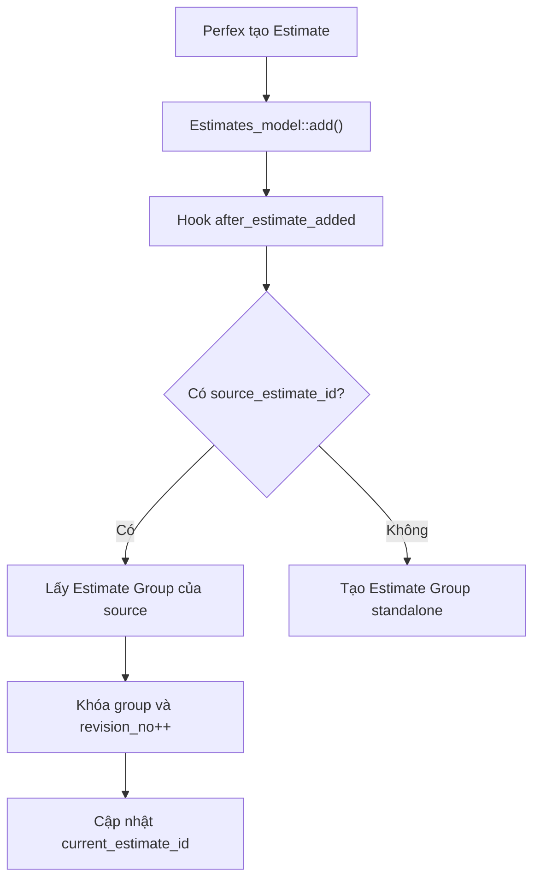
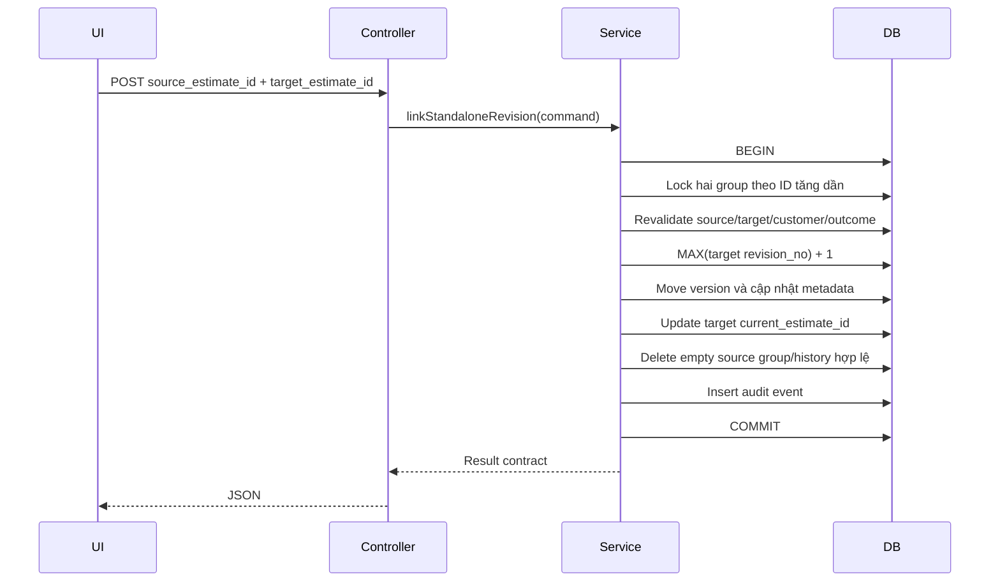

# Kế hoạch quản lý Clone và Revision Báo giá

> **Dự án**: `portal_18`  
> **Module**: `sales_pipeline`  
> **Phạm vi**: Perfex Estimate, Estimate Group, Estimate Revision và quan hệ Deal tùy chọn  
> **Trạng thái**: Kế hoạch To-Be, chưa triển khai  
> **Ngày lập**: 2026-08-21  
> **Tên file được giữ theo yêu cầu**: `Clone_estiamtes_plan.md`

Tài liệu này là kế hoạch triển khai cho bài toán nhân viên kinh doanh có thể tạo nhiều Báo giá liên tiếp vì hết hạn, thay đổi giá, số lượng hoặc cấu hình; đồng thời vẫn có thể tạo một Báo giá hoàn toàn mới cho cùng khách hàng. Mục tiêu là phân biệt chính xác **Báo giá mới** và **Bản điều chỉnh**, không tự động gộp sai và không làm tăng giả tạo KPI.

Các đặc tả liên quan cần được giữ đồng bộ:

- [performance_score.md](./performance_score.md): Estimate Group là nguồn dữ liệu khử trùng revision cho Điểm hiệu suất.
- [rule_engine.md](./rule_engine.md): mỗi `estimate_group_id` chỉ được tính một lần trong các rule sản lượng.
- [core_plane.md](./core_plane.md): Reminder của Estimate độc lập với việc Estimate có liên kết Deal hay không.
- [planUI_Dashboard.md](./planUI_Dashboard.md): Dashboard và ranking phải sử dụng dữ liệu Estimate đã khử revision.

---

## 1. Mục tiêu và phạm vi

### 1.1 Mục tiêu

1. Cho phép NVKD chủ động xác định một Báo giá được tạo từ form trắng là Báo giá mới hay revision của Báo giá đã có.
2. Giữ nguyên cơ chế tự động nhận biết revision khi sử dụng chức năng Copy của Perfex hoặc controller `duplicate_estimate` của module.
3. Gợi ý các Báo giá liên quan nhưng không tự động gộp dựa trên suy đoán.
4. Cho phép sửa sai sau khi tạo thông qua thao tác link/unlink có kiểm soát và có audit.
5. Bảo đảm revision không làm tăng sai số lượng Báo giá, tỷ lệ chấp nhận, doanh thu accepted hoặc Điểm hiệu suất.
6. Giữ toàn bộ thay đổi trong module `sales_pipeline`, không sửa core Perfex nếu không có blocker được chứng minh bằng test.

### 1.2 Ngoài phạm vi ban đầu

- Không dùng AI/ML để tự quyết định hai Báo giá thuộc cùng một nhu cầu.
- Không tự gộp chỉ vì cùng khách hàng, sản phẩm, giá trị hoặc thời gian tạo.
- Không triển khai merge hai chuỗi revision phức tạp cho Staff trong V1.
- Không bắt buộc mọi Estimate phải có Deal.
- Không thay đổi cách Perfex cấp số Báo giá.
- Không renumber lịch sử revision chỉ để làm dãy số liên tục sau khi xóa.
- Không dùng `tblsales_pipeline.estimate_id` làm nguồn sự thật cho quan hệ revision.

---

## 2. Hiện trạng Basecode

### 2.1 Luồng tạo và clone hiện tại



Nguồn `source_estimate_id` hiện có:

1. Property request-scope khi gọi `Sales_pipeline_model::duplicate_estimate_revision()`.
2. Router `estimates/copy/{id}` của Perfex.
3. Không có nguồn khi NVKD mở form trắng `/admin/estimates/estimate`.

### 2.2 Các bảng đang là nguồn dữ liệu

| Bảng | Trách nhiệm hiện tại |
|---|---|
| `tblsales_pipeline_estimate_groups` | Đại diện một nhu cầu Báo giá logic và giữ kết quả tổng hợp cuối |
| `tblsales_pipeline_estimate_versions` | Ánh xạ từng Estimate vật lý vào group và giữ `revision_no` |
| `tblsales_pipeline_estimate_outcome_history` | Lưu lịch sử thay đổi `pending/accepted/declined` |
| `tblsales_pipeline` | Deal; hiện chỉ có một `estimate_id`, không đủ mô tả chuỗi revision |

### 2.3 Các bất biến hiện có cần bảo toàn

- Mỗi `estimate_id` chỉ thuộc tối đa một group qua unique index `uq_estimate_id`.
- Mỗi `(estimate_group_id, revision_no)` là duy nhất.
- `current_estimate_id` trỏ tới revision mới nhất còn tồn tại.
- `origin_estimate_id` trỏ tới revision đầu tiên còn tồn tại.
- `decision_estimate_id` trỏ tới revision tạo ra kết quả accepted/declined hiện hành.
- `decision_value_base` lấy từ revision quyết định, không lấy tùy tiện từ revision hiện tại.
- Estimate Group độc lập với Deal.

---

## 3. Rà soát các rủi ro cần vá

### 3.1 Risk register

| ID | Mức độ | Rủi ro | Hậu quả | Hướng vá bắt buộc |
|---|---|---|---|---|
| R-01 | Critical | `get_estimate_dashboard_metrics()` đang đếm `COUNT(ev.estimate_id)` | Clone/revision làm tăng số lượng Báo giá trên Dashboard, không khớp Performance Score và Rule Engine | Đếm group đúng một lần và áp dụng cùng định nghĩa “Báo giá hợp lệ” |
| R-02 | Critical | Reconciliation luôn chọn tối đa 1.000 group cũ nhất nhưng group không đổi không được cập nhật mốc quét | Khi có hơn 1.000 group, group mới có thể không bao giờ được reconcile | Thêm `last_reconciled_at` hoặc cursor bền vững; cập nhật sau mọi lần quét, kể cả không đổi outcome |
| R-03 | High | Estimate được insert trước khi hook liên kết group chạy | Nếu append thất bại, Estimate có thể tồn tại mà không có `estimate_versions` | Fail-safe thành standalone, ghi log/cảnh báo và bổ sung job tìm Estimate orphan |
| R-04 | High | Form tạo mới không truyền ý định revision | Tạo hai group cho cùng một nhu cầu và làm sai KPI | Thêm request context `standalone/revision` và UI khai báo ý định |
| R-05 | High | Chưa kiểm tra đầy đủ customer khi liên kết thủ công | Có thể gộp Báo giá của hai khách hàng khác nhau | Server-side hard guard `clientid` phải giống nhau; không có quyền override |
| R-06 | High | Group accepted chưa có chính sách revision rõ ràng | Có thể làm mơ hồ accepted revenue, trạng thái thương vụ và lịch sử quyết định | Staff bị chặn; Manager override có lý do và không tự mở lại outcome trong V1 |
| R-07 | High | Không có audit cho link/unlink/override | Không xác định được ai đã làm thay đổi KPI | Lưu event bất biến với actor, from/to group, source Estimate, reason và timestamp |
| R-08 | High | Chưa có integration test cho group/revision | Regression có thể đi thẳng vào KPI và Reminder | Viết test cho clone, explicit link, concurrency, delete, accepted và fallback |
| R-09 | Medium | `grouping_source` chỉ ở cấp group | Không biết từng revision được tạo bởi native copy, form trắng hay manual link | Thêm metadata ở cấp version và event audit |
| R-10 | Medium | Asset JS hiện chỉ được load khi router thuộc module `sales_pipeline` | UI khai báo revision sẽ không xuất hiện trên form Estimate của core Perfex | Tạo loader riêng chỉ cho route create Estimate |
| R-11 | Medium | Source Estimate có thể là revision cũ thay vì current revision | Parent hiển thị và audit có thể gây hiểu nhầm | Cho phép resolve về cùng group nhưng lưu chính xác `parent_estimate_id`; UI ưu tiên current revision |
| R-12 | Medium | Hai thao tác manual link đồng thời có thể khóa group khác thứ tự | Deadlock hoặc trùng revision | Khóa các group theo ID tăng dần, sau đó tính `MAX(revision_no)` trong transaction |
| R-13 | Medium | Xóa quan hệ trong hook `before_estimate_deleted` xảy ra trước khi core xóa Estimate | Nếu core delete thất bại, metadata group đã bị thay đổi | Bổ sung reconciliation/orphan repair và test failure path; cân nhắc deferred cleanup nếu Perfex có hook phù hợp |
| R-14 | Medium | `owner_staff_id` và owner revision có thể khác nhau | KPI số lượng và accepted revenue có thể bị gán sai nếu không có rule rõ | Giữ group owner bất biến; accepted revenue lấy owner của revision quyết định |
| R-15 | Low | Tài liệu `performance_score.md` còn ghi “chưa triển khai” trong khi code/test đã tồn tại | Agent và developer có thể thiết kế dựa trên trạng thái sai | Cập nhật trạng thái tài liệu trong cùng đợt chuẩn hóa docs |

### 3.2 Bản vá nền tảng R-01: thống nhất định nghĩa số Báo giá

Nguồn sự thật phải là `tblsales_pipeline_estimate_groups`, không phải số row trong `estimate_versions`.

Định nghĩa V1:

```sql
COUNT(grp.id)
WHERE grp.owner_staff_id = :staff_id
  AND grp.datecreated >= :period_start
  AND grp.datecreated < :period_end_exclusive
  AND EXISTS (
      SELECT 1
      FROM tblsales_pipeline_estimate_versions ev
      JOIN tblestimates e ON e.id = ev.estimate_id
      WHERE ev.estimate_group_id = grp.id
        AND e.status IN (2, 3, 4, 5)
  )
```

Query dùng cho Dashboard, Performance Score và Reminder Rule phải dùng cùng một method/repository để tránh lệch định nghĩa.

Tiêu chí nghiệm thu:

- Một standalone Estimate đã gửi tạo count bằng `1`.
- Clone 10 lần trong cùng group vẫn tạo count bằng `1`.
- Group chỉ có Draft chưa được tính vào “Báo giá hợp lệ”.
- Khi một revision chuyển từ Draft sang Sent, group bắt đầu được tính đúng một lần.

### 3.3 Bản vá nền tảng R-02: chống starvation reconciliation

Không dùng `datemodified` như cursor kỹ thuật vì nó còn mang ý nghĩa thay đổi nghiệp vụ. Bổ sung vào group:

```text
last_reconciled_at DATETIME NULL
INDEX idx_last_reconciled (last_reconciled_at, id)
```

Thuật toán:

1. Chọn batch theo `ORDER BY COALESCE(last_reconciled_at, '1970-01-01'), id`.
2. Sync từng group.
3. Cập nhật `last_reconciled_at` sau khi đã kiểm tra, kể cả outcome không thay đổi.
4. Batch sau sẽ tiến tới các group chưa được quét gần đây.
5. Nếu sync phát sinh lỗi, không cập nhật mốc cho group lỗi và ghi log có group ID.

Tiêu chí nghiệm thu:

- Fixture 1.500 group được chia batch 1.000 và 500; cả 1.500 đều được quét.
- Group không đổi outcome vẫn được đẩy xuống cuối hàng đợi sau lần quét.
- Group lỗi không làm dừng toàn bộ batch.

### 3.4 Bản vá nền tảng R-03: fail-safe và orphan repair

Do core Perfex đã insert Estimate trước `after_estimate_added`, module không thể giả định liên kết revision luôn thành công.

Chính sách:

1. Nếu explicit revision hợp lệ: append vào target group.
2. Nếu append thất bại: thử tạo standalone group cho Estimate mới.
3. Nếu standalone cũng thất bại: ghi error log có `estimate_id`, actor và request intent.
4. Hiển thị cảnh báo cho người dùng; không hiển thị thông báo “đã liên kết revision”.
5. Cron hoặc command reconciliation tìm mọi Estimate chưa có row trong `estimate_versions` và tạo standalone an toàn.

Không được tự đoán target group trong job repair.

---

## 4. Quyết định kiến trúc

### 4.1 Mô hình được giữ nguyên

```text
Estimate Group   = một nhu cầu Báo giá logic
Estimate Version = một tài liệu Báo giá vật lý
Deal             = quan hệ nghiệp vụ tùy chọn, không phải điều kiện để grouping
```

Hệ quả:

- Group tiếp tục là aggregate root của KPI Báo giá.
- Estimate tiếp tục là chứng từ Perfex độc lập, có số và trạng thái riêng.
- Deal không được dùng làm điều kiện bắt buộc để tạo hoặc link revision.
- Không đưa `pipeline_id` trở lại bảng group trong V1.
- Nếu cần liên kết Deal sau này, dùng bảng bridge thay vì suy diễn từ `tblsales_pipeline.estimate_id`.

### 4.2 Nguyên tắc thiết kế

1. **Explicit intent first**: quyết định của người dùng có giá trị cao hơn heuristic.
2. **No blind merge**: heuristic chỉ gợi ý, không ghi dữ liệu.
3. **Fail safe to standalone**: khi không thể chứng minh link hợp lệ, giữ Estimate thành group riêng.
4. **Server-authoritative**: mọi điều kiện customer, quyền, accepted lock và concurrency được kiểm tra lại ở server.
5. **Audit before convenience**: mọi manual link/unlink/override phải truy vết được.
6. **Module-only integration**: ưu tiên hook, module controller, library và asset riêng.
7. **Idempotent migration**: schema upgrade chạy lại an toàn và không làm mất dữ liệu cũ.
8. **KPI consistency**: Dashboard, Reminder và Performance Score dùng cùng một định nghĩa group hợp lệ.

### 4.3 Phân lớp đề xuất

```text
modules/sales_pipeline/
├── sales_pipeline.php
│   ├── hook before_estimate_added
│   ├── hook after_estimate_added
│   └── loader asset cho route Estimate
├── controllers/Sales_pipeline.php
│   ├── estimate_revision_candidates
│   ├── link_estimate_revision
│   └── unlink_estimate_revision
├── libraries/
│   └── Estimate_revision_service.php
├── models/Sales_pipeline_model.php
│   ├── query Dashboard/KPI
│   └── adapter tương thích API hiện tại
├── includes/estimate_group_schema.php
├── migrations/107_version_107.php
├── assets/js/estimate_revision.js
├── assets/css/estimate_revision.css
└── tests/
    ├── Estimate_revision_service_test.php
    ├── Estimate_group_integration_test.php
    └── Estimate_revision_permissions_test.php
```

`Estimate_revision_service` chịu trách nhiệm:

- Validate intent và quyền.
- Resolve Estimate Group.
- Tạo standalone.
- Append revision.
- Manual link/unlink.
- Khóa transaction.
- Ghi audit event.
- Trả kết quả chuẩn hóa cho hook/controller.

Không tiếp tục dồn toàn bộ logic revision mới vào `Sales_pipeline_model.php`, vì model hiện đã đảm nhiệm CRUD Deal, reminder, dashboard, KPI và estimate grouping.

### 4.4 Command result contract

Mọi thao tác service trả một contract thống nhất:

```php
[
    'success'           => true,
    'action'            => 'linked', // standalone|linked|unlinked|fallback_standalone
    'estimate_id'       => 123,
    'estimate_group_id' => 45,
    'revision_no'       => 3,
    'warning_code'      => null,
    'message_key'       => 'sales_pipeline_revision_linked',
]
```

Không trả raw exception hoặc raw SQL cho UI.

---

## 5. Thiết kế dữ liệu mục tiêu

### 5.1 Mở rộng `sales_pipeline_estimate_groups`

```text
last_reconciled_at DATETIME NULL
```

Không thay đổi ý nghĩa của:

- `owner_staff_id`;
- `decision_owner_staff_id`;
- `decision_estimate_id`;
- `decision_value_base`;
- `current_estimate_id`;
- `origin_estimate_id`.

### 5.2 Mở rộng `sales_pipeline_estimate_versions`

```text
parent_estimate_id INT NULL
link_method        VARCHAR(30) NOT NULL DEFAULT 'origin'
linked_by          INT NULL
```

Allow-list `link_method`:

| Giá trị | Ý nghĩa |
|---|---|
| `origin` | Revision đầu tiên của group được tạo mới |
| `native_copy` | Copy qua controller `estimates/copy` của Perfex |
| `module_copy` | Copy qua controller `sales_pipeline/duplicate_estimate` |
| `declared_revision` | Tạo từ form trắng và người dùng chọn “Bản điều chỉnh” |
| `manual_link` | Được hậu kiểm và link sau khi đã tạo |
| `manual_unlink` | Được tách thành group mới |
| `legacy_import` | Dữ liệu backfill không đủ metadata lịch sử |
| `legacy_revision` | Revision cũ đã tồn tại nhưng không xác định được nguồn |

`parent_estimate_id` ghi đúng Estimate mà người dùng chọn làm “bản điều chỉnh của”. Group vẫn được resolve từ Estimate này; không giả định parent luôn là revision ngay trước đó.

### 5.3 Bảng audit mới

```sql
CREATE TABLE tblsales_pipeline_estimate_group_events (
    id                 INT AUTO_INCREMENT PRIMARY KEY,
    event_type         VARCHAR(30) NOT NULL,
    estimate_id        INT NULL,
    source_estimate_id INT NULL,
    from_group_id      INT NULL,
    to_group_id        INT NULL,
    actor_staff_id     INT NULL,
    reason             VARCHAR(500) NULL,
    metadata_json      LONGTEXT NULL,
    datecreated        DATETIME NOT NULL,
    INDEX idx_event_estimate (estimate_id, datecreated),
    INDEX idx_event_from_group (from_group_id, datecreated),
    INDEX idx_event_to_group (to_group_id, datecreated)
);
```

Allow-list `event_type` V1:

```text
group_created
revision_linked
revision_link_failed
revision_fallback_standalone
revision_unlinked
accepted_override
orphan_repaired
```

Event đã ghi không được update hoặc delete qua giao diện nghiệp vụ.

### 5.4 Backfill

- Revision `1` trong group `legacy_import` nhận `link_method = legacy_import`.
- Revision `1` trong group khác nhận `link_method = origin`.
- Revision lớn hơn `1` nhưng không có nguồn lịch sử nhận `link_method = legacy_revision`.
- `parent_estimate_id` và `linked_by` của dữ liệu cũ để `NULL`.
- Không tạo audit event giả cho các thao tác lịch sử không thể chứng minh.
- Migration phải idempotent và giữ các unique index hiện có.

### 5.5 Quan hệ Deal ở giai đoạn sau

Sau khi hệ thống revision vận hành ổn định, nếu cần liên kết Deal, dùng bảng bridge:

```text
tblsales_pipeline_deal_estimate_groups
- pipeline_id
- estimate_group_id
- linked_by
- datecreated
```

Quan hệ này không thay đổi cách tính revision và không bắt buộc khi tạo Estimate.

---

## 6. Giai đoạn 1 — Khai báo ý định ngay trên form tạo Estimate

### 6.1 Mục tiêu

Cho NVKD lựa chọn rõ ràng ngay khi tạo từ form trắng:

```text
Mục đích Báo giá
(●) Báo giá mới độc lập
( ) Bản điều chỉnh/thay thế của Báo giá đã có
```

Mặc định luôn là **Báo giá mới độc lập**.

### 6.2 Request contract

Các field thuộc namespace module:

```text
sales_pipeline[intent]                  = standalone | revision
sales_pipeline[revision_of_estimate_id] = integer | empty
sales_pipeline[override_accepted]       = 0 | 1
sales_pipeline[override_reason]         = string | empty
```

Hook `before_estimate_added` phải:

1. Đọc namespace `sales_pipeline`.
2. Xóa namespace này khỏi `$hook['data']` trước khi Perfex insert `tblestimates`.
3. Normalize intent.
4. Validate sơ bộ target, quyền, customer và accepted lock.
5. Lưu context trong object request-scope; không dùng session, cookie hoặc option.

Hook `after_estimate_added` phải resolve nguồn theo thứ tự:

1. Module copy context.
2. Native Perfex route `estimates/copy/{id}`.
3. Explicit form context `revision_of_estimate_id`.
4. Nếu không có nguồn hợp lệ: standalone.

### 6.3 UI integration không sửa core

- Chỉ load `estimate_revision.js` và CSS trên route tạo mới Estimate.
- Không hiển thị selector trên form edit Estimate hiện hữu.
- JS chèn panel vào form `.accounting-template.estimate` sau vùng chọn khách hàng/project.
- Nội dung label và thông báo lấy từ language file module, không hard-code chuỗi tiếng Việt trong JS.
- Nếu JS không tải được, form vẫn submit như Báo giá standalone.

### 6.4 Server-side validation

Intent `revision` hợp lệ khi:

- Actor có quyền tạo Estimate.
- Source Estimate tồn tại và actor có quyền xem.
- `clientid` của Estimate mới bằng `clientid` của source.
- Source đã thuộc một Estimate Group hợp lệ hoặc có thể được backfill an toàn.
- Group target không accepted đối với Staff.
- Manager override accepted có quyền riêng và reason hợp lệ.

Client mismatch không có override, kể cả Admin.

### 6.5 Fail-safe

Nếu explicit link không hợp lệ hoặc append thất bại:

1. Tạo standalone group cho Estimate mới.
2. Ghi event `revision_link_failed` và `revision_fallback_standalone` khi audit schema đã sẵn sàng.
3. Gọi `set_alert('warning', ...)` để người dùng biết Estimate chưa được link.
4. Cung cấp CTA đi tới thao tác hậu kiểm.

### 6.6 Tiêu chí nghiệm thu Giai đoạn 1

1. Tạo mới mặc định sinh group riêng.
2. Chọn revision hợp lệ sinh revision kế tiếp trong target group.
3. Native Copy tiếp tục hoạt động như trước.
4. API không gửi intent tiếp tục tạo standalone.
5. Hai tab trình duyệt không làm lẫn source Estimate.
6. Field namespace module không bị đưa vào câu lệnh insert `tblestimates`.
7. Link lỗi không làm mất Estimate và không im lặng.

---

## 7. Giai đoạn 2 — Smart Prompt

### 7.1 Mục tiêu

Giảm thao tác tìm kiếm nhưng không thay thế quyết định của NVKD.

Khi chọn khách hàng, UI gọi:

```text
GET /admin/sales_pipeline/estimate_revision_candidates
    ?client_id=45
    &project_id=12
    &limit=10
```

### 7.2 Hard filter

Candidate chỉ được trả khi:

- Cùng `client_id`.
- Estimate/group vẫn tồn tại.
- Actor có quyền xem Estimate.
- Candidate là `current_estimate_id` của group.
- Nằm trong cửa sổ cấu hình, mặc định 60 ngày.
- Không phải group accepted đối với Staff.
- Không vượt quá limit server quy định.

### 7.3 Xếp hạng deterministic

Có thể dùng điểm chỉ để sắp xếp:

| Tín hiệu | Mức ưu tiên |
|---|---:|
| Cùng `project_id` khác `0` | Rất cao |
| Cùng sale owner | Cao |
| Status Expired hoặc Declined gần đây | Cao |
| Reference number tương đồng | Trung bình |
| Mô tả item có độ trùng cao | Trung bình |
| Ngày tạo/expiry gần hiện tại | Thấp |

Không dùng tổng tiền bằng nhau làm điều kiện đủ. Không gộp theo một tín hiệu đơn lẻ.

### 7.4 Response contract

```json
{
  "success": true,
  "data": {
    "candidates": [
      {
        "estimate_id": 89,
        "estimate_group_id": 21,
        "estimate_number": "EST-0089",
        "revision_no": 2,
        "status": 5,
        "status_label": "Hết hạn",
        "total": 50000000,
        "currency_symbol": "₫",
        "expirydate": "2026-08-18",
        "project_name": "Nâng cấp tổng đài",
        "reason_codes": ["same_project", "recently_expired"]
      }
    ]
  }
}
```

UI chỉ hiển thị lý do thân thiện; không hiển thị “độ chính xác 100%”.

### 7.5 UX

- Khi có candidate mạnh, hiển thị banner: “Khách hàng này có Báo giá gần đây. Đây có phải bản điều chỉnh không?”
- Hai hành động rõ ràng: `Giữ là Báo giá mới` và `Chọn làm bản điều chỉnh`.
- Không mở modal chặn khi không có candidate.
- Không tự chuyển radio sang revision.
- Nếu request gợi ý lỗi, người dùng vẫn tạo standalone bình thường.
- Hỗ trợ bàn phím, focus state, loading, empty và error state.

### 7.6 Tiêu chí nghiệm thu Giai đoạn 2

1. Candidate khác khách hàng không bao giờ xuất hiện.
2. Candidate không có quyền xem không xuất hiện trong payload.
3. Staff không thấy accepted group.
4. Không có thao tác ghi database khi chỉ gọi endpoint gợi ý.
5. Việc bỏ qua prompt tạo standalone.
6. Chọn candidate chỉ điền intent; server vẫn validate lại khi submit.

---

## 8. Giai đoạn 3 — Metadata và audit

### 8.1 Mục tiêu

Mọi revision mới phải trả lời được:

- Được tạo từ Estimate nào?
- Được link bằng phương thức nào?
- Ai thực hiện?
- Có từng bị chuyển group hoặc override accepted hay không?
- Link thất bại đã fallback thế nào?

### 8.2 Audit events bắt buộc

| Tình huống | Event |
|---|---|
| Tạo group mới | `group_created` |
| Native/module/declared revision thành công | `revision_linked` |
| Link explicit thất bại | `revision_link_failed` |
| Estimate được bảo toàn thành standalone | `revision_fallback_standalone` |
| Manual unlink | `revision_unlinked` |
| Manager link vào accepted group | `accepted_override` |
| Job sửa Estimate orphan | `orphan_repaired` |

### 8.3 Metadata snapshot tối thiểu

`metadata_json` không lưu dữ liệu bí mật không cần thiết. Snapshot tối thiểu:

```json
{
  "request_source": "estimate_create_form",
  "previous_revision_no": 2,
  "assigned_revision_no": 3,
  "group_outcome_before": "declined",
  "group_outcome_after": "pending",
  "client_id": 45
}
```

### 8.4 Manager override accepted

Trong V1, override chỉ cho phép tạo tài liệu điều chỉnh sau khi đã accepted; nó không tự động xóa quyết định accepted cũ và không tự mở lại KPI.

Nếu nghiệp vụ cần “reopen accepted group” thật sự, phải thiết kế riêng:

- Đánh dấu decision cũ bị superseded.
- Xác định kỳ KPI cần điều chỉnh.
- Xác định cách hoàn/hủy accepted revenue.
- Bổ sung outcome/lifecycle state phù hợp.

Không thực hiện reopen bằng cách đơn giản set `outcome = pending`, vì reconciliation sẽ lại tìm revision accepted cũ.

### 8.5 Tiêu chí nghiệm thu Giai đoạn 3

1. Mỗi revision mới có `link_method` đúng.
2. `parent_estimate_id` phản ánh đúng lựa chọn của người dùng.
3. Manual link/unlink và override có actor/reason.
4. Event cũ không bị sửa qua controller nghiệp vụ.
5. Backfill không bịa parent hoặc actor cho dữ liệu cũ.
6. Audit query theo Estimate và group sử dụng index.

---

## 9. Giai đoạn 4 — Hậu kiểm an toàn

### 9.1 Phạm vi V1

V1 chỉ hỗ trợ hai command:

```text
Link một standalone Estimate thành revision của group khác
Tách revision mới nhất trở lại thành standalone group
```

Không cho Staff merge hai group đều đã có nhiều revision.

### 9.2 Endpoint

```text
POST /admin/sales_pipeline/link_estimate_revision
POST /admin/sales_pipeline/unlink_estimate_revision
```

Yêu cầu chung:

- POST only.
- CSRF theo cơ chế Perfex.
- Không nhận `staff_id`, owner KPI hoặc revision number từ client.
- JSON response chuẩn hóa.
- Kiểm tra quyền trên server.

### 9.3 Quyền

Định nghĩa capability mới:

```text
sales_pipeline.manage_estimate_revisions
```

Quy ước “Manager” trong tài liệu này là:

```text
is_admin() OR has_permission('sales_pipeline', '', 'manage_estimate_revisions')
```

Staff thông thường chỉ được khai báo revision lúc tạo mới và chỉ với group chưa accepted mà họ có quyền xem.

### 9.4 Điều kiện manual link

- Source Estimate tồn tại.
- Source đang thuộc standalone group có đúng một revision.
- Source group đang `pending`.
- Target Estimate tồn tại và resolve được target group.
- Source và target cùng `clientid`.
- Actor xem được cả hai Estimate.
- Target chưa accepted, trừ Manager override có reason.
- Source group và target group khác nhau.
- Không có invoice/decision phụ thuộc khiến việc chuyển group phá lịch sử.

### 9.5 Transaction manual link



Lock group theo ID tăng dần để giảm deadlock.

### 9.6 Manual unlink

Chỉ cho phép unlink khi revision:

- Là current/latest revision của group.
- Chưa phải decision Estimate.
- Chưa Accepted hoặc đã chuyển Invoice.
- Không làm group nguồn rỗng.
- Actor có capability quản lý revision.

Unlink tạo group mới với revision `1`. Các revision còn lại trong group cũ giữ nguyên số; không renumber.

### 9.7 Tiêu chí nghiệm thu Giai đoạn 4

1. Link standalone hợp lệ cập nhật group và KPI đúng một lần.
2. Hai request đồng thời nhận hai revision number khác nhau hoặc một request bị từ chối an toàn.
3. Client mismatch luôn bị từ chối.
4. Staff không thể link vào accepted group.
5. Manager thiếu reason không thể override.
6. Unlink revision không hợp lệ không thay đổi dữ liệu.
7. Rollback để database trở về trạng thái ban đầu khi bất kỳ bước nào thất bại.
8. Mọi thay đổi thành công có audit event.

---

## 10. Quy tắc nghiệp vụ phải chốt trước khi triển khai

### BR-01 — Accepted group lock

Không cho Staff gắn revision vào group đã accepted.

### BR-02 — Manager override

Manager có thể override nhưng bắt buộc nhập lý do. Lý do phải được trim, giới hạn độ dài và lưu audit. Trong V1, override không tự reopen accepted outcome/KPI.

### BR-03 — Customer boundary

Không cho gắn hai khách hàng khác nhau. Đây là hard guard không có override.

### BR-04 — Group owner KPI

`owner_staff_id` của group vẫn là owner lúc tạo group và không đổi khi append/manual link.

### BR-05 — Accepted revenue owner

Accepted revenue thuộc người sở hữu revision được chấp nhận, được snapshot vào `decision_owner_staff_id`. Không suy diễn từ owner hiện tại của group.

### BR-06 — Revision numbering

Revision number không renumber sau khi xóa để giữ audit. Revision tiếp theo luôn là `MAX(revision_no) + 1` trong transaction.

### BR-07 — Explicit link failure

Nếu explicit link thất bại, hệ thống tạo standalone và cảnh báo rõ; không được âm thầm bỏ qua và không tự chọn target khác.

### BR-08 — Heuristic boundary

Heuristic không bao giờ tự động merge. Nó chỉ trả candidate và reason codes.

### BR-09 — Source revision

Nếu người dùng chọn một revision cũ, hệ thống resolve về group hiện tại nhưng lưu đúng revision được chọn trong `parent_estimate_id`. UI ưu tiên hiển thị current revision để giảm nhầm lẫn.

### BR-10 — Ownership mismatch

Append revision của Staff khác không thay đổi group owner. Nếu chính sách công ty không cho chuyển người phụ trách giữa revision, server phải chặn; nếu cho phép thì accepted revenue vẫn theo BR-05.

### BR-11 — Accepted override semantics

Manager override V1 được xem là “tài liệu điều chỉnh sau chấp nhận”, không phải “mở lại cơ hội”. Reopen là một feature riêng và phải có đặc tả KPI riêng.

### BR-12 — Deletion

Xóa revision không làm thay đổi số của các revision còn lại. Nếu xóa decision revision, phải chạy lại sync outcome và ghi audit phù hợp.

---

## 11. Thứ tự triển khai

### Bước 1 — Vá hai vấn đề nền tảng

1. Sửa Dashboard đếm group thay vì revision.
2. Thêm cursor/mốc `last_reconciled_at` để chống starvation.
3. Tách query “valid Estimate Group” dùng chung cho Dashboard, Performance Score và Reminder Engine.

**Gate**: clone không tăng count và fixture trên 1.000 group được reconcile đầy đủ.

### Bước 2 — Bổ sung integration test cho group/revision hiện tại

Test baseline trước khi mở rộng:

- Standalone add.
- Native Perfex copy.
- Module copy.
- Concurrent append.
- Update status/value.
- Accepted/declined outcome.
- Delete origin/current/non-current revision.
- Orphan repair.

**Gate**: test phải tái hiện được lỗi R-01/R-02 trước bản vá và pass sau bản vá.

### Bước 3 — Thêm request context standalone/revision và metadata

1. Migration mở rộng schema dưới dạng nullable/backward-compatible.
2. Tạo `Estimate_revision_service`.
3. Hook `before_estimate_added` capture và strip module payload.
4. Hook `after_estimate_added` dùng result contract và fail-safe standalone.
5. Ghi `link_method`, `parent_estimate_id`, `linked_by`.

Schema audit có thể được tạo sớm theo chiến lược **expand trước, activate sau**; UI audit hoàn chỉnh vẫn thuộc Giai đoạn 3 sản phẩm.

**Gate**: request không có intent giữ nguyên hành vi hiện tại; explicit context được xử lý an toàn bằng test service/integration.

### Bước 4 — Thêm UI “Báo giá mới/Bản điều chỉnh”

1. Loader riêng trên route create Estimate.
2. Panel intent, dropdown source và các trạng thái UI.
3. Language keys Việt/Anh.
4. Progressive enhancement: JS lỗi vẫn standalone.

**Gate**: kiểm thử desktop/mobile, keyboard, hai tab và submit khi JS lỗi.

### Bước 5 — Thêm endpoint Smart Prompt

1. Query candidate có hard filter và permission.
2. Deterministic ranking và reason codes.
3. Debounce/cancel request khi đổi khách hàng nhanh.
4. Không có side effect database.

**Gate**: không rò rỉ Estimate ngoài quyền và không có auto-selection.

### Bước 6 — Thêm manual link/unlink có audit

1. Capability quản lý revision.
2. POST endpoints.
3. Transaction và lock order.
4. Audit events.
5. UI action từ Estimate detail hoặc Dashboard.

**Gate**: mọi failure rollback; mọi success có audit; Staff không bypass accepted lock.

### Bước 7 — Quan hệ Deal–Estimate Group

Chỉ triển khai sau khi revision workflow vận hành ổn định. Dùng bảng bridge tùy chọn và không thay đổi source of truth KPI Estimate.

**Gate**: xóa/unlink Deal không làm mất Estimate Group hoặc lịch sử revision.

### Bước 8 — Kiểm tra và xác nhận hiện trạng

Baseline tại thời điểm lập kế hoạch:

- PHP lint đã pass cho bootstrap module, install, controller, model, Estimate Group schema và Reminder Engine.
- Các test hiện có đã pass:
  - Performance Score calculator.
  - Performance Score language rendering.
  - Performance Score period targets.
  - Reminder rule settings, delivery safety và audit invariants.

Giới hạn của baseline:

- Chưa có integration test database cho Estimate Group/Revision.
- Chưa có browser test cho form Estimate.
- Chưa kiểm thử concurrency thực tế trên MySQL.

Sau mỗi bước triển khai phải chạy lại toàn bộ baseline cùng test mới; không coi lint hoặc unit test thuần PHP là bằng chứng đủ cho tính đúng của transaction/database.

---

## 12. Ma trận kiểm thử bắt buộc

| Nhóm | Ca kiểm thử |
|---|---|
| Standalone | Không có intent; intent standalone; JS không tải; API không gửi namespace module |
| Copy | Native Perfex copy; module copy; copy source chưa có group; copy nhiều lần |
| Explicit revision | Source current; source revision cũ; source không tồn tại; source không có quyền xem |
| Customer | Cùng customer pass; khác customer fail; Admin khác customer vẫn fail |
| Accepted | Staff bị chặn; Manager thiếu reason bị chặn; Manager có reason được audit |
| Failure | Append lỗi fallback standalone; standalone lỗi ghi error; alert đúng nội dung |
| Concurrency | Hai revision đồng thời; manual link đồng thời; lock order không deadlock kéo dài |
| Delete | Xóa origin/current/middle/decision revision; không renumber lịch sử |
| KPI | Clone không tăng count; accepted revenue chỉ cộng một lần; decision owner đúng |
| Reconciliation | Hơn 1.000 group; group không đổi; group lỗi; orphan Estimate |
| Smart Prompt | Permission, limit, accepted visibility, same client, no database write |
| Manual link | Source group một revision; source group nhiều revision; target same group; rollback |
| Manual unlink | Latest pending; non-latest; decision revision; group chỉ có một revision |
| Security | CSRF, POST-only, ID tampering, capability, payload không nhận owner/revision number từ client |
| UI | Desktop/mobile, keyboard, loading/error/empty, đổi customer liên tục, hai browser tab |
| Migration | Fresh install, upgrade từ 1.0.7, chạy migration hai lần, dữ liệu legacy |

---

## 13. Quan sát vận hành và rollback

### 13.1 Logging tối thiểu

Log có cấu trúc cho các tình huống:

- `revision_link_failed`;
- `fallback_standalone_failed`;
- `reconciliation_group_failed`;
- `orphan_estimate_detected`;
- `manual_link_rollback`;
- `accepted_override`.

Không log toàn bộ POST chứa dữ liệu khách hàng; chỉ log ID, actor, code lỗi và request correlation ID nếu có.

### 13.2 Chỉ số theo dõi sau rollout

- Tỷ lệ Estimate tạo với intent revision.
- Số lần Smart Prompt được hiển thị/chấp nhận/bỏ qua.
- Số explicit link fallback standalone.
- Số Estimate orphan phát hiện mỗi ngày.
- Số manual link/unlink.
- Số Manager accepted override.
- Chênh lệch count giữa Dashboard, Rule Engine và Performance Score phải bằng `0` theo cùng điều kiện.

### 13.3 Feature flags

Nên có option module:

```text
sp_estimate_revision_intent_enabled
sp_estimate_revision_suggestions_enabled
sp_estimate_revision_manual_link_enabled
```

Cho phép tắt UI/endpoint mới mà không xóa schema hoặc dữ liệu audit. Native Copy grouping hiện tại tiếp tục hoạt động khi các flag mới bị tắt.

### 13.4 Rollback

- Rollback feature bằng flag, không drop cột/bảng audit.
- Không đảo migration bằng cách xóa metadata đã ghi.
- Khi service mới bị tắt, hook quay về hành vi hiện tại: native/module copy là revision, form trắng là standalone.
- Dữ liệu đã link chỉ được đảo bằng command unlink có audit, không sửa SQL thủ công trong quy trình thông thường.

---

## 14. Definition of Done tổng thể

Feature chỉ được coi là hoàn tất khi:

1. Dashboard, Performance Score và Reminder Engine đếm cùng một Estimate Group đúng một lần.
2. Reconciliation không bỏ đói group khi dữ liệu vượt batch limit.
3. NVKD tạo form trắng có thể chọn standalone hoặc revision.
4. Native Copy và module Copy không regression.
5. Smart Prompt không tự merge và không rò rỉ dữ liệu ngoài quyền.
6. Customer mismatch bị chặn tuyệt đối.
7. Staff không thể link vào accepted group.
8. Manager override có reason và audit; không tự reopen KPI trong V1.
9. Explicit link lỗi được bảo toàn thành standalone và cảnh báo rõ.
10. Manual link/unlink transaction-safe, permission-safe và audit được.
11. Revision number không bị renumber sau delete.
12. Group owner và decision owner tuân thủ BR-04/BR-05.
13. Migration pass trên fresh install và upgrade dữ liệu legacy.
14. Unit, integration, permission, concurrency và browser test bắt buộc đều pass.
15. Tài liệu liên quan được cập nhật để phản ánh trạng thái As-Is sau khi triển khai.

