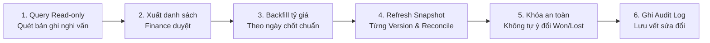

# Báo Cáo Rà Soát Doanh Thu & Lợi Nhuận Pipeline & Điểm Sai Lệch Hệ Thống — Sales Pipeline

> **Ngày cập nhật:** 2026-09-03  
> **Phạm vi chuẩn hóa:** Quản trị hiệu quả bán hàng, doanh thu kỳ vọng, doanh thu đã chốt và lợi nhuận gộp danh nghĩa của Sales Pipeline (không thay thế kế toán dòng tiền thực tế).  
> **Tài liệu tham chiếu:** [`cashflow_audit_report.md`](./cashflow_audit_report.md), [`PERFORMANCE_SCORE.md`](../../specifications/PERFORMANCE_SCORE.md), [`DEAL_BRIDGE.md`](../../specifications/DEAL_BRIDGE.md), [`PERFORMANCE_SCORE_GUIDE.md`](../../user-guides/PERFORMANCE_SCORE_GUIDE.md), [`rule_engine.md`](./rule_engine.md).  
> **Basecode đã đối chiếu:** [`Performance_score_calculator.php`](../../../modules/sales_pipeline/libraries/Performance_score_calculator.php), [`Sales_pipeline_model.php`](../../../modules/sales_pipeline/models/Sales_pipeline_model.php), [`Estimate_revision_service.php`](../../../modules/sales_pipeline/libraries/Estimate_revision_service.php).

---

## 1. Bản đồ luồng dữ liệu doanh thu & lợi nhuận tổng thể

Hệ thống vận hành theo **hai luồng tài chính tách biệt**, kết nối có kiểm soát qua Deal–Estimate Bridge:

```mermaid
graph TD
    subgraph "Luồng 1: Deal (Thương vụ - Quản trị Lợi nhuận & Pipeline)"
        D[tblsales_pipeline] --> |deal_value - cost_price| P["Lợi nhuận gộp danh nghĩa<br/>(actual_profit)"]
        D --> |won / total period deals| WR["Tỷ lệ thắng Deal<br/>(period_win_rate)"]
        D --> |SUM deal_value| DR["Tổng giá trị Deal danh nghĩa"]
    end

    subgraph "Luồng 2: Báo giá (Estimate Group - Quản trị Doanh thu & KPI)"
        EG[tblsales_pipeline_estimate_groups] --> |decision_value_base| AR["Doanh thu Accepted<br/>(accepted_revenue)"]
        EG --> |accepted / (accepted + declined)| ACC["Tỷ lệ chấp nhận<br/>(acceptance_rate)"]
        EG --> |COUNT id non-draft per period| QC["Số Báo giá logic<br/>(estimate_count)"]
        
        AR --> PS["Điểm hiệu suất V2<br/>(Performance Score)"]
        ACC --> PS
        QC --> PS
    end

    subgraph "Deal–Estimate Bridge"
        EG -.->|"Pending: Sync base_total của Primary Group<br/>Accepted: Sync decision_value_base<br/>(trừ khi manual_lock = 1)"| D
    end

    PS -.->|"TUYỆT ĐỐI KHÔNG ĐỌC cost_price/profit"| D
```

---

## 2. Các công thức & cơ chế đã xác minh đúng trong Basecode

1. **Lợi nhuận Deal đơn lẻ:** `actual_profit = deal_value - cost_price` (tính runtime trong `Sales_pipeline_model.php`, có guard `cost_price IS NULL` và guard chia cho 0 khi tính `% profit`).
2. **Chuẩn hóa điểm thành phần:** Các điểm `quote_score`, `accepted_revenue_score`, `acceptance_score` đều áp dụng đúng hàm chuẩn hóa `CLAMP((actual / target) × 100, 0, cap)` và chặn trần tại `component_cap = 120`.
3. **Doanh thu Accepted trong KPI:** Sử dụng `decision_value_base` và gán doanh thu cho `decision owner` (`COALESCE(decision_owner_staff_id, owner_staff_id)`), không cộng dồn các revision của cùng một nhóm Báo giá (tuân thủ BI-1 và BI-7).
4. **Tỷ lệ chấp nhận Báo giá (`acceptance_rate`):** Tính đúng theo công thức `accepted / (accepted + declined) × 100` (loại trừ các báo giá đang soạn thảo hoặc đang chờ khách phản hồi).
5. **Xếp hạng nhân sự:** Áp dụng thuật toán xếp hạng thi đua tiêu chuẩn (Standard Competition Ranking: `1, 2, 2, 4`), ổn định thứ tự bằng tên khi đồng điểm, tính toán trên toàn bộ cohort trước khi chiếu quyền (role projection) cho Staff.

---

## 3. Danh mục các điểm sai lệch & lỗi kỹ thuật runtime (Theo mức ưu tiên)

### 🚨 MỨC NGHIÊM TRỌNG (CRITICAL)

#### 1. Pending Bridge lấy trực tiếp `estimates.total` ngoại tệ làm `deal_value` VND (Biến động giá trị 26.000 lần)
- **Vị trí code:** [`Estimate_revision_service.php`](../../../modules/sales_pipeline/libraries/Estimate_revision_service.php#L1472-L1476) trong hàm `sync_deal()` nhánh Pending:
  ```php
  $currentEst = $this->CI->db->select('total')->where('id', (int) $primaryGroup['current_estimate_id'])->get(db_prefix() . 'estimates')->row_array();
  if ($currentEst) {
      $updateData['deal_value'] = (float) $currentEst['total'];
      $updateData['estimate_id'] = (int) $primaryGroup['current_estimate_id'];
  }
  ```
- **Hậu quả tài chính:**
  - `deal_value` trong hệ thống được định nghĩa là tiền tệ cơ sở (VND), trong khi `estimates.total` có thể là ngoại tệ (USD, EUR,...).
  - Khi Group đang **Pending**: Một báo giá `10,000 USD` bị gán trực tiếp thành `deal_value = 10,000 VND`!
  - Khi Group chuyển sang **Accepted**: Hệ thống lấy `decision_value_base` (`10,000 USD × 26,000 = 260,000,000 VND`).
  - Cùng một thương vụ, giá trị Deal bị nhảy vọt **gấp 26.000 lần** giữa hai trạng thái đàm phán và chốt đơn, làm méo mó hoàn toàn dự báo quy mô pipeline.
- **Giải pháp:** Pending bridge bắt buộc phải dùng `base_total` từ snapshot của Version. Nếu chưa có tỷ giá, **giữ nguyên giá trị Deal cũ**, không ghi đè giá trị ngoại tệ thô và đánh dấu cảnh báo đồng bộ bị chặn.

#### 2. Formula Version Drift & Nguy cơ làm sai lệch điểm số lịch sử
- **Vị trí code:** [`Performance_score_calculator.php`](../../../modules/sales_pipeline/libraries/Performance_score_calculator.php#L11).
- **Hiện trạng:**
  - Migration 112 đã kích hoạt thành phần `reminder_response` với cơ chế phân bổ mẫu số động (100 khi có nhắc nhở đến hạn / 85 khi không có).
  - Tuy nhiên, hằng số công thức vẫn giữ nguyên: `const FORMULA_VERSION = 'performance_score_v1';`.
  - Trước migration 112, `v1` luôn dùng mẫu số cố định 85. Sau migration 112, cùng mang tên `v1` nhưng có thể dùng mẫu số 85 hoặc 100.
- **Rủi ro tài chính & KPI:**
  - Điểm hiệu suất được **tính runtime** và hệ thống **chưa có bảng snapshot lưu trữ điểm lịch sử**.
  - Khi xem lại các kỳ cũ, hệ thống chạy lại công thức hiện tại. Cùng một kỳ dữ liệu lịch sử sẽ cho ra điểm số và thứ hạng khác nhau sau khi nâng cấp hệ thống hoặc đổi target.
- **Giải pháp:** Đã thống nhất nâng cấp lên `performance_score_v2` áp dụng từ **tháng 9/2026**, kèm bảng snapshot điểm số tại thời điểm chốt kỳ.

#### 3. Quy đổi ngoại tệ không nhất quán giữa Model và Service
- **Vị trí code:**
  - [`Sales_pipeline_model.php`](../../../modules/sales_pipeline/models/Sales_pipeline_model.php#L2545-L2547): Khi thiếu tỷ giá, gán `$estimate['base_total'] = null` (chuẩn để kích hoạt `missing_revenue_rate`).
  - [`Estimate_revision_service.php`](../../../modules/sales_pipeline/libraries/Estimate_revision_service.php#L1547-L1556): Khi không tìm thấy tỷ giá từ `get_currency_rate()`, service lại **mặc định gán `$exchangeRate = 1.0`**.
- **Hậu quả tài chính:** Một báo giá ngoại tệ `10,000 USD` khi thiếu tỷ giá sẽ bị nhân với `1.0` và ghi nhận thành `10,000 VND`.
- **Giải pháp:** Hợp nhất hai luồng snapshot về một hàm duy nhất; nếu thiếu tỷ giá, **bắt buộc trả về `NULL`** và kích hoạt cờ `missing_revenue_rate`.

#### 4. Group Accepted thiếu tỷ giá có thể ghi Deal thành "Won" với giá trị 0 VND
- **Vị trí code:** [`Estimate_revision_service.php`](../../../modules/sales_pipeline/libraries/Estimate_revision_service.php#L1443-L1452) trong hàm `sync_deal()`.
- **Hiện trạng:**
  ```php
  $acceptedTotal += (float) ($ag['decision_value_base'] ?? 0);
  $updateData['deal_value'] = $acceptedTotal;
  ```
  Nếu `decision_value_base` là `NULL` (do thiếu tỷ giá), giá trị bị ép thành `0`, cập nhật `deal_value = 0`, sau đó vẫn **tự động đổi trạng thái Deal sang Won**.
- **Giải pháp:** Chặn hoàn toàn việc cập nhật `deal_value` và chuyển trạng thái Won nếu bất kỳ Accepted Group nào bị thiếu `decision_value_base`, đồng thời ghi log audit cảnh báo Admin.

---

### ⚠️ MỨC CAO (HIGH)

#### 5. Xung đột định nghĩa “Số Báo Giá” và Target tháng (Đã có giải pháp thống nhất)
- **Hiện trạng trước thống nhất:**
  1. `get_staff_kpi_metrics()` đếm `COUNT(*)` từ bảng `tblestimates`, đếm lặp từng bản Revision (vi phạm BI-1) và cài cứng target tháng = 30.
  2. `get_estimate_performance_ranking()` đếm Estimate Group nhưng không lọc draft và cài target tháng = 20.
  3. `get_estimate_dashboard_metrics()` đếm Estimate Group nhưng lọc `status IN (2,3,4,5)`.
- **Giải pháp đã thống nhất:** Chuẩn hóa toàn bộ hệ thống theo **Lựa chọn A** (chỉ đếm Group có revision `status IN (2,3,4,5)`, loại bỏ draft) và thống nhất Target tháng = **30 Báo giá** (đồng bộ với Rule 2 `ESTIMATE_MONTHLY_MIN_COUNT` trong `rule_engine.md`).

#### 6. Thiếu cơ chế Self-Healing cho `decision_value_base` khi cập nhật tỷ giá muộn
- **Vị trí code:** [`Sales_pipeline_model.php`](../../../modules/sales_pipeline/models/Sales_pipeline_model.php#L2796-L2800) trong hàm `sync_estimate_group()`.
- **Hiện trạng:** Khi tỷ giá ngoại tệ được bổ sung muộn, `refresh_estimate_version_snapshot()` cập nhật lại `base_total` cho Version. Nhưng khi chạy `sync_estimate_group()`, nếu Group đã mang trạng thái `accepted` và đã có `decision_at`/`decision_estimate_id`, hàm sẽ xem như không có thay đổi và **thoát sớm mà không cập nhật lại `decision_value_base`**.
- **Giải pháp:** Bổ sung điều kiện tự phục hồi: `$group['outcome'] === 'accepted' && $group['decision_value_base'] === null && $decision_version['base_total'] !== null`.

#### 7. Có thể phản hồi Reminder trước khi SLA chính thức bắt đầu
- **Vị trí code:** [`Sales_pipeline_model.php`](../../../modules/sales_pipeline/models/Sales_pipeline_model.php#L1215-L1252) trong hàm `submit_reminder_response()`.
- **Hiện trạng:** Hàm **hoàn toàn không kiểm tra `sent_at IS NOT NULL` và `response_due_at IS NOT NULL`**. Nhân viên truy cập URL trước khi delivery thành công có thể gửi phản hồi trước. Khi delivery chạy sau, phản hồi này mặc nhiên được coi là "đúng hạn".
- **Giải pháp:** Bắt buộc `sent_at IS NOT NULL` và `response_due_at IS NOT NULL` mới cho phép submit phản hồi.

#### 8. Chính sách xếp hạng cho nhân viên bị cờ "Tạm tính (Provisional)" (Đã có giải pháp thống nhất)
- **Hiện trạng trước thống nhất:** Điểm provisional (do thiếu tỷ giá, thiếu mẫu báo giá hay thiếu mẫu reminder) vẫn tham gia xếp hạng thi đua bình thường, dẫn đến nhân viên chốt 1 báo giá duy nhất đứng Top 1.
- **Giải pháp đã thống nhất:** Áp dụng **Chính sách B (Hệ số tin cậy - Confidence Weighting)**: Nhân viên vẫn được xếp hạng nhưng điểm tỷ lệ chốt sẽ bị suy giảm trọng số theo quy mô mẫu thực tế.

#### 9. Win Rate của Deal lọc theo ngày tạo và đưa cả Deal đang mở vào mẫu số
- **Hiện trạng tại [`Sales_pipeline_model.php`](../../../modules/sales_pipeline/models/Sales_pipeline_model.php#L3506-L3511):**
  Query lọc theo `deal_date` (ngày tạo deal ban đầu) chứ không lọc theo ngày chốt thắng/thua, đồng thời đưa toàn bộ deal đang mở vào mẫu số. Deal tạo tháng 1 nhưng tháng 2 mới chốt Won sẽ bị tính hồi tố ngược về tháng 1.
- **Giải pháp:** Chuẩn hóa công thức Win Rate đóng: $\text{Won} / (\text{Won} + \text{Lost})$ dựa theo ngày đóng `closed_at`.

---

### ⚠️ MỨC TRUNG BÌNH (MEDIUM)

#### 10. Tiền tệ đang cộng bằng PHP Float
- **Vị trí code:** [`Estimate_revision_service.php`](../../../modules/sales_pipeline/libraries/Estimate_revision_service.php#L1444): `$acceptedTotal += (float) (...)`. Phép tính số thực dấu phẩy động trong PHP có thể sinh sai số thập phân ngoài ý muốn.
- **Giải pháp:** Dùng database `SUM()` trên cột `DECIMAL` hoặc hàm `bcadd`.

#### 11. Tổng lợi nhuận cộng gộp cả Deal Lost và không cảnh báo thiếu giá vốn
- **Vị trí code:** [`Sales_pipeline_model.php`](../../../modules/sales_pipeline/models/Sales_pipeline_model.php#L546-L548) trong `get_summary()`.
- **Hiện trạng:** Hàm cộng dồn lợi nhuận của **toàn bộ các Deal** (gồm cả Open, Won và **Lost**), đồng thời bỏ qua các Deal thiếu `cost_price` mà không có cờ cảnh báo `missing_cost_count`.

---

## 4. Các Quyết Định Nghiệp Vụ Đã Thống Nhất & Các Vấn Đề Kỹ Thuật Còn Lại

### ✅ CÁC QUYẾT ĐỊNH NGHIỆP VỤ ĐÃ CHỐT CHÍNH THỨC (2026-09-03)

| # | Hạng mục | Quyết định đã thống nhất | Cơ sở nghiệp vụ & áp dụng kỹ thuật |
|:---:|---|---|---|
| **1** | **Ranh giới module** | **Chuẩn hóa Sales CRM** (Hướng 1) | Xác nhận module quản trị hiệu quả bán hàng, doanh thu kỳ vọng và lợi nhuận gộp danh nghĩa. **Đổi toàn bộ tên gọi từ "Dòng tiền" thành "Doanh thu & Lợi nhuận Pipeline"**. Không đối soát số dư ngân hàng. |
| **2** | **Sản lượng Báo giá (Quote Count)** | **Lựa chọn A: Chỉ tính Báo giá hợp lệ** | Chỉ đếm các Estimate Group có ít nhất một phiên bản `status IN (2, 3, 4, 5)` (Đã gửi, Khách đã xem, Đã duyệt, Từ chối). **Loại bỏ hoàn toàn Báo giá Draft (nháp)** vì luồng Báo giá đã xử lý 100% việc chống duplicate KPI khi Clone/Revision. |
| **3** | **Mốc thời gian Báo giá (Event Date)** | **Lựa chọn B: Ngày gửi bản thảo đầu tiên** | Tính theo ngày gửi bản thảo hợp lệ đầu tiên cho khách hàng (`first_sent_at`), không dùng `datecreated` nháp. |
| **4** | **Target Báo giá chuẩn tháng** | **30 Báo giá / tháng / nhân sự** | **Khớp hoàn toàn với Rule 2 (`ESTIMATE_MONTHLY_MIN_COUNT`) trong [`rule_engine.md`](./rule_engine.md#L388-L406)**. Đồng bộ thống nhất target 30 cho cả Executive KPI và Performance Score V2. |
| **5** | **Ngày hiệu lực Performance V2** | **Áp dụng từ tháng 09/2026** | Kỳ hiện tại (2026-09) trở đi chính thức chạy `performance_score_v2`. Các kỳ quá khứ (trước 09/2026) giữ nguyên lịch sử tính theo V1. |
| **6** | **Chính sách điểm Tạm tính (Provisional)** | **Chính sách B: Hệ số tin cậy (Confidence Weighting)** | Vẫn cho nhân viên tham gia xếp hạng thi đua, nhưng điểm thành phần (như tỷ lệ chốt đơn, điểm phản hồi) sẽ bị nhân với hệ số suy giảm độ tin cậy khi kích thước mẫu chưa đạt ngưỡng tối thiểu. |

---

### ❓ CÁC VẤN ĐỀ ĐẶC TẢ KỸ THUẬT CÒN LẠI CẦN TRIỂN KHAI

#### Vấn đề Kỹ thuật 1: Thiếu trường vòng đời đóng Deal (`closed_at`) để tính Win Rate chuẩn
- **Hiện trạng:** Schema `tblsales_pipeline` chưa có cột lưu thời điểm đóng Deal.
- **Kế hoạch triển khai:**
  1. Tạo migration bổ sung cột `closed_at` (datetime) và `closed_by_staff_id` (int) vào `tblsales_pipeline`.
  2. Viết hook bắt sự kiện cập nhật `closed_at = NOW()` khi Deal chuyển sang trạng thái có `is_won = 1` hoặc `is_lost = 1`.
  3. Xử lý kịch bản mở lại Deal (Reopen): Xóa `closed_at` về `NULL`.
  4. Backfill cho Deal lịch sử: Lấy theo `date_won` hoặc ngày cập nhật log trạng thái cuối cùng.

#### Vấn đề Kỹ thuật 2: Phân tách rõ ràng các chỉ số Lợi Nhuận trên Dashboard
- Tách bạch hàm `get_summary()` thành 3 chỉ số riêng biệt:
  - `pipeline_profit`: Lợi nhuận kỳ vọng của Deal đang mở (`status.is_won = 0 AND status.is_lost = 0`).
  - `realized_gross_profit`: Lợi nhuận gộp thực tế của Deal đã thắng (`status.is_won = 1`).
  - `lost_profit`: Lợi nhuận tiềm năng bị mất của Deal thua (`status.is_lost = 1`).
- Bổ sung cờ cảnh báo `missing_cost_count` khi có deal chưa nhập giá vốn.

---

## 5. Invariant Nghiệp Vụ Bổ Sung: Chống Cộng Trùng Doanh Thu (Anti-Double Counting)

> [!IMPORTANT]
> **INVARIANT BẮT BUỘC:**  
> Doanh thu Báo giá Accepted (`decision_value_base`) được tự động đồng bộ sang `deal_value` của Deal thông qua Deal Bridge. Do đó:  
> $$\text{Accepted Revenue} + \text{Won Deal Revenue} \neq \text{Tổng Doanh Thu Doanh Nghiệp}$$  
> Hai con số này đại diện cho **cùng một dòng tiền**. Mọi dashboard, báo cáo tài chính hoặc xuất dữ liệu tổng hợp **tuyệt đối không được cộng gộp trực tiếp** hai đại lượng này nếu chưa có khóa loại trừ trùng lặp.

**Phân định ranh giới số liệu:**
- **Accepted Revenue:** Ghi nhận theo ngày duyệt `decision_at`, thuộc quyền sở hữu của `decision_owner`.
- **Deal Revenue:** Ghi nhận theo tiến độ phễu thương vụ và Deal owner.
- **Actual Profit:** Lợi nhuận thương vụ (`deal_value - cost_price`), tuyệt đối không đưa vào Điểm hiệu suất.

---

## 6. Kế Hoạch 6 Bước Sửa Dữ Liệu Bị Nhiễm Trước Go-Live (Data Sanitization Plan)



1. **Quét dữ liệu nghi vấn (Read-only query):**
   - Tìm các Báo giá ngoại tệ (`currency != base_currency`) có `exchange_rate_to_base = 1.0`.
   - Tìm các Deal Pending có `deal_value` lấy theo ngoại tệ thô (lệch với tỷ giá cơ sở).
   - Tìm các Estimate Group Accepted nhưng `decision_value_base IS NULL` hoặc `= 0`.
   - Tìm các Deal có `status = won` nhưng `deal_value = 0`.
2. **Xuất báo cáo tài chính:** Gửi danh sách chi tiết các bản ghi sai lệch cho Kế toán / Finance đối soát và phê duyệt.
3. **Backfill tỷ giá chuẩn:** Cập nhật bảng tỷ giá chính thức theo ngày duyệt `decision_at` tương ứng.
4. **Tính toán lại toàn diện:** Chạy sanitizer chuyên biệt để refresh snapshot của từng Estimate Version đã được Finance duyệt; sau đó mới gọi reconcile cho các Group/Deal bị ảnh hưởng. `reconcile_estimate_groups()` thông thường chỉ gọi `sync_estimate_group()` và **không** refresh Version snapshot.
5. **Bảo vệ trạng thái thương vụ:** Tuyệt đối không tự động đổi trạng thái Deal giữa Won/Lost nếu chưa có văn bản xác nhận.
6. **Ghi vết Audit:** Toàn bộ quá trình backfill phải được ghi log đầy đủ vào bảng audit với lý do và người thực hiện.

---

## 7. Phân Tích Nguyên Nhân Kiến Trúc Sâu Xa (Root Causes) & Bảng Rào Cản Go-Live

Các lỗi và sự bất đồng bộ hiện tại không phải là những bug ngẫu nhiên mà bắt nguồn từ 3 nguyên nhân kiến trúc cốt lõi:

### 1. Nguyên nhân thiếu Policy & Schema cho Performance V2
- **Tư duy "Pure Runtime Computation" thiếu tầng lưu trữ snapshot:** Calculator được thiết kế như một pure class để dễ unit test, nhưng hệ thống lại thiếu bảng lưu trữ kết quả chốt kỳ (`tblsales_pipeline_score_snapshots`). Hậu quả: Điểm số bị tính lại động mỗi khi mở dashboard. Nếu thay đổi cấu hình target hoặc công thức, toàn bộ điểm và thứ hạng của các kỳ quá khứ sẽ bị nhảy lại, làm mất tính vẹn toàn lịch sử.
- **Thói quen "Hot-patch" tính năng (Formula Drift):** Migration 112 đưa thêm `reminder_response` vào nhưng cấy thẳng vào `v1` thay vì bump lên `v2` kèm ngày hiệu lực (effective date).
- **Khoảng trống chính sách Provisional:** Người thiết kế chỉ tạo cờ kỹ thuật `is_provisional` nhưng chưa định nghĩa quy tắc xếp hạng trong nghiệp vụ thi đua.

### 2. Nguyên nhân thiếu Policy & Schema cho Quote Count (Số Báo Giá)
- **Technical Debt chuyển đổi nửa vời giữa Perfex Core và Domain Model mới:** Hàm `get_staff_kpi_metrics()` cũ query `COUNT(*)` từ `tblestimates` được giữ nguyên khi Domain Model `tblsales_pipeline_estimate_groups` mới ra đời.
- **Khoảng trống định nghĩa "Bản nháp (Draft)" và "Mốc ghi nhận":** BA/Quản lý chưa ban hành quy định: Tạo nháp có tính KPI không? Tính theo ngày tạo nháp hay ngày gửi khách? Dẫn đến mỗi lập trình viên tự code một kiểu.
- **Target bị phân tán:** Hardcode target tháng = 30 trong code Executive Dashboard nhưng lại cấu hình target tháng = 20 trong options của Performance Score.

### 3. Nguyên nhân thiếu Policy & Schema cho Finance Lock (Khóa Tài Chính & Tỷ Giá)
- **Tư duy Defensive Programming sai lệch:** Service tự gán `$exchangeRate = 1.0` để code "chạy êm không crash" thay vì fail-safe trả `NULL`, dẫn đến 10,000 USD bị tính thành 10,000 VND.
- **Giả định ngầm Single-Currency:** Nhánh Pending trong `sync_deal()` lấy thẳng trường `total` vì ngầm định hệ thống chỉ có VND.
- **Thiếu Schema khóa sổ tài chính:** Không có cờ `is_finance_locked` để bảo vệ số liệu sau khi Kế toán đã chốt, tỷ giá động làm nhảy số liệu quá khứ.
- **Early-exit bug trong Reconcile:** Hàm `sync_estimate_group()` thoát sớm khi đã có ID quyết định mà không kiểm tra xem doanh thu quy đổi có bị NULL hay không, triệt tiêu khả năng tự phục hồi (self-healing).

### Tóm lược: Bảng rào cản ngăn Go-Live (Go-Live Blockers Matrix)

| Trụ cột | Lỗ hổng Schema | Lỗ hổng Policy (Chính sách) | Lỗ hổng Code / Kiến trúc |
|---|---|---|---|
| **Performance V2** | Chưa có bảng `tblsales_pipeline_score_snapshots` để lưu kết quả cố định theo kỳ. | - Chưa có quy tắc Cutover.<br>- Chưa có chính sách xếp hạng cho điểm Provisional. | - Tính điểm pure runtime.<br>- Thay đổi công thức ngầm trong `v1` (Formula Drift). |
| **Quote Count** | Bảng `tblestimates` và `tblsales_pipeline_estimate_groups` chạy song song không đồng bộ. | - Chưa quyết định Báo giá nháp (draft-only) có được tính KPI không.<br>- Chưa chốt Target tháng chuẩn là 20 hay 30. | - `get_staff_kpi_metrics()` đếm `tblestimates` vi phạm BI-1.<br>- Hardcode target ở nhiều nơi. |
| **Finance Lock** | - Chưa có trường `is_finance_locked` để bảo vệ số liệu.<br>- Chưa có bảng snapshot tỷ giá bất biến tại ngày chốt. | - Chưa có thẩm quyền và quy trình override tỷ giá.<br>- Chưa có quy trình đối soát dữ liệu tài chính với Kế toán. | - Service gán tỷ giá `1.0` bừa bãi.<br>- Pending bridge lấy nhầm ngoại tệ thô.<br>- Reconcile bị lỗi thoát sớm không tự sửa được. |

---

## 8. Checklist Hành Động Kỹ Thuật Trước Khi Go-Live

| # | Hạng mục công việc | Mức độ | File / Thành phần liên quan | Trạng thái |
|:---:|---|:---:|---|:---:|
| 1 | Sửa Pending Bridge: Dùng `base_total` thay vì `estimates.total` ngoại tệ thô | **Khẩn cấp** | [`Deal_bridge_calculator.php`](../../../modules/sales_pipeline/libraries/Deal_bridge_calculator.php), `Estimate_revision_service.php` | **Đã triển khai & Test PASS** |
| 2 | Sửa lỗi fallback tỷ giá `1.0` trong Revision Service (luôn trả `NULL`) | **Khẩn cấp** | [`Quote_currency_resolver.php`](../../../modules/sales_pipeline/libraries/Quote_currency_resolver.php), `Estimate_revision_service.php` | **Đã triển khai & Test PASS** |
| 3 | Chặn `sync_deal()` ghi nhận Won và giá trị `0 VND` khi thiếu tỷ giá | **Khẩn cấp** | [`Deal_bridge_calculator.php`](../../../modules/sales_pipeline/libraries/Deal_bridge_calculator.php) | **Đã triển khai & Test PASS** |
| 4 | Nâng cấp lên `performance_score_v2` áp dụng từ **tháng 09/2026** kèm hệ số tin cậy (Confidence Weighting) & Dispatcher | **Khẩn cấp** | [`Performance_score_calculator_v2.php`](../../../modules/sales_pipeline/libraries/Performance_score_calculator_v2.php), `Performance_score_dispatcher.php` | **Đã triển khai & Test PASS** |
| 5 | Đồng bộ Target tháng chuẩn **30 Báo giá** (theo Rule Engine Rule 2) cho cả Performance V2 và Executive KPI | **Cao** | Migration 113, `Quote_count_repository.php`, `architecture_113_schema.php` | **Đã triển khai & DB Verified** |
| 6 | Lọc bỏ Báo giá Draft khỏi Quote Count (chỉ lấy `status IN (2,3,4,5)`) theo ngày gửi bản thảo đầu tiên (`first_sent_at`) | **Cao** | [`Quote_count_repository.php`](../../../modules/sales_pipeline/libraries/Quote_count_repository.php), `Sales_pipeline_model.php` | **Đã triển khai & Test PASS** |
| 7 | Bổ sung điều kiện tự phục hồi `decision_value_base` trong `sync_estimate_group()` | **Cao** | [`Estimate_group_reconciliation_policy.php`](../../../modules/sales_pipeline/libraries/Estimate_group_reconciliation_policy.php) | **Đã triển khai & Test PASS** |
| 8 | Chặn phản hồi reminder khi chưa delivery (`sent_at`/`response_due_at` là NULL) | **Cao** | [`Reminder_response_guard.php`](../../../modules/sales_pipeline/libraries/Reminder_response_guard.php), `reminder_response.php` | **Đã triển khai & Test PASS** |
| 9 | Migration thêm `closed_at` cho Deal và tính Win Rate theo `closed_at` | **Cao** | Migration & `Sales_pipeline_model.php` | Scope riêng tiếp theo |
| 10 | Phân tách `pipeline_profit` (Open) và `realized_gross_profit` (Won) kèm cảnh báo `missing_cost_count` | **Trung bình** | `Sales_pipeline_model.php` | Scope riêng tiếp theo |
| 11 | Thực hiện Kế hoạch 6 bước Data Sanitization quét và làm sạch dữ liệu cũ | **Bắt buộc** | [`Currency_data_sanitizer.php`](../../../modules/sales_pipeline/libraries/Currency_data_sanitizer.php) | **Engine sẵn sàng, chờ Finance sign-off manifest** |
