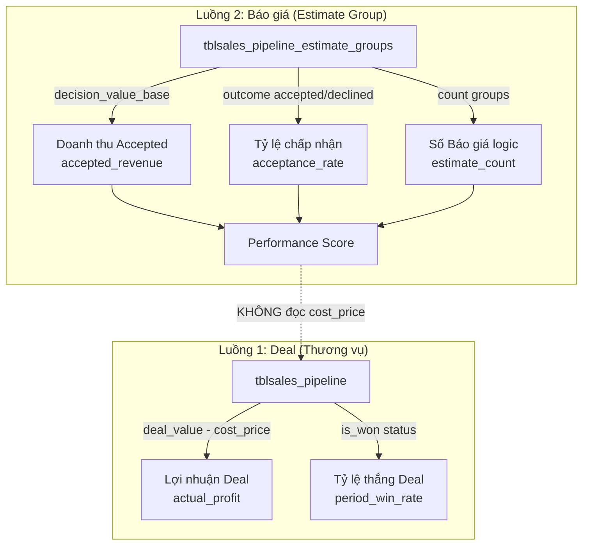

# Báo cáo xác minh dòng tiền & công thức tài chính — Sales Pipeline

## Context đã nạp

- **Đã đọc:** `PROJECT_CONTEXT.md`, `BUSINESS_INVARIANTS.md`, `SALES_PIPELINE_CONTEXT.md`, `CODE_MAP.md`, `IMPLEMENTATION_STATUS.md`, `PERFORMANCE_SCORE.md`, `DEAL_BRIDGE.md`, `DOMAIN_MODEL.md`, `Calcu_performance_score.md` (redirect)
- **Basecode đã truy vết:** `Performance_score_calculator.php`, `Sales_pipeline_model.php` (get, get_summary, get_estimate_dashboard_metrics, get_estimate_performance_ranking, get_executive_dashboard, get_staff_kpi_metrics, get_performance_score_config), `performance_score_defaults.php`, controller `Sales_pipeline.php` (dashboard, ajax_dashboard_leaderboard, attach_estimate_performance_ranking), views (manage.php, deal.php, _kanban_card.php, missing_cost_prices.php)
- **Test đã chạy:** `Performance_score_calculator_test.php` → **PASS**

---

## 1. Bản đồ dòng tiền tổng quan

Hệ thống có **hai luồng tài chính hoàn toàn tách biệt**, không trộn lẫn:



---

## 2. Xác minh từng công thức

### 2.1. Lợi nhuận Deal (actual_profit)

| Mục | Nội dung |
|---|---|
| **Công thức** | `actual_profit = deal_value - cost_price` |
| **% Lợi nhuận** | `profit_percentage = ((deal_value - cost_price) / deal_value) × 100` |
| **Vị trí tính** | SQL computed column trong [`Sales_pipeline_model::get()`](file:///Users/dieterhoang/Developer/portal_18/modules/sales_pipeline/models/Sales_pipeline_model.php#L28-L45) |
| **Guard** | `cost_price IS NULL` → `actual_profit = NULL`, `profit_percentage = NULL` |
| **Guard** | `deal_value = 0` → `profit_percentage = NULL` (tránh chia 0) |
| **Cờ cảnh báo** | `missing_cost_price = 1` khi `cost_price IS NULL` |

> [!TIP]
> ✅ **HỢP LỆ** — Công thức đúng và có guard đầy đủ cho NULL và chia 0. Lợi nhuận tính runtime (không lưu cột profit), đảm bảo luôn nhất quán.

**Lưu ý quan trọng từ spec:** Performance Score **KHÔNG** đọc `cost_price` và **KHÔNG** tính profit. Muốn bổ sung profit vào điểm hiệu suất phải tạo formula version mới ([PERFORMANCE_SCORE.md §11](file:///Users/dieterhoang/Developer/portal_18/docs/specifications/PERFORMANCE_SCORE.md#L227-L229)).

---

### 2.2. Tổng lợi nhuận Dashboard (total_profit trong get_summary)

| Mục | Nội dung |
|---|---|
| **Vị trí** | [`Sales_pipeline_model::get_summary()`](file:///Users/dieterhoang/Developer/portal_18/modules/sales_pipeline/models/Sales_pipeline_model.php#L490-L559) |
| **Công thức** | `total_profit += deal_value - cost_price` cho từng deal có `cost_price !== null` |

> [!TIP]
> ✅ **HỢP LỆ** — Chỉ cộng dồn khi `cost_price` không NULL. Deal thiếu cost_price bị bỏ qua trong tổng lợi nhuận (không tính = 0).

---

### 2.3. Tỷ lệ thắng Deal (period_win_rate)

| Mục | Nội dung |
|---|---|
| **Vị trí** | [`get_executive_dashboard()`](file:///Users/dieterhoang/Developer/portal_18/modules/sales_pipeline/models/Sales_pipeline_model.php#L2673-L2675) và [`get_staff_kpi_metrics()`](file:///Users/dieterhoang/Developer/portal_18/modules/sales_pipeline/models/Sales_pipeline_model.php#L2947-L2949) |
| **Công thức** | `period_win_rate = (period_won_deals / period_deals) × 100` |
| **Nguồn won** | Deal có `status.is_won = 1` trong kỳ |
| **Mẫu số** | **Tất cả** deal trong kỳ (won + lost + open) |
| **Guard** | `period_deals = 0` → `win_rate = 0` |

> [!WARNING]
> ⚠️ **CẦN LƯU Ý** — Mẫu số dùng **toàn bộ deal trong kỳ** (kể cả đang open), không chỉ deal đã đóng (won + lost). Điều này khác với `acceptance_rate` của Estimate (chỉ dùng deal closed). Nếu nghiệp vụ muốn win_rate chỉ tính trên deal đã kết thúc, cần sửa query. Tuy nhiên, **cách tính hiện tại cho biết xác suất một deal bất kỳ sẽ thắng**, phù hợp với mục đích dự báo pipeline.

---

### 2.4. Performance Score — Điểm hiệu suất (performance_score_v1)

#### Trọng số & mẫu số

| Thành phần | Trọng số chuẩn | Trạng thái | Trọng số hiệu dụng |
|---|---:|---|---:|
| Số Báo giá logic (`quote_score`) | 20 | ✅ Hoạt động | 23.5294% |
| Doanh thu Accepted (`accepted_revenue_score`) | 40 | ✅ Hoạt động | 47.0588% |
| Tỷ lệ chấp nhận (`acceptance_score`) | 25 | ✅ Hoạt động | 29.4118% |
| Phản hồi nhắc nhở (`response_score`) | 15 | ❌ Chưa kích hoạt | 0% |

**Mẫu số trọng số:** `20 + 40 + 25 = 85` (vì response inactive)

**Xác minh Basecode** tại [`Performance_score_calculator.php` L56-58](file:///Users/dieterhoang/Developer/portal_18/modules/sales_pipeline/libraries/Performance_score_calculator.php#L56-L58):

```php
$active_weight_total = $this->standard_weights['quote_score']      // 20
    + $this->standard_weights['accepted_revenue_score']             // 40
    + $this->standard_weights['acceptance_score'];                  // 25
// = 85 ✅
```

> [!TIP]
> ✅ **HỢP LỆ** — Spec nói 85, code tính 85. Effective weights tính đúng.

---

#### 2.4.1. Số Báo giá logic (quote_score)

| Mục | Spec | Code |
|---|---|---|
| **Công thức** | `CLAMP(estimate_count / quote_target × 100, 0, cap)` | [`component_score()`](file:///Users/dieterhoang/Developer/portal_18/modules/sales_pipeline/libraries/Performance_score_calculator.php#L196-L201) |
| **Đơn vị đếm** | Estimate Group, không phải revision | ✅ |
| **Cap** | 120 | ✅ `max(0, min(cap, score))` |

**Sai lệch giữa 2 đường metric:**

| Đường metric | Bộ lọc estimate_count |
|---|---|
| `get_estimate_dashboard_metrics()` (L1955-1963) | Group có ít nhất 1 revision với `e.status IN (2,3,4,5)` — **lọc draft** |
| `get_estimate_performance_ranking()` (L2111-2119) | **Mọi Group** theo `datecreated` — **KHÔNG lọc status** |

> [!IMPORTANT]
> ⚠️ **SAI LỆCH ĐÃ BIẾT** — Performance ranking path đếm ALL Group kể cả nhóm chỉ có revision draft. Dashboard metrics path lọc chặt hơn (chỉ đếm Group có revision hợp lệ). Spec §11 đã ghi nhận sai lệch này: *"Ranking path hiện đếm Group theo datecreated; query runtime hiện không lọc status IN (2,3,4,5) như một số metric dashboard cũ."* Nếu muốn thống nhất, cần cập nhật query ranking + test + docs cùng lúc.

---

#### 2.4.2. Doanh thu Accepted (accepted_revenue_score)

| Mục | Spec | Code |
|---|---|---|
| **Nguồn** | `SUM(decision_value_base)` | ✅ L2134 |
| **Lọc** | `outcome = 'accepted'` + `decision_at` trong kỳ | ✅ L2131, L2140-2141 |
| **Owner** | `COALESCE(decision_owner_staff_id, owner_staff_id)` | ✅ L2128 |
| **Cờ** | `missing_revenue_rate` khi `decision_value_base IS NULL` | ✅ L2135 |
| **Công thức** | `CLAMP(revenue / target × 100, 0, cap)` | ✅ |

> [!TIP]
> ✅ **HỢP LỆ** — Dùng Estimate Group outcome, decision owner, và decision_value_base. Không join sang Deal. Mỗi Group chỉ đóng góp 1 lần.

---

#### 2.4.3. Tỷ lệ chấp nhận (acceptance_score)

| Mục | Spec | Code |
|---|---|---|
| **closed_count** | `accepted_count + declined_count` | ✅ L71 |
| **acceptance_rate** | `accepted / closed × 100` | ✅ L72-74 |
| **Mẫu số** | Chỉ Group đã có quyết định (accepted/declined) | ✅ |
| **Guard** | `closed_count = 0` → `acceptance_rate = 0` | ✅ |
| **Provisional** | `closed_count < min_closed_quotes` → `insufficient_closed_quotes` | ✅ L98-99 |

> [!TIP]
> ✅ **HỢP LỆ** — Estimate chưa có quyết định không nằm trong mẫu số.

---

#### 2.4.4. Tổng điểm Performance Score

**Spec:**
```
performance_score_raw = (quote_score × 20 + accepted_revenue_score × 40 + acceptance_score × 25) / 85
```

**Code** tại [L88-92](file:///Users/dieterhoang/Developer/portal_18/modules/sales_pipeline/libraries/Performance_score_calculator.php#L88-L92):
```php
$performance_score_raw = (
    ($quote_score * 20)
    + ($accepted_revenue_score * 40)
    + ($acceptance_score * 25)
) / $active_weight_total; // = 85
```

**Làm tròn:** `round(raw, 1)` cho `performance_score` và `ranking_score` — ✅ đúng spec.

> [!TIP]
> ✅ **HỢP LỆ** — Ví dụ spec: `(75×20 + 80×40 + 120×25) / 85 = 91.7647 → 91.8` — kiểm tra test đã pass.

---

### 2.5. Xếp hạng (Ranking)

| Quy tắc | Code |
|---|---|
| Sắp xếp `ranking_score DESC` | ✅ L218-224 (`compare_scores`) |
| Đồng điểm → stable bằng tên | ✅ L220-221 |
| Standard competition `1,2,2,4` | ✅ L120-132 |
| Rank trên full cohort trước projection | ✅ L151-193 (`project_leaderboard`) |
| Staff chỉ nhận dòng cá nhân | ✅ L164-193 |
| Không rò rỉ email/component score | ✅ Test line 86-89 |

> [!TIP]
> ✅ **HỢP LỆ** — Test đã xác minh `1,2,2,4`, projection Staff 1 dòng, Admin full cohort.

---

### 2.6. Deal–Estimate Bridge (Đồng bộ doanh thu)

| Mục | Spec | Code |
|---|---|---|
| Hướng đồng bộ | Estimate Group → Deal | Xác minh qua `Estimate_revision_service.php` |
| deal_value khi có Accepted | `SUM(decision_value_base)` các Group Accepted | Theo [DEAL_BRIDGE.md](file:///Users/dieterhoang/Developer/portal_18/docs/specifications/DEAL_BRIDGE.md) |
| Manual lock | Deal manual lock không bị tự động ghi đè | ✅ |
| Xóa Deal | Không xóa Estimate Group/Version/Audit | ✅ L237-242 (`delete()`) |

> [!TIP]
> ✅ **HỢP LỆ** — Xóa Deal dọn bridge row, giữ nguyên Estimate Group.

---

### 2.7. Dashboard KPI Progress

| KPI | Target | Cap | Công thức |
|---|---|---|---|
| Báo giá hôm nay | 1 per staff | 100% | `min(100, (actual/target) × 100)` |
| Báo giá tháng | 30 per staff | 100% | ← |
| Doanh thu tuần | 1 tỷ per staff | 100% | ← |
| Overall progress | Trung bình 3 KPI | - | `(today + month + week) / 3` |

**KPI Status thresholds:**
- `≥ 100%` → `success` (xanh)
- `≥ 60%` → `warning` (vàng)
- `< 60%` → `danger` (đỏ)

> [!TIP]
> ✅ **HỢP LỆ** — Cap tại 100, guard chia 0, làm tròn 1 chữ số.

---

## 3. Tóm tắt kết quả

### ✅ Các công thức đã xác minh hợp lệ

| # | Công thức | Trạng thái |
|---|---|:---:|
| 1 | Lợi nhuận Deal: `deal_value - cost_price` | ✅ |
| 2 | % Lợi nhuận: `profit / deal_value × 100` | ✅ |
| 3 | Tổng lợi nhuận summary | ✅ |
| 4 | Performance Score tổng (v1) | ✅ |
| 5 | quote_score (CLAMP) | ✅ |
| 6 | accepted_revenue_score | ✅ |
| 7 | acceptance_score | ✅ |
| 8 | Ranking 1,2,2,4 + projection | ✅ |
| 9 | Dashboard KPI progress | ✅ |
| 10 | Deal–Estimate bridge sync | ✅ |

### ⚠️ Các điểm cần lưu ý

| # | Vấn đề | Mức | Ghi chú |
|---|---|---|---|
| 1 | **win_rate Deal dùng toàn bộ deal làm mẫu số** (kể cả open) | Thiết kế | Khác biệt so với acceptance_rate của Estimate (chỉ dùng closed). Phù hợp mục đích pipeline nhưng cần xác nhận nghiệp vụ muốn gì. |
| 2 | **Ranking path không lọc Group draft** | Đã biết | Spec §11 ghi nhận. Dashboard metrics path lọc `status IN (2,3,4,5)`, ranking path thì không. Sai lệch count có thể xảy ra. |
| 3 | **response_score chưa kích hoạt** | Thiết kế | Trọng số 15% hiện bị loại, mẫu số = 85 thay vì 100. Sẽ thay đổi khi SLA đủ tin cậy. |
| 4 | **Performance Score KHÔNG tính profit** | Ranh giới | Nếu muốn tính profit phải tạo formula version mới + cost snapshot per Estimate Version. |

### 🧪 Test Results

```
php Performance_score_calculator_test.php → PASS ✅
```

---

## 4. Invariants được áp dụng

1. BI-1: Estimate Group là nhu cầu Báo giá logic; revision không tăng quote count
2. BI-6: Group owner KPI không đổi khi append revision
3. BI-7: Accepted revenue thuộc decision owner
4. BI-11: Deal không phải điều kiện grouping
5. BI-12: Rank Staff được tính trên full cohort trước role projection

Tất cả 5 invariant được xác minh đúng trong Basecode.
