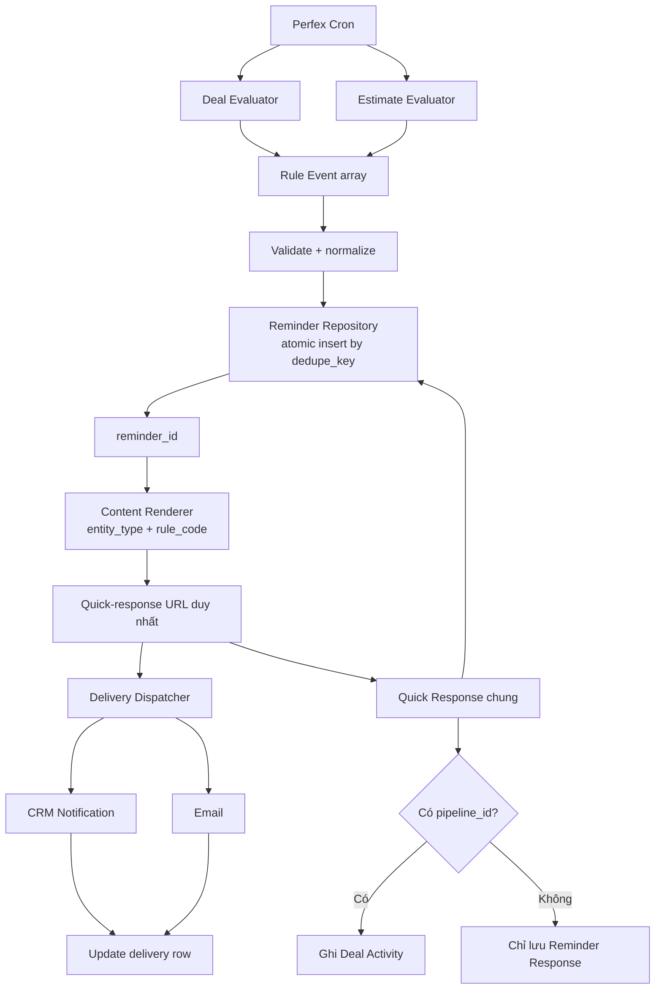
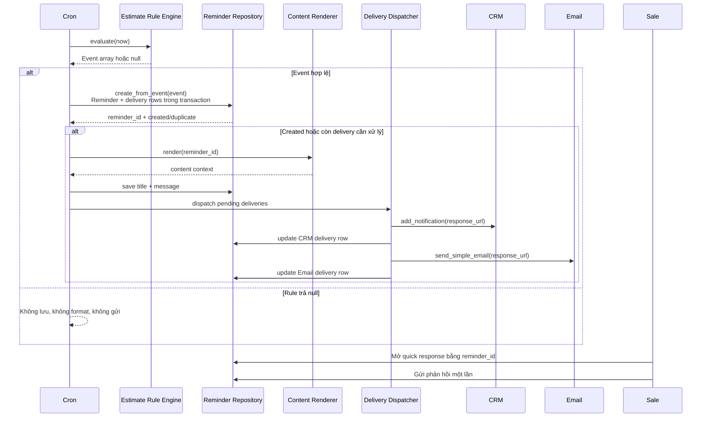

# Core Plan: Reminder Engine dùng chung cho Deal và Báo giá

> **Module**: Sales Pipeline  
> **Tài liệu tham chiếu**:  
> - [workflow_reminder.md](file:///Users/dieterhoang/Developer/portal_18/docs/plans/Sales%20Pipeline/workflow_reminder.md)  
> - [rule_engine.md](file:///Users/dieterhoang/Developer/portal_18/docs/plans/Sales%20Pipeline/rule_engine.md)  
> **Phiên bản kế hoạch**: 2.2  
> **Cập nhật lần cuối**: 2026-08-12

> **Trạng thái triển khai**: Đây là tài liệu **To-Be**. Basecode hiện vẫn dùng schema Deal-only trong `install.php`; các cột Reminder mới và bảng Delivery dưới đây là migration Giai đoạn 1, chưa tồn tại trong code hiện tại.

---

## 1. Mục tiêu và quyết định kiến trúc

Mục tiêu V1 là đưa rule Deal hiện có và ba rule Báo giá vào cùng một vòng đời:

```text
Deal Rule ──────┐
                ├──> Reminder Record chung
Estimate Rule ──┘             │
                              ├──> Format theo entity_type/rule_code
                              ├──> Dispatcher gửi CRM/Email
                              └──> Quick Response chung
```

Các quyết định bắt buộc:

1. Tái sử dụng và mở rộng `tblsales_pipeline_reminders_log` làm **Reminder Repository duy nhất**.
2. Rule Event là payload chuẩn hóa trong bộ nhớ. Event hợp lệ được lưu trực tiếp thành Reminder Record; không tạo bảng `rule_events`.
3. Tạo một bảng con `tblsales_pipeline_reminder_deliveries` dùng chung cho CRM, Email và WhatsApp. Một dòng đại diện cho một kênh/người nhận; retry cập nhật cùng dòng.
4. Không tạo bảng `tblsales_pipeline_manager_alerts`. Manager là một loại người nhận trong delivery, không phải một bản sao khác của Reminder Event.
5. Chỉ dùng rule `if-else` trong `rule_engine.md`; không triển khai weighted score, prorate, prediction hoặc rule DSL.
6. Giữ một cặp route phản hồi chung cho cả Deal và Báo giá:
   - `GET /admin/sales_pipeline/reminder_response/{reminder_id}`
   - `POST /admin/sales_pipeline/respond_reminder/{reminder_id}`
7. Dùng layout phản hồi chung, nhưng context và content riêng theo `entity_type`/`rule_code`.
8. Giữ tương thích dữ liệu reminder Deal hiện có trong quá trình migration.

### 1.1 Phạm vi V1

Trong phạm vi:

- Reminder Deal đang mở và đến tần suất nhắc.
- `ESTIMATE_DAILY_MIN_COUNT`.
- `ESTIMATE_MONTHLY_MIN_COUNT` tại `D10`, `D20`, `FINAL`.
- `ESTIMATE_WEEKLY_MIN_REVENUE` tại `MIDWEEK`, `FINAL`.
- `ESTIMATE_ACCEPTED_VALUE_MISSING` dành cho Admin, không yêu cầu Sale phản hồi.
- Năm Estimate Lifecycle Rule cho một Báo giá cụ thể: Draft lâu, Sent im lặng/sắp hết hạn, Declined gần đây, Expired và Accepted chưa xuất hóa đơn.
- CRM Notification, Email, quick response và audit trạng thái gửi cơ bản.

Ngoài phạm vi:

- KPI trọng số, xếp hạng hiệu suất và tuyên dương.
- WhatsApp provider adapter, webhook và manager digest được triển khai sau khi CRM/Email ổn định; schema delivery được chuẩn bị ngay để không phải chuyển đổi từ JSON.
- UI rule builder, JSON expression hoặc rule DSL.
- Bảng Rule Event hoặc Manager Alert riêng.
- Retry tự động phức tạp; V1 chỉ lưu lỗi để Cron sau hoặc Admin có thể xử lý ở giai đoạn kế tiếp.

---

## 2. Đánh giá basecode hiện tại

| Thành phần | Hiện trạng | Kết luận |
|---|---|---|
| Deal evaluator | `process_weekly_reminders()` lọc status, toggle và frequency | Tái sử dụng điều kiện; đổi đầu ra thành Event payload |
| Reminder record | `tblsales_pipeline_reminders_log` bắt buộc `pipeline_id` | Mở rộng thành repository chung; cho phép `pipeline_id = NULL` |
| CRM | `add_notification()` được gọi trực tiếp trong `send_reminder()` | Bọc trong dispatcher chung |
| Email | `reminder.php` chỉ trình bày dữ liệu Deal | Giữ layout email; thêm content context theo rule |
| Quick response | Route/view/model phụ thuộc Deal tồn tại | Tổng quát hóa để Estimate reminder không cần Deal |
| Response lock | Transaction + `SELECT ... FOR UPDATE` đã có | Tái sử dụng |
| Deal activity | Phản hồi luôn gọi `add_activity()` | Chỉ gọi khi reminder có `pipeline_id` |
| Estimate label | `get_reminder_context()` đổi nhãn khi Deal có `estimate_id` | Đây chưa phải Estimate Rule workflow |
| Channel selection | CRM luôn gửi; Email gửi nếu có địa chỉ | Chưa đọc `channels`; cần dispatcher |
| Delivery audit | `reminder_type = email`, không phản ánh hai kênh | Tạo bảng con delivery dùng chung cho CRM/Email/WhatsApp |
| Rule dedupe | Chưa có unique key | Bổ sung `dedupe_key` unique |

---

## 3. Backend target-state



### 3.1 Trách nhiệm từng lớp

| Thành phần | Trách nhiệm | Không được làm |
|---|---|---|
| Evaluator | Đọc dữ liệu, chạy `if-else`, trả Event array hoặc `null` | Không insert reminder, không gửi kênh |
| Reminder Repository | Validate, atomic insert Reminder + delivery rows, dedupe, đọc/cập nhật reminder và response | Không tính lại rule, không format nội dung |
| Context Builder | Chuyển Reminder Record + snapshot thành context hiển thị | Không query lại để thay đổi snapshot nghiệp vụ |
| Content Renderer | Tạo title, CRM text, email data và response prompts | Không gửi kênh |
| Delivery Dispatcher | Gửi các delivery `pending` và cập nhật delivery row | Không quyết định rule, người nhận hoặc kênh |
| Quick Response | Kiểm tra quyền, hiển thị context, khóa và lưu một phản hồi | Không bắt buộc Estimate reminder phải có Deal |

### 3.2 Cấu trúc file đề xuất

```text
modules/sales_pipeline/
├── includes/
│   └── reminder_schema.php
├── libraries/
│   ├── Reminder_repository.php
│   ├── Reminder_delivery_repository.php
│   ├── Reminder_context_builder.php
│   ├── Reminder_content_renderer.php
│   ├── Reminder_dispatcher.php
│   └── Reminder_rule_engine.php
├── views/
│   ├── reminder_response.php
│   ├── partials/reminders/
│   │   ├── deal_context.php
│   │   ├── estimate_daily_context.php
│   │   ├── estimate_monthly_context.php
│   │   ├── estimate_weekly_revenue_context.php
│   │   ├── estimate_lifecycle_context.php
│   │   └── data_quality_context.php
│   └── emails/
│       └── reminder.php
├── models/Sales_pipeline_model.php
└── controllers/Sales_pipeline.php
```

Không bắt buộc tạo một class cho từng rule. `Reminder_rule_engine.php` có thể chứa ba evaluator Estimate dưới dạng ba method độc lập để giữ KISS.

---

## 4. Reminder Repository dùng chung

### 4.1 Mở rộng bảng Reminder hiện có

Mở rộng `tblsales_pipeline_reminders_log` bằng migration idempotent:

| Cột | Kiểu gợi ý | Mục đích |
|---|---|---|
| `pipeline_id` | `INT NULL` | Deal liên quan; `NULL` với rule tổng hợp Báo giá |
| `rule_code` | `VARCHAR(80) NOT NULL` | Xác định renderer và nguồn rule |
| `entity_type` | `VARCHAR(40) NOT NULL` | `deal`, `staff_estimate_period` hoặc `estimate` |
| `entity_id` | `INT NULL` | Deal ID khi là `deal`; Estimate ID khi là `estimate`; `NULL` với reminder tổng hợp theo kỳ |
| `period_key` | `VARCHAR(20) NOT NULL` | `YYYY-MM-DD`, `YYYY-MM` hoặc `YYYY-Www` |
| `checkpoint` | `VARCHAR(20) NOT NULL` | `FREQUENCY`, `FINAL`, `D10`, `D20`, `MIDWEEK` |
| `severity` | `VARCHAR(20) NOT NULL` | `info`, `warning`, `critical` |
| `response_required` | `TINYINT(1) NOT NULL DEFAULT 1` | `0`: chỉ thông báo; `1`: bắt buộc Sale phản hồi |
| `snapshot_json` | `LONGTEXT NOT NULL` | Số liệu bất biến tại thời điểm evaluate |
| `dedupe_key` | `VARCHAR(191) NULL` | Khóa chống tạo trùng; unique với reminder mới |
| `title` | `VARCHAR(255) NULL` | Tiêu đề đã render để audit ổn định |
| `message` | `TEXT NULL` | Nội dung text đã render; đổi nullable để insert record trước khi sinh URL |
| `created_at` | `DATETIME NOT NULL` | Thời điểm tạo Reminder Record |
| `sent_at` | `DATETIME NULL` | Thời điểm kênh đầu tiên gửi thành công; đổi từ ý nghĩa legacy |

Giữ các cột hiện tại `staff_id`, `staff_response`, `responded_at`. `reminder_type` được giữ để tương thích nhưng không còn là nguồn sự thật về delivery.

Index tối thiểu:

```sql
UNIQUE KEY uq_sales_pipeline_reminder_dedupe (dedupe_key)
KEY idx_reminder_staff_period (staff_id, period_key)
KEY idx_reminder_rule_period (rule_code, period_key)
```

MySQL cho phép nhiều giá trị `NULL` trong unique index. Reminder legacy có thể giữ `dedupe_key = NULL`; reminder mới bắt buộc có key.

### 4.2 Backfill dữ liệu Deal cũ

Migration phải:

1. Đổi `pipeline_id` thành nullable mà không xóa dữ liệu.
2. Gán record cũ:
   - `rule_code = DEAL_FREQUENCY_REMINDER`
   - `entity_type = deal`
   - `entity_id = pipeline_id`
   - `period_key = DATE(sent_at)`
   - `checkpoint = FREQUENCY`
   - `severity = warning`
   - `response_required = 1`
   - `snapshot_json` chứa tối thiểu `legacy = true`, `pipeline_id` và `evaluated_at = sent_at`
3. Giữ `dedupe_key = NULL` cho record cũ vì không đủ dữ liệu tái tạo chính xác occurrence key.
4. Backfill `created_at = sent_at` cho record cũ; giữ nguyên `message`, `staff_response`, `responded_at` và `sent_at`.

Thứ tự migration an toàn:

1. Thêm các cột mới ở trạng thái nullable.
2. Backfill toàn bộ record legacy theo các giá trị trên.
3. Kiểm tra không còn `NULL` ngoài các cột được phép.
4. Mới đổi các cột bắt buộc sang `NOT NULL` và tạo index.
5. Chạy lại migration lần hai để xác nhận idempotent.

### 4.3 Repository API

```php
create_from_event(array $event): array
find(int $reminderId): ?array
save_rendered_content(int $reminderId, array $content): bool
submit_response(int $reminderId, int $staffId, string $response): array
```

`create_from_event()` phải resolve người nhận, mở transaction, insert Reminder và materialize toàn bộ delivery rows trước khi commit. Nếu một bước thất bại thì rollback toàn bộ. Nó bắt duplicate-key exception, load Reminder hiện có theo `dedupe_key` và trả `reminder_id` với trạng thái `duplicate`; không dùng riêng `SELECT` rồi `INSERT` vì có race condition.

`duplicate` không đồng nghĩa đã gửi xong. Orchestrator phải resume cùng Reminder Record: render nếu `title/message` còn thiếu và dispatch mọi delivery còn `pending/failed` theo chính sách retry. Quy tắc này phục hồi trường hợp process dừng sau commit nhưng trước khi gửi.

### 4.4 Bảng Delivery dùng chung

Tạo `tblsales_pipeline_reminder_deliveries` làm bảng con của Reminder Repository:

| Cột | Kiểu gợi ý | Mục đích |
|---|---|---|
| `id` | `BIGINT PK AI` | Delivery ID |
| `reminder_id` | `INT NOT NULL` | Tham chiếu `tblsales_pipeline_reminders_log.id` |
| `channel` | `VARCHAR(20) NOT NULL` | `crm`, `email`, `whatsapp` |
| `recipient_type` | `VARCHAR(20) NOT NULL` | `staff`, `manager`, `admin` |
| `recipient_key` | `VARCHAR(191) NOT NULL` | Staff ID, email hoặc WhatsApp destination đã chuẩn hóa |
| `status` | `VARCHAR(20) NOT NULL` | `pending`, `sent`, `failed`, `skipped`, `delivered`, `read` |
| `attempt_count` | `INT NOT NULL DEFAULT 0` | Tổng số lần attempt |
| `provider_message_id` | `VARCHAR(191) NULL` | ID từ Email/WhatsApp provider nếu có |
| `last_error` | `VARCHAR(500) NULL` | Mã/lỗi gần nhất, không lưu payload nhạy cảm |
| `next_retry_at` | `DATETIME NULL` | Thời điểm retry tiếp theo |
| `sent_at` | `DATETIME NULL` | Gửi thành công |
| `delivered_at` | `DATETIME NULL` | Provider xác nhận delivered |
| `read_at` | `DATETIME NULL` | Provider xác nhận read |
| `created_at` | `DATETIME NOT NULL` | Thời điểm materialize delivery |
| `updated_at` | `DATETIME NULL` | Thời điểm cập nhật cuối |

Index tối thiểu:

```sql
UNIQUE KEY uq_reminder_channel_recipient
    (reminder_id, channel, recipient_type, recipient_key)
KEY idx_delivery_worker (status, next_retry_at)
KEY idx_delivery_reminder (reminder_id)
KEY idx_delivery_provider (provider_message_id)
```

Không tạo dòng mới cho mỗi retry; worker khóa và cập nhật cùng một delivery row. Bảng này vừa là audit log cho CRM/Email, vừa đóng vai trò outbox cho WhatsApp `pending`. Không cần `tblsales_pipeline_manager_alerts` vì rule/severity/snapshot đã nằm ở Reminder Record.

---

## 5. Rule Event contract

Rule Event không cần bảng riêng. Đây là mảng/JSON chuẩn chuyển từ evaluator sang repository:

```json
{
  "rule_code": "ESTIMATE_DAILY_MIN_COUNT",
  "entity_type": "staff_estimate_period",
  "entity_id": null,
  "pipeline_id": null,
  "staff_id": 7,
  "period_key": "2026-08-12",
  "checkpoint": "FINAL",
  "severity": "warning",
  "response_required": true,
  "recipient_policy": ["staff"],
  "channels": ["crm", "email"],
  "dedupe_key": "ESTIMATE_DAILY_MIN_COUNT:7:2026-08-12:FINAL",
  "snapshot": {
    "actual_count": 0,
    "required_count": 1,
    "evaluated_at": "2026-08-12 15:00:00"
  }
}
```

### 5.1 Validation trước khi lưu

- `rule_code` thuộc allow-list.
- `entity_type` chỉ là `deal`, `staff_estimate_period` hoặc `estimate` trong V1.
- `staff_id` tồn tại và active.
- Deal event bắt buộc có `pipeline_id`/`entity_id` hợp lệ.
- Estimate period event bắt buộc `pipeline_id = NULL`.
- Estimate lifecycle event bắt buộc `entity_id = tblestimates.id`; `pipeline_id` chỉ có giá trị khi có Deal liên kết hợp lệ, không tạo Deal giả.
- `period_key` và `checkpoint` đúng format của rule.
- `recipient_policy` chỉ nhận giá trị do server cấu hình; các rule yêu cầu Sale phản hồi dùng `["staff"]`.
- `channels` V1 chỉ chứa `crm`, `email` và không trùng.
- Snapshot có đủ key bắt buộc cho rule.
- `dedupe_key` được tạo server-side. Estimate period dùng:

```text
rule_code + staff_id + period_key + checkpoint
```

Deal phải thêm entity để nhiều Deal của cùng một Staff không triệt tiêu lẫn nhau:

```text
rule_code + staff_id + entity_type + entity_id + period_key + checkpoint
```

Estimate lifecycle dùng timestamp bắt đầu occurrence thay cho checkpoint kỳ:

```text
rule_code + staff_id + entity_type + estimate_id + condition_since
```

Không nhận `dedupe_key`, recipient hoặc channel tùy ý từ request HTTP.

### 5.2 Snapshot bắt buộc theo rule

| Rule | Snapshot tối thiểu |
|---|---|
| `DEAL_FREQUENCY_REMINDER` | `deal_id`, `deal_name`, `customer_name`, `status_name`, `deal_value`, `deal_date`, `evaluated_at` |
| `ESTIMATE_DAILY_MIN_COUNT` | `actual_count`, `required_count`, `evaluated_at` |
| `ESTIMATE_MONTHLY_MIN_COUNT` | `actual_count`, `required_count`, `today_count`, `checkpoint`, `evaluated_at` |
| `ESTIMATE_WEEKLY_MIN_REVENUE` | `accepted_revenue`, `required_revenue`, `remaining_revenue`, `evaluated_at` |
| `ESTIMATE_ACCEPTED_VALUE_MISSING` | `estimate_group_id`, `estimate_number`, `evaluated_at` |
| Estimate lifecycle | `estimate_id`, `estimate_number`, `customer_id`, `customer_name`, `estimate_status`, `status_label`, `risk_reason`, `condition_since`, `datecreated`, `datesend`, `expirydate`, `invoiceid`, `evaluated_at` |

Khi doanh thu accepted tuần đã đạt `>= 1.000.000.000`, evaluator trả `null`; không tạo Reminder Record, không render và không dispatch.

---

## 6. Context và content renderer

### 6.1 Nguyên tắc

Renderer chọn nội dung bằng `rule_code`, không suy luận nội dung từ tên bảng hoặc trạng thái hiện tại. Số liệu hiển thị phải lấy từ `snapshot_json`, không chạy lại query vì dữ liệu có thể đã thay đổi sau thời điểm kích hoạt.

Renderer trả một cấu trúc chung:

```php
[
    'title'            => '...',
    'crm_description'  => 'sales_pipeline_rule_reminder',
    'crm_data'         => ['...'],
    'email_subject'    => '...',
    'summary'          => '...',
    'facts'            => [['label' => '...', 'value' => '...']],
    'response_prompts' => ['...', '...'],
    'primary_url'      => $responseUrl,
    'secondary_url'    => $entityUrl,
]
```

Mọi dữ liệu động phải được escape tại lớp view phù hợp. Không lưu HTML không tin cậy vào snapshot.

### 6.2 Nội dung riêng theo rule

| Rule | Nội dung chính | Câu hỏi phản hồi |
|---|---|---|
| Deal | Deal, khách hàng, trạng thái, giá trị, ngày kỳ vọng | Đã làm gì, hành động tiếp theo, cần hỗ trợ gì |
| Daily Estimate | Hôm nay đạt `actual/required` Báo giá | Vì sao chưa đạt và sẽ xử lý gì trước cuối ngày |
| Monthly Estimate | Tháng đạt `actual/required`, checkpoint hiện tại | Nguyên nhân chậm và kế hoạch bù sản lượng |
| Weekly Revenue | Accepted revenue đạt `actual/1 tỷ`, còn thiếu bao nhiêu | Deal/Báo giá nào có thể chốt và cần hỗ trợ gì |
| Estimate Draft/Expired | Số Báo giá, khách hàng, trạng thái và lý do cảnh báo | Không hỏi; chỉ CTA `Đi tới Báo giá` |
| Estimate Sent/Declined | Số Báo giá, khách hàng, thời gian im lặng/từ chối | Bắt buộc nêu lý do và kế hoạch follow-up |
| Estimate Accepted chưa Invoice | Số Báo giá, khách hàng, thời điểm accepted | Bắt buộc nêu kế hoạch xuất hóa đơn hoặc vướng mắc |
| Data quality | Estimate group thiếu giá trị quyết định | Không có form Sale; hướng Admin sửa dữ liệu |

### 6.3 Template

- Giữ [reminder.php](file:///Users/dieterhoang/Developer/portal_18/modules/sales_pipeline/views/emails/reminder.php) làm email layout chung.
- Layout chỉ render các trường chuẩn `title`, `summary`, `facts`, CTA và link phụ.
- Nội dung rule nằm trong renderer/language key, không nhồi nhiều nhánh nghiệp vụ vào template.
- CRM dùng một description key chung và `additional_data` đã chuẩn hóa.
- Quick response dùng một shell chung và partial context theo `rule_code`.

---

## 7. Quick Response chung

### 7.1 Route và quyền

Giữ nguyên route hiện tại:

```text
GET  /admin/sales_pipeline/reminder_response/{reminder_id}
POST /admin/sales_pipeline/respond_reminder/{reminder_id}
```

Quyền V1:

- Staff được nhắc có quyền xem và gửi phản hồi nếu `response_required = 1`.
- Admin/người có quyền quản lý được xem.
- Chỉ Staff được nhắc gửi câu trả lời thay mặt chính họ; Manager/Admin không ghi đè phản hồi của Sale.
- Reminder `response_required = 0` hiển thị read-only và không nhận POST.

### 7.2 Load context

`get_reminder_log()` hiện tại phải được thay bằng repository lookup rồi phân nhánh:

```php
$reminder = $repository->find($reminderId);

if ($reminder['entity_type'] === 'deal') {
    $context = $contextBuilder->buildDeal($reminder);
} else {
    $context = $contextBuilder->buildEstimatePeriod($reminder);
}
```

- Deal reminder có thể bổ sung link đến Deal nếu Deal còn tồn tại.
- Estimate period reminder không join hoặc kiểm tra `tblsales_pipeline`.
- Xóa điều kiện chung `deal_exists` khỏi controller đối với Estimate reminder.

### 7.3 Lưu phản hồi

Giữ transaction và `SELECT ... FOR UPDATE`:

1. Lock Reminder Record.
2. Kiểm tra owner, `response_required`, nội dung và trạng thái chưa phản hồi.
3. Ghi `staff_response`, `responded_at`.
4. Nếu có `pipeline_id`, gọi `add_activity()` cho Deal.
5. Nếu không có `pipeline_id`, không gọi `add_activity()`; Reminder Record là nguồn lưu vết chính.
6. Commit và trả trạng thái chuẩn.

View [reminder_response.php](file:///Users/dieterhoang/Developer/portal_18/modules/sales_pipeline/views/reminder_response.php) giữ header, badge, form và trạng thái chung; phần context được include từ partial tương ứng.

### 7.4 Contract UI theo `response_required`

`response_required` là nguồn sự thật duy nhất quyết định form phản hồi; view không hard-code theo tên rule:

| Giá trị | Loại | Hành vi Quick Response | Trạng thái Dashboard |
|---:|---|---|---|
| `0` | Informational | Không render `<textarea>` và không nhận POST; hiển thị cảnh báo cùng nút `Đi tới Báo giá` | `Đã thông báo`, không treo `Pending` phản hồi |
| `1` | Actionable | Render `<textarea required maxlength="2000">`; POST rỗng trả `422`; CTA chính `Gửi phản hồi` | `Pending` cho đến khi `staff_response IS NOT NULL` |

Ánh xạ lifecycle V1:

```text
ESTIMATE_DRAFT_TOO_LONG             -> response_required = 0
ESTIMATE_EXPIRED                    -> response_required = 0
ESTIMATE_SENT_NO_RESPONSE           -> response_required = 1
ESTIMATE_DECLINED_RECENT            -> response_required = 1
ESTIMATE_ACCEPTED_NOT_INVOICED      -> response_required = 1
```

`Accepted chưa xuất hóa đơn` được phân loại Actionable vì hệ thống cần biết kế hoạch xuất hóa đơn hoặc vướng mắc. Nếu nghiệp vụ sau này chỉ muốn thông báo, thay đổi thuộc Event policy mà không cần sửa layout.

CTA `Đi tới Báo giá` được tạo server-side từ `entity_id` và chỉ hiển thị khi người dùng có quyền xem/sửa Estimate. Không nhận redirect URL từ request hoặc `snapshot_json`.

---

## 8. Delivery Dispatcher và delivery log chung

### 8.1 Materialize kênh và người nhận

Trước khi commit Reminder Record, workflow đọc `channels` và `recipient_policy` từ Event đã được server validate, giải quyết thành danh sách delivery cụ thể rồi insert idempotent trong cùng transaction:

```php
foreach ($resolvedRecipients as $recipient) {
    foreach ($channels as $channel) {
        $deliveryRepository->createPending(
            $reminder['id'],
            $channel,
            $recipient
        );
    }
}
```

Rule mặc định:

- Deal: `crm`, `email`.
- Daily/Monthly/Weekly Estimate: `crm`, `email`.
- Email chỉ attempt khi Staff có email hợp lệ; nếu thiếu, ghi `skipped` với lý do.
- Data quality: CRM cho Admin/role cấu hình; không sinh quick response bắt buộc.

Key người nhận dùng dạng `role:id`, cho phép mở rộng mà không đổi schema. Trong V1, reminder yêu cầu phản hồi chỉ gửi cho `staff:{staff_id}`. Manager escalation chỉ được bật sau khi có nguồn mapping Manager rõ ràng; Manager xem read-only và không phản hồi thay Sale.

### 8.2 Gửi và cập nhật trạng thái

```php
foreach ($deliveryRepository->pendingForReminder($reminder['id']) as $delivery) {
    $result = $this->sendChannel($delivery, $reminder, $content);
    $deliveryRepository->recordResult($delivery['id'], $result);
}
```

- CRM/Email V1 dùng `pending`, `sent`, `failed`, `skipped`.
- WhatsApp có thể chuyển tiếp sang `delivered`, `read` khi provider webhook xác nhận.
- Không suy diễn `delivered/read` cho `add_notification()` hoặc `send_simple_email()` nếu không có receipt đáng tin cậy.
- `provider_message_id` là khóa đối soát webhook, không phải dedupe key nghiệp vụ.

### 8.3 Quy tắc lỗi

- CRM lỗi không ngăn Email được thử gửi và ngược lại.
- Luôn cập nhật delivery row ngay sau attempt.
- Không đánh dấu một kênh `sent` nếu adapter trả thất bại.
- Reminder Record vẫn tồn tại khi mọi delivery lỗi để audit và retry sau.
- `last_reminder_sent` của Deal chỉ cập nhật khi có ít nhất một kênh `sent`.
- V1 không tự retry trong cùng lượt Cron; dedupe ngăn tạo reminder khác cho cùng event. Retry cập nhật cùng delivery row thuộc cùng `reminder_id`.

Khi triển khai WhatsApp, worker claim các delivery `channel = whatsapp AND status IN (pending, failed)` bằng transaction/row lock, gọi provider rồi cập nhật cùng dòng. Nhờ vậy lỗi API ngoài không chặn Cron Rule Engine.

---

## 9. Luồng end-to-end cho Event Báo giá



Thứ tự bắt buộc:

1. Rule tạo Event JSON chuẩn.
2. Resolve người nhận; repository tạo Reminder Record và delivery rows trong cùng transaction rồi trả `reminder_id`. Nếu dedupe, load record hiện có.
3. Sinh duy nhất một URL `/admin/sales_pipeline/reminder_response/{reminder_id}`.
4. Renderer được chọn theo `rule_code` và format từ snapshot đã lưu.
5. Dispatcher xử lý các delivery `pending`; record duplicate được resume nếu còn việc chưa hoàn tất.
6. Mỗi kênh/người nhận có một delivery row; retry cập nhật cùng dòng.
7. Phản hồi của Sale gắn với Reminder Record; chỉ ghi Deal Activity khi có Deal.

---

## 10. Kế hoạch triển khai tuyến tính

### Giai đoạn 1 — Schema và Repository

1. Tạo `includes/reminder_schema.php` với migration idempotent.
2. Mở rộng và backfill `tblsales_pipeline_reminders_log` theo mục 4.
3. Tạo `tblsales_pipeline_reminder_deliveries` và các unique/index theo mục 4.4.
4. Tạo `Reminder_repository.php` và `Reminder_delivery_repository.php`.
5. Viết kiểm thử atomic dedupe, delivery materialization, legacy lookup và Estimate reminder có `pipeline_id = NULL`.

**Gate**: Chưa nối Cron cho đến khi record legacy và record mới đều đọc được.

### Giai đoạn 2 — Rule Event và Evaluator

1. Đổi Deal evaluator để trả `DEAL_FREQUENCY_REMINDER` event thay vì gọi gửi trực tiếp.
2. Viết ba Estimate evaluator theo `rule_engine.md`.
3. Viết năm lifecycle evaluator cho `entity_type = estimate`, bao gồm nguồn `declined_at` và precedence Expired trước Sent.
4. Viết query đếm Estimate group và accepted revenue không trùng revision.
5. Áp dụng checkpoint 15:00 cho Daily/Monthly và 16:30 cho Weekly; lifecycle được quét mỗi Cron và dựa vào dedupe occurrence.
6. Áp dụng quy tắc Monthly triệt tiêu Daily cùng lượt quét.
7. Khi Weekly revenue đạt từ 1 tỷ, trả `null`.

**Gate**: Evaluator test chỉ kiểm tra Event/null; không có side effect delivery.

### Giai đoạn 3 — Context và Renderer

1. Tạo context builder cho Deal và Estimate period.
2. Tạo renderer allow-list theo `rule_code`.
3. Chuẩn hóa email layout `reminder.php`.
4. Thêm language keys tiếng Việt/Anh cho từng rule.
5. Lưu `title`/`message` đã render vào reminder để audit không thay đổi theo dữ liệu sau này.

**Gate**: Snapshot mẫu của mỗi rule render được CRM text, Email context và response prompts; lifecycle informational không có textarea.

### Giai đoạn 4 — Dispatcher

1. Bọc `add_notification()` thành CRM channel adapter nội bộ.
2. Bọc `send_simple_email()` thành Email channel adapter nội bộ.
3. Materialize các cặp kênh/người nhận từ Event vào delivery table bằng atomic insert.
4. Cập nhật delivery row sau từng attempt.
5. Chỉ cập nhật `last_reminder_sent` cho Deal khi ít nhất một kênh thành công.

**Gate**: Email lỗi không ngăn CRM; CRM lỗi không ngăn Email; không tạo reminder trùng.

### Giai đoạn 5 — Quick Response chung

1. Tổng quát hóa repository lookup, bỏ ràng buộc `deal_exists` cho Estimate reminder.
2. Tách view thành shell chung và context partial.
3. Giữ transaction/row lock và giới hạn 2.000 ký tự.
4. Deal response ghi thêm Activity Feed.
5. Estimate response chỉ gắn Reminder Record.
6. Record không yêu cầu response phải read-only.

**Gate**: Cùng route xử lý được Deal, Estimate period và Estimate lifecycle; POST bị từ chối khi `response_required = 0`.

### Giai đoạn 6 — Cron integration và hardening

1. Cron gọi Deal và Estimate evaluators.
2. Với mỗi Event: create → render → dispatch.
3. Ghi log lỗi có `reminder_id`, `rule_code`, channel; không log snapshot nhạy cảm đầy đủ.
4. Thêm batch limit để một lượt Cron không gửi không giới hạn.
5. Chạy migration trên bản sao DB và kiểm tra reminder Deal cũ.

---

## 11. Ma trận kiểm thử

| Nhóm | Ca kiểm thử bắt buộc |
|---|---|
| Repository | Atomic duplicate key; legacy record; pipeline nullable; JSON lỗi bị từ chối |
| Recovery | Dừng sau commit nhưng trước render/send; Cron sau load theo dedupe và resume đúng reminder/delivery |
| Daily | 0/1 sau 15:00 tạo event; 1/1 không tạo; trước 15:00 không tạo; cuối tuần không tạo |
| Monthly | D10, D20, FINAL; checkpoint rơi cuối tuần; Monthly triệt tiêu Daily |
| Weekly | MIDWEEK = 0; FINAL < 1 tỷ; đạt đúng/vượt 1 tỷ trả `null` |
| Lifecycle | Draft >3 ngày; Sent >3 ngày; Sent sắp hết hạn; Declined trong/ngoài 7 ngày; Expired status/date; Accepted thiếu/có invoice |
| Lifecycle precedence | Sent đã quá expiry chỉ tạo `ESTIMATE_EXPIRED`; một lượt quét không tạo hai lifecycle reminders cho cùng Estimate |
| Grouping | Revision không tăng count; draft-only không được tính |
| Renderer | Mỗi rule có title, facts, prompts đúng snapshot; escape dữ liệu động |
| Dispatcher | CRM/Email success, failure, skipped; một kênh lỗi không chặn kênh còn lại |
| Delivery | Unique theo reminder/kênh/người nhận; retry không sinh dòng mới; worker chỉ claim dòng đủ điều kiện |
| Quick response | Owner submit một lần; người khác bị chặn; Admin view-only; `response_required=0` không textarea/POST; `response_required=1` bắt buộc textarea |
| Deal | Phản hồi ghi Reminder + Activity; Deal bị xóa vẫn xem được snapshot nhưng không ghi Activity |
| Estimate | Không cần `pipeline_id`; phản hồi lưu thành công; không gọi `add_activity()` |
| Security | Không sửa recipient/channels từ HTTP; CSRF; IDOR; giới hạn 2.000 ký tự |

---

## 12. Tiêu chí nghiệm thu tổng thể

1. Deal và Estimate Rule cùng tạo record trong `tblsales_pipeline_reminders_log`.
2. Không tạo bảng Rule Event hoặc Manager Alert; chỉ tạo một bảng Delivery con phục vụ mọi kênh.
3. Một `dedupe_key` chỉ tạo tối đa một Reminder Record.
4. Rule Engine không gửi CRM/Email trực tiếp.
5. Renderer không tính lại điều kiện rule và chỉ dùng snapshot đã lưu.
6. CRM và Email nhận cùng một `reminder_id` và cùng quick-response URL.
7. Kết quả từng kênh/người nhận được lưu độc lập trong `tblsales_pipeline_reminder_deliveries`.
8. Một kênh lỗi không ngăn kênh còn lại được attempt.
9. Cùng route phản hồi xử lý được Deal và Estimate period reminder.
10. Estimate reminder không cần `pipeline_id` hoặc một Deal giả.
11. Phản hồi Deal được ghi thêm vào Activity Feed; phản hồi Estimate được giữ tại Reminder Record.
12. Reminder legacy tiếp tục đọc được sau migration.
13. Không còn weighted KPI, prorate hoặc rule catalog ngoài `rule_engine.md` trong kế hoạch V1.
14. Khi doanh thu tuần đạt từ 1 tỷ, không có reminder record, delivery hoặc quick-response link được tạo.
15. Lifecycle reminder dùng `entity_type = estimate`, `entity_id = Estimate ID` và không bắt buộc có Deal.
16. Draft/Expired là informational; Sent/Declined/Accepted-not-invoiced là actionable.
17. Lifecycle snapshot đủ dữ liệu để Dashboard render khách hàng và lịch sử mà không tái dựng trạng thái quá khứ.

---

## 13. Rủi ro và quyết định hoãn

| Rủi ro | Xử lý V1 | Khi nào cần nâng cấp |
|---|---|---|
| Delivery table tăng theo số kênh/người nhận | Một dòng cho mỗi cặp; retry cập nhật cùng dòng; áp dụng retention/index | Khi dữ liệu vận hành cho thấy cần archive/partition |
| CRM/Email không có receipt delivered/read | Chỉ dùng `sent/failed/skipped` | WhatsApp chỉ dùng `delivered/read` khi provider webhook xác nhận |
| Manager escalation chưa có mapping chuẩn | Chưa đưa vào dispatcher V1 | Khi xác định được manager source và quyền xem |
| Deal bị xóa sau khi gửi | Hiển thị snapshot, bỏ Activity | Khi cần soft-delete/archival policy |
| Thay đổi language key làm message mới khác | Lưu title/message rendered tại lúc tạo | Không cần xử lý thêm |
| Delivery thất bại nhưng dedupe đã khóa event | Retry cùng delivery row thuộc `reminder_id` | Bật worker theo `status/next_retry_at` khi WhatsApp triển khai |

Nguyên tắc chống database bloat: không nhân bản snapshot/payload vào delivery, không insert dòng mới cho retry, index theo truy vấn worker và đặt retention/archive khi có số liệu vận hành thực tế.
