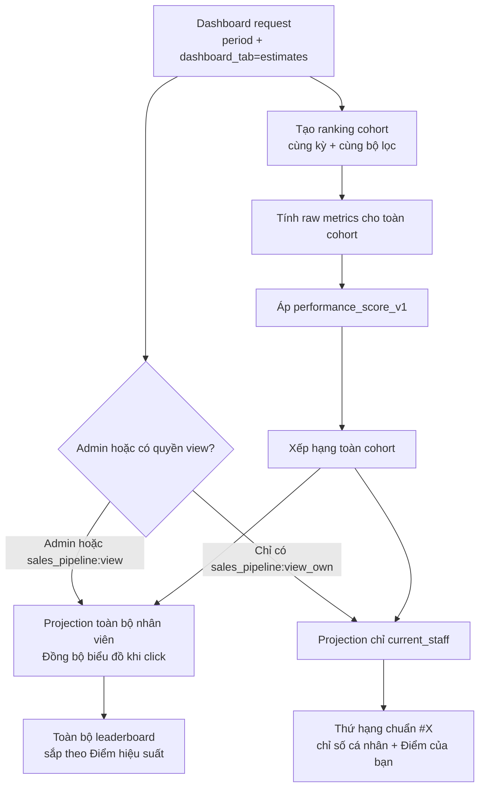

# Kế hoạch UI Dashboard — Bảng xếp hạng theo Điểm hiệu suất

> **Module**: Sales Pipeline  
> **Route mục tiêu**: `/admin/sales_pipeline/dashboard?dashboard_tab=estimates`  
> **Công thức tham chiếu**: [performance_score.md](./performance_score.md)  
> **Trạng thái**: To-Be — kế hoạch triển khai, chưa sửa basecode  
> **Phiên bản kế hoạch**: 1.0  
> **Cập nhật lần cuối**: 2026-08-13

Tài liệu này mô tả cách áp dụng `performance_score` vào tab **Báo giá**, cách tính hạng đúng trên toàn bộ nhân viên cùng kỳ/bộ lọc và cách render khác nhau cho Admin/Staff.

---

## 1. Mục tiêu và phạm vi

### 1.1 Mục tiêu

1. Thay cơ chế xếp hạng hiện tại bằng **Điểm hiệu suất**.
2. Admin thấy đầy đủ bảng xếp hạng và có thể mở chi tiết từng nhân viên.
3. Staff chỉ thấy các chỉ số của chính mình nhưng biết đúng vị trí so với toàn cohort.
4. Không đưa dữ liệu nhân viên khác vào HTML/AJAX payload dành cho Staff.
5. Giữ nguyên kỳ thời gian, URL bookmark, AJAX refresh, accessibility và drawer hiện có.

### 1.2 Trong phạm vi

- Tab `dashboard_tab=estimates`.
- Request tải trang ban đầu và `ajax_dashboard_leaderboard`.
- Model/service tính metric, điểm và hạng.
- Partial `_estimates_leaderboard.php`.
- CSS/JS cần thiết cho bảng và drawer.
- Language keys tiếng Việt/tiếng Anh.
- Kiểm thử công thức, quyền và giao diện.

### 1.3 Ngoài phạm vi

- Thay đổi bảng Deal tại `dashboard_tab=deals`.
- UI cấu hình trọng số/mục tiêu cho Admin trong giai đoạn đầu.
- Kích hoạt điểm phản hồi nhắc nhở trước khi có SLA đáng tin cậy.
- Thay đổi workflow gửi reminder đã mô tả trong các tài liệu reminder hiện có.

---

## 2. Hiện trạng cần thay đổi

Luồng hiện tại truyền `staff_id` của người đăng nhập vào toàn bộ dashboard khi Staff chỉ có quyền `view_own`. Kết quả là danh sách dùng để xếp hạng chỉ có một người và Staff luôn đứng hạng 1.

Trong tab Báo giá, thứ tự hiện tại dựa lần lượt trên:

1. Doanh thu Báo giá được chấp nhận.
2. Tỷ lệ chấp nhận.
3. Số Báo giá.
4. Tên nhân viên.

Target-state thay toàn bộ tiêu chí xếp hạng trên bằng `ranking_score DESC` từ [performance_score.md](./performance_score.md). Tên chỉ dùng để ổn định thứ tự hiển thị giữa các dòng đồng hạng, không làm thay đổi hạng.

---

## 3. Nguyên tắc kiến trúc

Tách hai phạm vi dữ liệu độc lập:

```text
personal_scope    → Summary và chỉ số chi tiết của Staff đang đăng nhập
ranking_scope     → Tính điểm/hạng trên toàn cohort
```

Không gọi toàn bộ Executive Dashboard với `staff_id = null` rồi trả kết quả nguyên trạng cho Staff, vì cách đó làm lộ summary và metric toàn công ty.



`rank` luôn được gán trước bước projection. Không lọc về `current_staff_id` rồi mới chạy thuật toán xếp hạng.

---

## 4. Hợp đồng dữ liệu đề xuất

### 4.1 Kết quả nội bộ sau khi tính toàn cohort

```php
[
    'staff_id'                    => 12,
    'staff_name'                  => 'Nguyễn Văn A',
    'email'                       => '...',
    'estimate_count'              => 18,
    'accepted_revenue'            => 720000000,
    'accepted_count'              => 8,
    'declined_count'              => 4,
    'closed_count'                => 12,
    'acceptance_rate'             => 66.7,
    'quote_score'                 => 90.0,
    'accepted_revenue_score'      => 105.0,
    'acceptance_score'            => 95.3,
    'response_score'              => null,
    'performance_score_raw'       => 98.2471,
    'performance_score'           => 98.2,
    'rank'                        => 3,
    'total_ranked_staff'          => 18,
    'is_current_staff'            => true,
    'is_provisional'              => false,
    'can_open_details'            => true,
]
```

Các con số trên chỉ mô tả shape dữ liệu, không phải fixture mặc định hoặc mục tiêu production.

### 4.2 Projection Admin

Admin nhận toàn bộ dòng trong cohort cùng các trường cần cho bảng và drawer. `can_open_details = true` cho mọi dòng hợp lệ.

### 4.3 Projection Staff

Response dành cho Staff chỉ giữ dòng có:

```php
(int) $row['staff_id'] === (int) get_staff_user_id()
```

Các trường được phép render:

```php
[
    'staff_id',
    'staff_name',
    'estimate_count',
    'accepted_revenue',
    'acceptance_rate',
    'performance_score',
    'rank',
    'total_ranked_staff',
    'is_current_staff',
    'is_provisional',
    'can_open_details',
]
```

Không trả email, raw/component score hoặc dữ liệu của nhân viên khác. `can_open_details` chỉ đúng cho chính Staff đang đăng nhập.

---

## 5. UI dành cho Admin

### 5.1 Cấu trúc bảng

Admin tiếp tục thấy toàn bộ nhân viên. Bổ sung cột **Điểm hiệu suất** và sắp xếp giảm dần theo điểm:

| Hạng | Nhân viên | Số Báo giá | Doanh thu | Tỷ lệ chấp nhận (%) | Điểm hiệu suất |
|---:|---|---:|---:|---:|---:|
| 1 | Nguyễn Văn A | 24 | 1,2 tỷ | 72,0% | 104,8 |
| 2 | Trần Thị B | 19 | 980 triệu | 68,4% | 98,2 |

Quy tắc:

- Dùng `rank` do backend cung cấp; view không tự lấy `$index + 1`.
- Điểm hiển thị một chữ số thập phân.
- Dòng đồng điểm hiển thị cùng hạng.
- Nhân viên vẫn là nút `.js-sp-open-staff` để Admin mở drawer.
- Drawer Admin hiển thị breakdown: raw metric, component score, trọng số, cờ dữ liệu và phiên bản công thức.
- Nếu điểm tạm tính, hiển thị nhãn `Tạm tính` kèm tooltip giải thích dữ liệu còn thiếu.

### 5.2 Sắp xếp

```text
1. performance_score DESC
2. staff_name ASC chỉ để thứ tự render ổn định
```

`staff_name` không tạo hạng khác nhau. Rank dùng standard competition ranking `1, 2, 2, 4` theo `performance_score` đã làm tròn một chữ số.

---

## 6. UI dành cho Staff

### 6.1 Cấu trúc bảng bắt buộc

Khối vẫn có tiêu đề **Bảng xếp hạng**, nhưng chỉ hiển thị một dòng của Staff đang đăng nhập:

| Hạng | Nhân viên | Số Báo giá | Doanh thu | Tỷ lệ chấp nhận (%) | Điểm của bạn |
|---:|---|---:|---:|---:|---:|
| 7 | Bạn · Nguyễn Văn A | 12 | 540 triệu | 61,5% | 86,4 |

Quy tắc bảo mật và tương tác:

- Thứ hạng (ví dụ `#7`) được tính từ toàn bộ cohort trong cùng kỳ/bộ lọc, hiển thị dạng huy hiệu số (numeric badge) và không kèm nhãn phân số `Hạng x/y`.
- Các số Báo giá, Doanh thu và Tỷ lệ chấp nhận là dữ liệu của chính Staff.
- Không render dòng, điểm hoặc metric của nhân viên khác.
- Dòng cá nhân được làm nổi bật và có nhãn `Bạn`.
- Staff có thể mở drawer của chính mình để xem cách điểm cá nhân được cấu thành.
- Không có trigger/dữ liệu cho drawer của nhân viên khác trong DOM.
- Nếu chưa đủ điều kiện tính điểm, hiển thị `Chưa xếp hạng` thay cho một hạng giả.

### 6.2 Signature element

Đã loại bỏ khối/nhãn phụ phân số (`Hạng x/y` / `HẠNG CỦA BẠN #7 / 18`) để tinh gọn giao diện và đảm bảo tính đồng bộ:
- Cột **Hạng** chỉ hiển thị duy nhất **huy hiệu thứ hạng số** (ví dụ: `#7` hoặc `7`) của nhân viên trong kỳ.
- Không hiển thị tổng số nhân viên trong cohort (loại bỏ mẫu số `/ 18`) ở cả giao diện Desktop và Mobile.
- Dòng dữ liệu cá nhân được làm nổi bật với viền và màu nền riêng biệt (`--crm-primary`, `--crm-bg-alt`), không thêm podium hay animation trang trí phức tạp.

### 6.3 Microcopy

| Ngữ cảnh | Nội dung |
|---|---|
| Header điểm Staff | `Điểm của bạn` |
| Header điểm Admin | `Điểm hiệu suất` |
| Dòng cá nhân | `Bạn` |
| Điểm chưa chính thức | `Tạm tính` |
| Không đủ cấu hình | `Chưa thể tính Điểm hiệu suất. Vui lòng liên hệ quản trị viên.` |
| Không có dữ liệu cá nhân | `Bạn chưa có dữ liệu Báo giá trong kỳ này.` |
| Giải thích | `Xem cách tính điểm của bạn` |

---

## 7. Kế hoạch thiết kế UI

### 7.1 Token sử dụng

Chỉ dùng token có sẵn trong `dashboard.css`/design system:

| Mục đích | Token |
|---|---|
| Text chính | `--crm-ink` |
| Text phụ | `--crm-muted` |
| Dòng của Staff | `--crm-bg-alt` kết hợp viền `--crm-primary` |
| Điểm đạt mục tiêu | `--crm-success` |
| Điểm cần chú ý | `--crm-warning` |
| Điểm thấp/cảnh báo dữ liệu | `--crm-danger` |
| Viền bảng | `--crm-border` |
| Focus | `--crm-info` |
| Top 1/2/3 | Các token `--crm-rank-*` hiện có |

Không chỉ dùng màu để truyền trạng thái; luôn có text `Tạm tính`, `Hạng` hoặc giá trị điểm.

### 7.2 Desktop/tablet/mobile

- `>= 992px`: bảng đủ sáu cột.
- `768–991px`: giữ bảng, cho phép vùng bọc cuộn ngang nếu cần.
- `<= 767px`: chuyển dòng thành stacked card; thứ tự `Hạng → Nhân viên → Điểm → Số Báo giá → Doanh thu → Tỷ lệ chấp nhận`.
- Touch target cho dòng có thể mở drawer tối thiểu `38×38px`.
- Focus ring dùng `--crm-info`.
- Tôn trọng `prefers-reduced-motion`; không thêm animation mới ngoài drawer hiện có.

### 7.3 Trạng thái

| Trạng thái | Admin | Staff |
|---|---|---|
| Loading | Skeleton các dòng | Skeleton một dòng/card |
| Empty | Không có nhân viên đủ điều kiện trong kỳ | Bạn chưa có dữ liệu trong kỳ |
| Not configured | Cảnh báo cấu hình target | Hướng dẫn liên hệ quản trị viên |
| Provisional | Badge trên từng dòng | Badge trên dòng cá nhân |
| Error | Giữ nội dung cũ nếu có và hiển thị alert | Tương tự Admin |

---

## 8. Kế hoạch thay đổi backend

### Bước 1 — Tạo lớp tính Điểm hiệu suất

Tách công thức khỏi view và khỏi hàm query metric. Có thể triển khai dưới dạng service/library hoặc các method model có trách nhiệm rõ ràng:

```php
get_performance_ranking_cohort(array $period): array
get_performance_metrics(array $staffIds, array $period): array
calculate_performance_scores(array $metrics, array $config): array
assign_performance_ranks(array $scores): array
project_performance_ranking(array $ranking, array $viewer): array
```

Hoàn tất khi cùng fixture luôn cho cùng score/rank và không phụ thuộc role người đang gọi trong bước tính toán.

### Bước 2 — Tách personal scope và ranking scope

Trong cả `dashboard()` và `ajax_dashboard_leaderboard()`:

1. Summary/chi tiết tiếp tục dùng `current_staff_id` đối với Staff.
2. Ranking service luôn tính cohort đầy đủ theo kỳ/bộ lọc.
3. Admin nhận projection toàn cohort.
4. Staff nhận projection đúng một dòng của mình.

Hoàn tất khi Staff không còn luôn hạng 1 và summary cá nhân không bị biến thành summary toàn công ty.

### Bước 3 — Cập nhật Estimate metrics

- Đếm Báo giá logic đã khử revision.
- Lấy accepted revenue và acceptance rate hiện tại cho UI.
- Dùng `decision_value_base` của Estimate Group được chấp nhận để tính `accepted_revenue_score`; không join sang Deal để suy diễn lợi nhuận.
- Trả data-quality flags.
- Không `usort` theo accepted revenue trong method query cũ; việc sort/rank thuộc ranking service.

Hoàn tất khi raw metrics khớp fixture độc lập trước khi đưa vào công thức.

### Bước 4 — Giữ server-side authorization cho drawer

Endpoint `dashboard_staff_pipeline/{staff_id}` tiếp tục từ chối Staff khi `staff_id` khác người đăng nhập. UI chỉ là lớp affordance; kiểm tra `403` phía server là lớp bảo vệ bắt buộc.

Hoàn tất khi request thủ công tới Staff khác vẫn nhận `403`, kể cả khi sửa DOM hoặc URL.

---

## 9. Kế hoạch thay đổi frontend

### Bước 1 — Partial leaderboard

Cập nhật `modules/sales_pipeline/views/partials/_estimates_leaderboard.php`:

- Dùng `$metric['rank']`, không dùng `$index + 1`.
- Thêm cột điểm theo role.
- Admin render toàn bộ rows và button mở drawer.
- Staff render một personal row và chỉ mở drawer của chính mình.
- Bỏ email khỏi bảng Staff.
- Render badge `Tạm tính` khi có cờ dữ liệu.

### Bước 2 — Dashboard shell và AJAX

Truyền vào partial tối thiểu:

```php
[
    'dashboard'          => $dashboard,
    'can_view_all'       => $can_view_all,
    'current_staff_id'   => get_staff_user_id(),
]
```

Request AJAX phải trả đúng projection theo role giống lần render đầu; tránh lần đầu an toàn nhưng refresh lại lộ dữ liệu.

### Bước 3 — CSS

Cập nhật `modules/sales_pipeline/assets/css/dashboard.css` bằng class prefix `sp-`, ví dụ:

```text
sp-performance-score
sp-performance-score--provisional
sp-leaderboard-row--current
sp-current-rank
```

Dùng CSS Custom Properties hiện có, không sửa core stylesheet và không hardcode màu ngoài token hệ thống.

### Bước 4 — JavaScript

Giữ luồng refresh/tab hiện có. JavaScript không tự tính score/rank và không lọc dữ liệu nhạy cảm; nó chỉ tải/render HTML đã được server phân quyền.

---

## 10. Kiểm thử bắt buộc

### 10.1 Unit test công thức

1. Đạt đúng target ở mọi thành phần cho `100,0` điểm.
2. Thành phần vượt target bị chặn tại `120`.
3. Thành phần inactive được loại khỏi mẫu số trọng số.
4. Estimate Group thiếu tỷ giá không bị tính thành doanh thu `0` và phải tạo trạng thái tạm tính.
5. Closed quote bằng `0` không gây chia cho `0`.
6. Hai score cùng giá trị hiển thị nhận cùng hạng `1, 2, 2, 4`.
7. Revision không tăng số Báo giá hợp lệ.

### 10.2 Integration test phân quyền

| Tình huống | Kỳ vọng |
|---|---|
| Admin mở trang | Nhận toàn bộ cohort, sort theo score |
| Staff mở trang | Chỉ nhận personal row |
| Staff refresh AJAX | Vẫn chỉ nhận personal row |
| Staff có điểm đứng thứ 7 | Hiển thị `7/N`, không phải `1/1` |
| Staff gọi drawer của mình | `200` |
| Staff gọi drawer người khác | `403` |
| Admin gọi drawer bất kỳ Staff hợp lệ | `200` |
| Cùng Staff/kỳ giữa Admin và Staff | Score/rank giống nhau |

Test HTML/AJAX dành cho Staff phải khẳng định tên, email, metric và `staff_id` của người khác hoàn toàn không xuất hiện trong response.

### 10.3 UI test

- Desktop `>= 1200px`.
- Tablet `768–991px`.
- Mobile `<= 767px`.
- Keyboard: Tab/Enter/Space, focus restore sau khi đóng drawer.
- Loading, empty, error, provisional và not-configured.
- Đổi `period` liên tục không để response cũ ghi đè response mới.

---

## 11. Thứ tự triển khai

1. Chốt target theo kỳ và minimum sample; xác nhận `decision_at`/`decision_value_base` của Estimate Group là nguồn ghi nhận quyết định chấp nhận.
2. Viết fixture/test đỏ cho công thức và lỗi Staff luôn hạng 1.
3. Triển khai cohort, raw metrics, score và rank.
4. Tách projection Admin/Staff ở cả initial render và AJAX.
5. Cập nhật partial, drawer breakdown, language keys và CSS.
6. Chạy unit/integration/UI tests.
7. Đối chiếu một kỳ dữ liệu thật với phép tính thủ công của Admin.
8. Triển khai `performance_score_v1` ở chế độ quan sát trước khi dùng cho đánh giá chính thức.
9. Chỉ kích hoạt trọng số reminder từ đầu một kỳ mới sau khi SLA và dữ liệu phản hồi ổn định.

---

## 12. Tiêu chí nghiệm thu cuối

1. Admin thấy đầy đủ bảng và bảng được sắp theo Điểm hiệu suất giảm dần.
2. Admin thấy cột `Điểm hiệu suất` và mở được drawer của từng nhân viên.
3. Staff thấy đúng các cột: **Hạng | Nhân viên | Số Báo giá | Doanh thu | Tỷ lệ chấp nhận (%) | Điểm của bạn**.
4. Staff chỉ thấy dòng của mình và chỉ mở được drawer của mình.
5. Hạng Staff được tính trên toàn bộ nhân viên kinh doanh đủ điều kiện trong cùng kỳ/bộ lọc.
6. Đổi kỳ cập nhật đồng thời raw metric, score, rank và tổng số người được xếp hạng.
7. Người đồng điểm nhận cùng hạng; view không dùng `$index + 1`.
8. HTML/AJAX Staff không chứa dữ liệu người khác.
9. Summary cá nhân của Staff vẫn là dữ liệu cá nhân.
10. Loading, empty, error, provisional, responsive và keyboard states đạt tiêu chuẩn UI của module.
