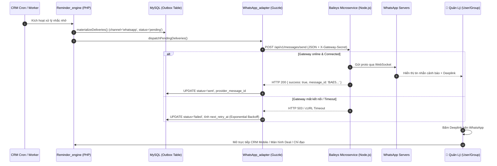

# Kế hoạch Tích hợp Kênh Cảnh báo WhatsApp (Baileys Gateway) cho Sales Pipeline

> **Module**: `sales_pipeline`  
> **Ngày lập**: 2026-09-09  
> **Trạng thái**: Bản kế hoạch triển khai chi tiết đã rà soát Basecode (Refined Implementation Plan)  
> **Phạm vi**: Kênh phân phối `whatsapp` cho hệ thống Nhắc nhở (Reminder); giữ nguyên độc lập kênh `crm` và `email`.  
> **Ràng buộc cứng**: 
> - Tuân thủ nguyên tắc không can thiệp Core Perfex (`application/`, `system/` và root project là read-only);
> - Kế thừa 100% kiến trúc Outbox & Resilience của `tblsales_pipeline_reminder_deliveries` (không tạo bảng queue riêng);
> - Module Baileys được triển khai dưới dạng **Microservice Gateway độc lập** (trên máy chủ/container riêng hoặc đóng gói biệt lập trong `modules/sales_pipeline/gateway/`); CRM giao tiếp qua HTTP REST API nội bộ;
> - Bảo mật dữ liệu & Auth: Không log khóa bí mật (API Key), không gửi thông tin tài chính nhạy cảm lộ liễu, bảo vệ Deeplink.

---

## 1. Mục tiêu Nghiệp vụ & Kỹ thuật

### 1.1 Mục tiêu Nghiệp vụ
- **Giải phóng Quản lý khỏi "ngập lụt" Email**: Thay vì đọc email HTML dài dòng, Quản lý nhận được thông báo ngắn gọn, súc tích (3–5 dòng trọng tâm) trực tiếp trên ứng dụng WhatsApp quen thuộc.
- **Tập trung vào Hành động (Action-driven)**: Trang bị các nút bấm chứa **Deeplink** trực tiếp (Xem Deal, Nhập chỉ đạo/Ghi chú phản hồi, Xem Leaderboard) giúp Quản lý xử lý ngay trên điện thoại chỉ với 1 chạm.
- **Linh hoạt điểm nhận tin (Direct & Group Routing)**: Cho phép đẩy cảnh báo tới riêng Quản lý phụ trách hoặc đẩy đồng thời vào **Nhóm WhatsApp Ban Giám Đốc/Quản Lý** (`@g.us`) để nắm bắt tình hình chung của đội ngũ.

### 1.2 Mục tiêu Kỹ thuật & Hạ tầng
- **Tối ưu chi phí & Tự chủ 100%**: Sử dụng thư viện **Baileys** (WebSocket kết nối trực tiếp giao thức WhatsApp Web Multi-Device), không phụ thuộc chi phí theo tin nhắn của Twilio hay quy trình xét duyệt Template khắt khe của Meta Cloud API.
- **Tách biệt mối quan tâm (Separation of Concerns)**:
  - CRM (`portal_18`): Đóng vai trò Client gửi payload thông báo, quản lý outbox, retry, audit status.
  - Baileys Gateway (Node.js): Đóng vai trò Microservice trung chuyển kết nối socket, duy trì session WhatsApp, render tin nhắn kèm nút tương tác.

---

## 2. Khảo sát & Bằng chứng Basecode Hiện Tại

1. **Outbox Deliveries Table (`tblsales_pipeline_reminder_deliveries`)**:
   - Cột `channel varchar(20)`: Đang xử lý `crm` và `email`. Hỗ trợ mở rộng `whatsapp` mà **không cần thay đổi cấu trúc bảng**.
   - Có sẵn các cột `provider_message_id`, `last_error`, `attempt_count`, `next_retry_at`, `delivered_at`, `read_at` phục vụ audit delivery lifecycle.
2. **Channel Router & Materialization ([`Reminder_engine.php`](file:///Users/dieterhoang/Developer/portal_18/modules/sales_pipeline/libraries/Reminder_engine.php))**:
   - Hàm `parseChannels()` đang filter tĩnh `['crm', 'email']`.
   - Hàm sinh delivery thực tế là `materializeDeliveries($reminderId, array $event)` (dòng 402), không phải `enqueueDeliveries()`.
   - Hàm `dispatchPendingDeliveries()` đang có rẽ nhánh `if ($channel === 'crm') ... elseif ($channel === 'email')`.
3. **Lock & Rate Limit ([`Reminder_delivery_rate_limiter.php`](file:///Users/dieterhoang/Developer/portal_18/modules/sales_pipeline/libraries/Reminder_delivery_rate_limiter.php))**:
   - Rate limit hiện tại fix cứng `scope_key = 'default_smtp_account'`. Cần tham số hóa `$scopeKey` để áp dụng riêng cho `whatsapp_baileys_gateway` với hạn mức phù hợp (ví dụ: tránh bị WhatsApp chặn spam khi gửi dồn dập).
4. **Hiện trạng Trang Phản hồi ([`reminder_response.php`](file:///Users/dieterhoang/Developer/portal_18/modules/sales_pipeline/views/reminder_response.php#L108-L114))**:
   - Quản lý/Admin khi mở `reminder_response` hiện chỉ được hiển thị banner **Giám sát viên (Supervisor Read-Only)**, chưa có form nhập chỉ đạo/note trực tiếp. Cần bổ sung tính năng "Chỉ đạo của Quản lý" (Manager Directive) hoặc định tuyến deeplink về màn hình chi tiết Deal.
5. **Quản lý Thông tin Nhân sự ([`tblstaff`](file:///Users/dieterhoang/Developer/portal_18/application/views/admin/staff/member.php#L118-L120))**:
   - Trường `phonenumber` đã tồn tại sẵn trong core `tblstaff`, có thể tái sử dụng để map số điện thoại WhatsApp cho nhân sự/quản lý.
6. **Hạ tầng Vendor có sẵn**:
   - `application/vendor/guzzlehttp/` đã sẵn sàng để PHP thực hiện non-blocking/timed-out HTTP request sang microservice.

---

## 3. Kiến trúc Tổng thể Hệ thống



---

## 4. Kế hoạch Triển khai Từng Giai đoạn (Phased Implementation)

### Giai đoạn 1: Xây dựng Baileys Microservice Gateway (Node.js)
*Mục tiêu: Dựng một dịch vụ chạy nền độc lập, kết nối WhatsApp qua QR và expose HTTP API an toàn.*

1. **Vị trí và Môi trường Triển khai**:
   - Triển khai trên **Máy chủ riêng biệt** (khuyên dùng Docker) HOẶC đóng gói biệt lập tại thư mục `modules/sales_pipeline/gateway/` (nếu chạy local microservice).
   - **Tuyệt đối không** tạo thư mục bừa bãi tại root của dự án `portal_18/` để giữ vững ranh giới repository.
   - Công nghệ: Node.js LTS (v18+ hoặc v20+), TypeScript/ESM.
   - Thư viện chính: `@whiskeysockets/baileys`, `express`, `pino` (logger), `dotenv`, `qrcode-terminal`.
2. **Quản lý Session bền vững (Session Persistence)**:
   - Dùng `useMultiFileAuthState('./auth_info_baileys')` để lưu session ra volume bền vững.
   - Thiết lập cơ chế tự động reconnect (`DisconnectReason.restartRequired`, `timedOut`, `connectionLost`).
   - Tách biệt luồng in mã QR ra Terminal hoặc web console nội bộ khi lần đầu pair thiết bị.
3. **Xây dựng REST API Controller (Thống nhất Contract)**:
   - Middleware xác thực Header `X-Gateway-Secret`.
   - **Endpoint**: `POST /api/v1/messages/send`
     - Params:
       - `recipient`: `string` (SĐT `8490xxxxxxx@s.whatsapp.net` hoặc Group JID `xxxx@g.us`).
       - `text`: `string` (nội dung format Markdown của WhatsApp).
       - `buttons`: `array` (danh sách CTA url/quick reply nếu dùng proto interactive).
       - `options`: `object` (priority, metadata).
     - Response thành công: `{ "success": true, "message_id": "3EB0...", "timestamp": 1725870000 }`.
   - **Endpoint Healthcheck**: `GET /api/v1/health` (trả về trạng thái socket: `CONNECTED`, `CONNECTING`, `DISCONNECTED`).
4. **Docker hóa Gateway**:
   - `Dockerfile` và `docker-compose.yml` có restart policy `unless-stopped` để tự phục hồi khi crash.

---

### Giai đoạn 2: Bổ sung Cấu hình & Schema Options trên CRM (PHP)
*Mục tiêu: Cho phép Admin thiết lập thông số kết nối Baileys và bật/tắt linh hoạt trên giao diện `sales_pipeline`.*

1. **Đăng ký Option trong DB (`tbloptions`)**:
   - `sp_reminder_whatsapp_enabled`: Cờ bật/tắt toàn cục kênh WhatsApp (`0`/`1`).
   - `sp_reminder_whatsapp_endpoint`: URL microservice (vd: `http://127.0.0.1:3050/api/v1/messages/send`).
   - `sp_reminder_whatsapp_secret_key`: Secret token trao đổi nội bộ (`X-Gateway-Secret`).
   - `sp_reminder_whatsapp_manager_mode`: `group_only` | `direct_only` | `both`.
   - `sp_reminder_whatsapp_group_jid`: Group JID mặc định của Ban Quản lý (vd: `1203630281928371@g.us`).
   - `sp_reminder_whatsapp_timeout_seconds`: Timeout kết nối HTTP (mặc định: `5`).
   - `sp_reminder_delivery_whatsapp_hourly_limit`: Giới hạn tin/giờ cho WhatsApp (mặc định: `60`).
2. **Cập nhật Giao diện Cài đặt ([`views/settings.php`](file:///Users/dieterhoang/Developer/portal_18/modules/sales_pipeline/views/settings.php))**:
   - Thêm panel cấu hình **"Kênh Cảnh Báo WhatsApp (Baileys Gateway)"**.
   - Bổ sung trường nhập: Endpoint URL, Secret Key, Group JID, Chế độ gửi, Rate limits.
   - Thêm nút **"Kiểm tra kết nối (Test Connection)"**: Gọi thử endpoint `/health` và gửi 1 tin test vào SĐT/Group cấu hình.
   - Cập nhật ma trận chọn kênh của từng Rule: Bổ sung checkbox `[ ] WhatsApp` song song với `[ ] CRM` và `[ ] Email`.
3. **Cập nhật Bộ điều khiển ([`controllers/Sales_pipeline.php`](file:///Users/dieterhoang/Developer/portal_18/modules/sales_pipeline/controllers/Sales_pipeline.php))**:
   - Thêm logic sanitize và lưu trữ các option WhatsApp trong phương thức `settings()`.
   - Bổ sung endpoint AJAX `test_whatsapp_connection()`.

---

### Giai đoạn 3: Mở Rộng Rate Limiter & Hiện Thực Hóa Adapter
*Mục tiêu: Đưa channel `whatsapp` vào quy trình materialization, kiểm soát tốc độ gửi và gọi sang Baileys.*

1. **Mở rộng Phạm vi [`Reminder_delivery_rate_limiter.php`](file:///Users/dieterhoang/Developer/portal_18/modules/sales_pipeline/libraries/Reminder_delivery_rate_limiter.php)**:
   - Tham số hóa `$scopeKey` trong hàm `reserve()` thay vì fix cứng `'default_smtp_account'`.
   - Khi kênh là `whatsapp`: Sử dụng `$scopeKey = 'whatsapp_baileys_gateway'`, kiểm soát số lượng tin nhắn/giờ tránh bị WhatsApp gắn cờ spam.
2. **Xây dựng Library Giao Vận Mới**:
   - `modules/sales_pipeline/libraries/channels/Reminder_delivery_whatsapp_adapter.php`
   - Nhiệm vụ:
     - Chuẩn hóa số điện thoại sang format E.164 / JID (`84xxxxxxxxx@s.whatsapp.net` hoặc giữ nguyên `@g.us`).
     - Gọi POST request đến endpoint `POST /api/v1/messages/send` với Header `X-Gateway-Secret` qua `GuzzleHttp\Client`.
     - Phân loại lỗi chính xác:
       - `temporary`: Gateway trả về mã 502/503 hoặc timeout kết nối → kích hoạt retry backoff.
       - `permanent`: Số điện thoại sai định dạng, 401 Unauthorized, Group JID không tồn tại → mark `cancelled`/`failed`.
3. **Xây dựng Formatter Tin nhắn Tinh gọn ([`Reminder_whatsapp_formatter.php`](file:///Users/dieterhoang/Developer/portal_18/modules/sales_pipeline/libraries/)):
   - Chuyển đổi event snapshot thành tin nhắn WhatsApp Markdown tối ưu scannability:
     ```text
     🔴 *[CẢNH BÁO SALES PIPELINE]* {Tên quy tắc}
     ━━━━━━━━━━━━━━━━━━━━
     👤 *NVKD phụ trách:* {Họ và tên}
     🏢 *Khách hàng:* {Tên khách hàng}
     💼 *Deal:* {Tên Deal} ({Giá trị Deal})
     ⚠️ *Vấn đề:* {Lý do cảnh báo / Số ngày không tương tác}
     ⏰ *Hạn SLA:* {Thời hạn phản hồi}

     👇 *Thao tác nhanh:*
     👉 *Xem Deal:* {deeplink_deal}
     👉 *Chỉ đạo NVKD:* {deeplink_action}
     ```
4. **Mở rộng [`Reminder_engine.php`](file:///Users/dieterhoang/Developer/portal_18/modules/sales_pipeline/libraries/Reminder_engine.php)**:
   - Cập nhật `parseChannels()`: Bổ sung `'whatsapp'`.
   - Trong `materializeDeliveries($reminderId, array $event)`:
     - Khi event có channel `whatsapp`: Xác định `recipient_key` dựa trên cài đặt (SĐT Quản lý hoặc Group JID).
     - Ghi nhận delivery vào `tblsales_pipeline_reminder_deliveries` với `status = 'pending'`.
   - Trong `dispatchPendingDeliveries()`:
     - Thêm nhánh xử lý `$row['channel'] === 'whatsapp'`: Gọi qua `Reminder_delivery_whatsapp_adapter`.
     - Cập nhật status `sent`, `failed`, lưu `provider_message_id`.

---

### Giai đoạn 4: Thiết kế Deeplink & Nâng cấp Chức năng Quản Lý Chỉ Đạo
*Mục tiêu: Đảm bảo khi Quản lý bấm link từ WhatsApp, không chỉ xem được thông tin mà còn có thể thực hiện chỉ đạo ngay trên CRM.*

1. **Chuẩn hóa URL Scheme & Deeplink**:
   - **Link Xem Deal**: `admin_url('sales_pipeline/deal/' . $deal_id)` (đầy đủ thông tin Deal, ghi chú, trao đổi).
   - **Link Xem Báo giá**: `admin_url('estimates/list_estimates/' . $estimate_id)`
   - **Link Xem Leaderboard**: `admin_url('sales_pipeline/dashboard#leaderboard')`
   - **Link Trang Phản hồi/Chỉ đạo**: `admin_url('sales_pipeline/reminder_response/' . $reminder_id . '?src=wa')`
2. **Nâng cấp Giao diện Phản hồi cho Quản Lý ([`reminder_response.php`](file:///Users/dieterhoang/Developer/portal_18/modules/sales_pipeline/views/reminder_response.php))**:
   - **Hiện trạng**: Quản lý mở trang chỉ thấy banner Read-only (`sales_pipeline_reminder_manager_read_only`), không có ô nhập chỉ đạo.
   - **Giải pháp nâng cấp**: 
     - Bổ sung form **"Chỉ đạo của Quản lý" (Manager Directive / Supervisor Note)** khi người dùng có quyền Quản lý/Admin (`is_admin()` hoặc có quyền `view` global).
     - Khi Quản lý gửi chỉ đạo: Lưu vào `tblsales_pipeline_activity` (gắn với Deal) hoặc lưu vào trường `manager_note` trong Reminder Log, đồng thời gửi thông báo CRM Bell ngược lại cho NVKD phụ trách biết để thực hiện.
3. **Cơ chế Xác thực Nhanh (Seamless Access Token - Tùy chọn nâng cao)**:
   - Nếu Quản lý mở trên trình duyệt mobile chưa đăng nhập CRM:
     - Tạo một signed token ngắn hạn (HMAC-SHA256, hạn 48 giờ) gắn vào URL: `.../reminder_response/123?auth_token=xyz`.
     - Cho phép xem nhanh thông tin tóm tắt và nhập chỉ đạo mà không bị chặn bởi form đăng nhập phức tạp.

---

### Giai đoạn 5: Kiểm thử, Đánh giá Chịu tải & Giám sát (Testing & Verification)

1. **Unit & Integration Test (PHP)**:
   - Viết test mô phỏng Adapter với Mock Guzzle Handler (`Reminder_delivery_whatsapp_adapter_test.php`):
     - Test thành công trả về HTTP 200 kèm `message_id`.
     - Test timeout (5s) chuyển sang trạng thái defer/retry.
     - Test sai secret key trả về lỗi permanent.
     - Test rate limiter riêng cho scope `whatsapp_baileys_gateway`.
2. **Kiểm thử Thực địa (Staging / Canary Test)**:
   - Dựng Baileys Gateway trên môi trường staging với 1 SIM test.
   - Kích hoạt gửi thử nghiệm nhắc nhở cho 1 tài khoản Manager và 1 Group test.
   - Đo lường độ trễ (latency): Tin nhắn gửi từ CRM đến khi WhatsApp nhận (< 3 giây).
3. **Cơ chế Ngắt mạch (Circuit Breaker & Fallback)**:
   - Nếu Baileys Gateway bị offline hoặc mất session QR quá 10 lần liên tiếp: Tự động ngắt mạch (open circuit), tạm ngừng gửi WhatsApp để không làm chậm luồng Cron chính của CRM, đồng thời phát cảnh báo về Bell Inbox của Admin.

---

## 5. Ma Trận Đánh Giá Rủi Ro & Biện Pháp Giảm Thiểu

| Rủi ro kỹ thuật | Mức độ | Biện pháp kiểm soát & Giảm thiểu |
| :--- | :---: | :--- |
| **Mất kết nối WhatsApp (Mất Session QR)** | Cao | Baileys Microservice lưu session ra disk; tự động kết nối lại; có endpoint `/health` cảnh báo khi session bị `Logged Out`. |
| **Số điện thoại bị WhatsApp kiểm duyệt (Spam flag)** | Trung bình | Chỉ gửi nội bộ cho nhân viên/quản lý công ty; tần suất gửi vừa phải; áp dụng rate limiter riêng cho scope `whatsapp_baileys_gateway`. |
| **Microservice treo làm nghẽn Cron CRM** | Cao | `GuzzleHttp` trong adapter bắt buộc set `connect_timeout = 3s` và `timeout = 5s`; Cron CRM luôn tiếp tục chạy bình thường dù gateway gặp sự cố. |
| **Lộ lọt thông tin nhạy cảm qua tin nhắn** | Thấp | Không gửi mật khẩu, secret key hay dữ liệu cá nhân nhạy cảm trong text; chỉ gửi tóm tắt mã hiệu Deal và lý do cảnh báo. |

---

## 6. Kế hoạch Triển khai (Checklist Thực hiện)

- [ ] **Giai đoạn 1**: Khởi tạo source code Baileys Gateway Node.js (tách biệt máy chủ hoặc trong `modules/sales_pipeline/gateway/`), cấu hình Docker và kết nối QR thành công theo contract `POST /api/v1/messages/send` và `X-Gateway-Secret`.
- [ ] **Giai đoạn 2**: Tạo migration/options thêm setting WhatsApp vào module `sales_pipeline` và cập nhật view `settings.php`.
- [ ] **Giai đoạn 3**: Tham số hóa `Reminder_delivery_rate_limiter.php`, viết `Reminder_delivery_whatsapp_adapter.php` và tích hợp vào `materializeDeliveries()` + `dispatchPendingDeliveries()` trong `Reminder_engine.php`.
- [ ] **Giai đoạn 4**: Chuẩn hóa format tin nhắn Markdown + Deeplink; bổ sung form "Chỉ đạo của Quản lý" trên `reminder_response.php`.
- [ ] **Giai đoạn 5**: Chạy thử nghiệm end-to-end qua Cron thực tế và nghiệm thu.

## 7. Chuẩn hóa người nhận quản lý (2026-09-09)

- Danh sách quản lý nghiệp vụ dùng `Reminder_engine::activeManagerStaff()`: nhân sự active và có `admin = 1` hoặc quyền `sales_pipeline:view`, đồng nhất với quyền xem Dashboard tổng thể.
- Áp dụng cho recipient quản lý CRM/email, email CC quản lý và WhatsApp `direct_only`/`both`. Giữ nguyên điều kiện rule yêu cầu manager, điều kiện CC và group routing hiện hữu.
- Nhân sự chỉ có `view_own` không được thêm vào danh sách quản lý; nhân sự inactive không được chọn. Admin kỹ thuật vẫn thuộc danh sách theo điều kiện OR đã thống nhất; không có cơ chế opt-out mới.
- SMTP authentication circuit và BCC incident tiếp tục chỉ thông báo Admin active. Không đổi schema, quyền tài khoản, staff owner hay logic tính SLA.
- Kết quả kiểm thử phạm vi này: [implementation report](plan_reminder_whatsapp_baileys_gateway.implementation.md). Đây không phải nghiệm thu toàn bộ tích hợp gateway.
