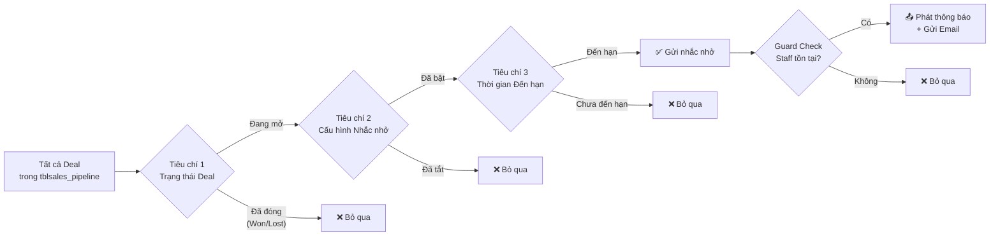
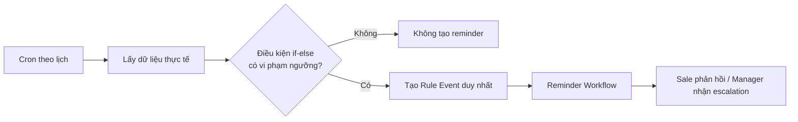

# Rule Engine: Bộ máy Quy tắc Nhắc nhở Tự động

> **Module**: Sales Pipeline  
> **Phiên bản tài liệu**: 1.4  
> **Cập nhật lần cuối**: 2026-08-12  
> **Tài liệu liên quan**: [workflow_reminder.md](file:///Users/dieterhoang/Developer/portal_18/docs/plans/Sales%20Pipeline/workflow_reminder.md)

---

## 1. Tổng quan

Bộ máy quy tắc (Rule Engine) quyết định **đối tượng nào** cần được nhắc hoặc cảnh báo trong mỗi chu kỳ đánh giá.

- **As-is**: mã nguồn hiện tại chỉ đánh giá Deal trong `tblsales_pipeline` qua ba cổng lọc: trạng thái, toggle và thời gian đến hạn.
- **Target-state**: giữ nguyên rule nhắc chăm sóc Deal và bổ sung ba rule `if-else` cho Báo giá, tạo đầu ra chuẩn để workflow gửi Notification, Email hoặc WhatsApp.

Các mục 2–6 là **As-Is** của Deal Rule đang chạy. Các mục 7–15 là **To-Be V1** cho Estimate Rule và Event contract, chưa được triển khai trong basecode.



---

## 2. As-Is — Chi tiết Deal Rule

### Tiêu chí 1 — Trạng thái Deal (Status-Based Filter)

**Mục đích**: Chỉ nhắc nhở các Deal đang trong tiến trình kinh doanh, loại bỏ Deal đã kết thúc.

**Cơ chế hoạt động**:
1. Hệ thống truy vấn toàn bộ bảng `tblsales_pipeline_statuses` qua `get_statuses()`.
2. Lọc ra các status có `is_won = 0 AND is_lost = 0` → tạo mảng `$active_status_ids`.
3. Chỉ những Deal có `status IN ($active_status_ids)` mới đi tiếp sang tiêu chí 2.

**Bảng trạng thái mặc định và phân loại**:

| # | Tên trạng thái       | Màu      | is_won | is_lost | Nhắc nhở? |
|---|----------------------|----------|--------|---------|-----------|
| 1 | Đang tư vấn          | `#5B93D3`| 0      | 0       | ✅ Có     |
| 2 | Đang báo giá         | `#3B7DD8`| 0      | 0       | ✅ Có     |
| 3 | Đã gửi báo giá       | `#F5A623`| 0      | 0       | ✅ Có     |
| 4 | KH đang duyệt        | `#E8913A`| 0      | 0       | ✅ Có     |
| 5 | Đã ký hợp đồng       | `#27AE60`| **1**  | 0       | ❌ Không  |
| 6 | Đã xuất hóa đơn      | `#2ECC71`| **1**  | 0       | ❌ Không  |
| 7 | Đã triển khai         | `#1ABC9C`| **1**  | 0       | ❌ Không  |
| 8 | Tạm ngưng             | `#95A5A6`| 0      | 0       | ✅ Có     |
| 9 | KH chọn NCC khác     | `#E74C3C`| 0      | **1**   | ❌ Không  |
| 10| Không phê duyệt      | `#C0392B`| 0      | **1**   | ❌ Không  |
| 11| Vượt ngân sách       | `#8E44AD`| 0      | **1**   | ❌ Không  |

**Quy tắc tóm tắt**:
- `is_won = 1` → Deal đã thắng → **không nhắc** (mục tiêu hoàn thành)
- `is_lost = 1` → Deal đã thua → **không nhắc** (không còn cơ hội)
- `is_won = 0 AND is_lost = 0` → Deal đang mở → **ứng viên được nhắc**

> [!NOTE]
> Trạng thái "Tạm ngưng" có `is_won = 0, is_lost = 0` nên vẫn **nằm trong phạm vi nhắc nhở**. Đây là thiết kế có chủ đích: deal tạm ngưng vẫn cần được Sale theo dõi và cập nhật tiến độ để tránh bị lãng quên.

**Tham chiếu nguồn**:
- Schema bảng statuses: [install.php](file:///Users/dieterhoang/Developer/portal_18/modules/sales_pipeline/install.php) (dòng 10–44)
- Logic lọc active status: [Sales_pipeline_model.php](file:///Users/dieterhoang/Developer/portal_18/modules/sales_pipeline/models/Sales_pipeline_model.php) (dòng 872–878)

---

### Tiêu chí 2 — Cấu hình Nhắc nhở (Per-Deal Toggle)

**Mục đích**: Cho phép từng Deal tự quyết định có tham gia vào hệ thống nhắc nhở hay không.

**Cơ chế hoạt động**:
- Kiểm tra cột `reminder_enabled` trên bảng `tblsales_pipeline`.
- Chỉ những Deal có `reminder_enabled = 1` mới đi tiếp sang tiêu chí 3.

**Giá trị cột `reminder_enabled`**:

| Giá trị | Ý nghĩa                              | Nhắc nhở? |
|---------|---------------------------------------|-----------|
| `1`     | Bật — Deal tham gia hệ thống nhắc    | ✅ Có     |
| `0`     | Tắt — Deal được loại khỏi hệ thống   | ❌ Không  |

**Giá trị mặc định**: `1` (bật) — Mọi Deal mới tạo đều tự động được nhắc nhở.

**Giao diện cấu hình**: Checkbox "Bật nhắc nhở tự động" trong phần **Cài đặt nhắc nhở** trên form tạo/sửa Deal.

**Tham chiếu nguồn**:
- Schema DB: [install.php](file:///Users/dieterhoang/Developer/portal_18/modules/sales_pipeline/install.php) (dòng 93)
- Giao diện checkbox: [deal.php](file:///Users/dieterhoang/Developer/portal_18/modules/sales_pipeline/views/deal.php) (dòng 258–262)
- Query lọc: [Sales_pipeline_model.php](file:///Users/dieterhoang/Developer/portal_18/modules/sales_pipeline/models/Sales_pipeline_model.php) (dòng 885)

---

### Tiêu chí 3 — Thời gian Đến hạn (Time-Based Scheduling)

**Mục đích**: Đảm bảo mỗi Deal chỉ được nhắc theo đúng tần suất đã cấu hình, không gửi trùng lặp.

**Cơ chế hoạt động**: Hệ thống so sánh 2 cột trên bảng `tblsales_pipeline`:

| Cột                   | Kiểu dữ liệu  | Mô tả                                     |
|------------------------|---------------|--------------------------------------------|
| `last_reminder_sent`   | DATETIME (NULL)| Thời điểm gửi nhắc nhở gần nhất cho Deal |
| `reminder_frequency`   | INT            | Số ngày giữa các lần nhắc (mặc định: `2`) |

**Công thức đánh giá**:

```sql
WHERE last_reminder_sent IS NULL                              -- Chưa từng nhắc
   OR DATEDIFF(NOW(), last_reminder_sent) >= reminder_frequency  -- Đã quá hạn nhắc
```

**Bảng chân trị (Truth Table)**:

| `last_reminder_sent` | `reminder_frequency` | `DATEDIFF(NOW(), last_reminder_sent)` | Kết quả     | Giải thích                               |
|----------------------|---------------------|---------------------------------------|-------------|------------------------------------------|
| `NULL`               | bất kỳ              | N/A                                   | ✅ Gửi nhắc | Deal mới, chưa từng nhắc lần nào         |
| `2026-08-09 10:00`   | `2`                 | `2` (hôm nay là 11/08)               | ✅ Gửi nhắc | Đã đủ 2 ngày kể từ lần nhắc cuối        |
| `2026-08-10 10:00`   | `2`                 | `1` (hôm nay là 11/08)               | ❌ Chưa nhắc | Mới nhắc hôm qua, chưa đủ 2 ngày        |
| `2026-08-05 10:00`   | `3`                 | `6` (hôm nay là 11/08)               | ✅ Gửi nhắc | Đã quá 3 ngày (6 ≥ 3)                   |
| `2026-08-10 10:00`   | `1`                 | `1` (hôm nay là 11/08)               | ✅ Gửi nhắc | Tần suất hàng ngày, đã đủ 1 ngày        |

**Phạm vi cho phép cấu hình**: `1` đến `30` ngày (giới hạn bởi thuộc tính `min="1" max="30"` trên input HTML).

**Tham chiếu nguồn**:
- Schema DB: [install.php](file:///Users/dieterhoang/Developer/portal_18/modules/sales_pipeline/install.php) (dòng 94–95)
- Query điều kiện thời gian: [Sales_pipeline_model.php](file:///Users/dieterhoang/Developer/portal_18/modules/sales_pipeline/models/Sales_pipeline_model.php) (dòng 887–890)
- Giao diện input tần suất: [deal.php](file:///Users/dieterhoang/Developer/portal_18/modules/sales_pipeline/views/deal.php) (dòng 266–272)

---

## 3. As-Is — Guard Check trước khi gửi

Sau khi Deal vượt qua cả 3 tiêu chí trên, hàm `send_reminder($deal)` thực hiện thêm 1 bước kiểm tra trước khi thực sự phát thông báo:

| Guard Check         | Điều kiện                                     | Nếu thất bại          |
|---------------------|-----------------------------------------------|------------------------|
| Staff tồn tại       | `$this->staff_model->get($deal['staff_id'])`  | Bỏ qua deal, return    |
| Insert log thành công| `$this->db->insert_id() > 0`                 | Bỏ qua deal, return    |
| Staff có email       | `!empty($staff->email)`                       | Chỉ gửi Notification, bỏ qua Email |

> [!IMPORTANT]
> Nếu nhân viên phụ trách (`staff_id`) đã bị xóa hoặc không tồn tại trong hệ thống, Deal sẽ **bị bỏ qua hoàn toàn** — không gửi Notification lẫn Email.

**Tham chiếu nguồn**: [Sales_pipeline_model.php](file:///Users/dieterhoang/Developer/portal_18/modules/sales_pipeline/models/Sales_pipeline_model.php) (dòng 903–931, 949)

---

## 4. As-Is — Câu truy vấn SQL tổng hợp

Dưới đây là câu truy vấn SQL tương đương mà bộ máy quy tắc thực thi (qua CodeIgniter Active Record):

```sql
SELECT sp.*
FROM tblsales_pipeline sp
INNER JOIN tblsales_pipeline_statuses ss ON ss.id = sp.status
WHERE ss.is_won  = 0                                       -- Tiêu chí 1a: Chưa thắng
  AND ss.is_lost = 0                                       -- Tiêu chí 1b: Chưa thua
  AND sp.reminder_enabled = 1                               -- Tiêu chí 2: Đã bật nhắc
  AND (
    sp.last_reminder_sent IS NULL                           -- Tiêu chí 3a: Chưa nhắc lần nào
    OR DATEDIFF(NOW(), sp.last_reminder_sent)               -- Tiêu chí 3b: Đã quá tần suất
       >= sp.reminder_frequency
  )
```

> [!NOTE]
> Trong mã nguồn thực tế, hệ thống thực hiện qua 2 query riêng biệt:
> 1. **Query 1**: Lấy `$active_status_ids` từ bảng `tblsales_pipeline_statuses` qua `get_statuses()`.
> 2. **Query 2**: Lọc Deal từ bảng `tblsales_pipeline` với `WHERE_IN('status', $active_status_ids)` + 2 tiêu chí còn lại.

---

## 5. As-Is — Sơ đồ quyết định tổng hợp

```
┌─────────────────────────────────────────────────────────────────────────┐
│                    BỘ MÁY QUY TẮC NHẮC NHỞ TỰ ĐỘNG                    │
├─────────────────────────────────────────────────────────────────────────┤
│                                                                         │
│  ┌──────────────────────────────────────┐                               │
│  │ TIÊU CHÍ 1: TRẠNG THÁI DEAL         │                               │
│  │ ────────────────────────────────────  │                               │
│  │ Nguồn: tblsales_pipeline_statuses    │                               │
│  │ Quy tắc: is_won=0 AND is_lost=0     │                               │
│  │ Nhóm Active:                         │                               │
│  │   ✅ Đang tư vấn                     │                               │
│  │   ✅ Đang báo giá                    │                               │
│  │   ✅ Đã gửi báo giá                  │                               │
│  │   ✅ KH đang duyệt                   │                               │
│  │   ✅ Tạm ngưng                       │                               │
│  │ Nhóm Inactive:                       │                               │
│  │   ❌ Đã ký hợp đồng (Won)            │                               │
│  │   ❌ Đã xuất hóa đơn (Won)           │                               │
│  │   ❌ Đã triển khai (Won)              │                               │
│  │   ❌ KH chọn NCC khác (Lost)          │                               │
│  │   ❌ Không phê duyệt (Lost)           │                               │
│  │   ❌ Vượt ngân sách (Lost)            │                               │
│  └──────────────┬───────────────────────┘                               │
│                 │ Pass                                                   │
│                 ▼                                                        │
│  ┌──────────────────────────────────────┐                               │
│  │ TIÊU CHÍ 2: CẤU HÌNH DEAL           │                               │
│  │ ────────────────────────────────────  │                               │
│  │ Nguồn: tblsales_pipeline             │                               │
│  │ Cột: reminder_enabled                │                               │
│  │ Quy tắc: reminder_enabled = 1       │                               │
│  │ Mặc định: 1 (bật)                   │                               │
│  └──────────────┬───────────────────────┘                               │
│                 │ Pass                                                   │
│                 ▼                                                        │
│  ┌──────────────────────────────────────┐                               │
│  │ TIÊU CHÍ 3: THỜI GIAN ĐẾN HẠN      │                               │
│  │ ────────────────────────────────────  │                               │
│  │ Nguồn: tblsales_pipeline             │                               │
│  │ Cột: last_reminder_sent,             │                               │
│  │      reminder_frequency              │                               │
│  │ Quy tắc:                             │                               │
│  │   last_reminder_sent IS NULL         │                               │
│  │   OR DATEDIFF(NOW(), last_sent)      │                               │
│  │      >= reminder_frequency           │                               │
│  │ Cấu hình: 1–30 ngày (mặc định: 2)  │                               │
│  └──────────────┬───────────────────────┘                               │
│                 │ Pass                                                   │
│                 ▼                                                        │
│  ┌──────────────────────────────────────┐                               │
│  │ GUARD CHECK                          │                               │
│  │ ────────────────────────────────────  │                               │
│  │ ✓ Staff_id tồn tại trong tblstaff   │                               │
│  │ ✓ Insert log thành công             │                               │
│  │ ✓ Staff có email (cho kênh Email)   │                               │
│  └──────────────┬───────────────────────┘                               │
│                 │ Pass                                                   │
│                 ▼                                                        │
│          ┌──────────────┐                                               │
│          │  📤 GỬI NHẮC  │                                               │
│          │ 🔔 + ✉️       │                                               │
│          └──────────────┘                                               │
│                                                                         │
└─────────────────────────────────────────────────────────────────────────┘
```

---

## 6. As-Is — Tham chiếu mã nguồn

| Thành phần                    | File                                                                                                                                                     | Dòng        |
|-------------------------------|----------------------------------------------------------------------------------------------------------------------------------------------------------|-------------|
| Schema bảng Statuses          | [install.php](file:///Users/dieterhoang/Developer/portal_18/modules/sales_pipeline/install.php)                                                           | 10–44       |
| Schema cột reminder trên Deal | [install.php](file:///Users/dieterhoang/Developer/portal_18/modules/sales_pipeline/install.php)                                                           | 93–95       |
| Lấy danh sách statuses        | [Sales_pipeline_model.php](file:///Users/dieterhoang/Developer/portal_18/modules/sales_pipeline/models/Sales_pipeline_model.php)                           | 293–297     |
| Lọc Active status IDs         | [Sales_pipeline_model.php](file:///Users/dieterhoang/Developer/portal_18/modules/sales_pipeline/models/Sales_pipeline_model.php)                           | 872–878     |
| Query lọc Deal cần nhắc       | [Sales_pipeline_model.php](file:///Users/dieterhoang/Developer/portal_18/modules/sales_pipeline/models/Sales_pipeline_model.php)                           | 884–892     |
| Guard check trong send_reminder| [Sales_pipeline_model.php](file:///Users/dieterhoang/Developer/portal_18/modules/sales_pipeline/models/Sales_pipeline_model.php)                           | 903–931     |
| Giao diện toggle + frequency   | [deal.php](file:///Users/dieterhoang/Developer/portal_18/modules/sales_pipeline/views/deal.php)                                                           | 254–274     |
| Lưu cấu hình vào Controller   | [Sales_pipeline.php](file:///Users/dieterhoang/Developer/portal_18/modules/sales_pipeline/controllers/Sales_pipeline.php)                                  | 351–352     |

---

## 7. To-Be V1 — Phạm vi Rule Engine

Mục tiêu của phiên bản này là **không để sót Deal hoặc Báo giá cần được nhân viên kinh doanh chăm sóc**. Rule Engine chỉ sử dụng các điều kiện `if-else` rõ ràng, không tính điểm hiệu suất tổng hợp, không dùng trọng số và không dự đoán.

Nguyên tắc:

1. Mỗi rule giải quyết đúng một câu hỏi nghiệp vụ.
2. Mỗi điều kiện dùng dữ liệu có sẵn trong hệ thống.
3. Ngưỡng được cấu hình tập trung, không hard-code rải rác.
4. Một rule chỉ phát tối đa một reminder cho cùng nhân viên và cùng kỳ kiểm tra.
5. Rule Engine chỉ tạo event; workflow chịu trách nhiệm gửi Notification, Email, WhatsApp và nhận phản hồi.
6. Ưu tiên false-negative thấp: nhắc đúng lúc để Sale còn thời gian hành động.
7. Không triển khai score 40/60, prorate ngày làm việc, dự báo hoặc công thức KPI tổng hợp trong phiên bản này.



## 8. Nguồn dữ liệu và định nghĩa dùng chung

### 8.1 Báo giá hợp lệ

Để tránh tăng giả tạo sản lượng do copy hoặc revision, một Báo giá hợp lệ được tính theo **nhóm Báo giá**:

- Một `estimate_group_id` chỉ được tính một lần.
- Không tính revision như một Báo giá mới.
- Không tính Báo giá nháp chưa hoàn thiện.
- Group được ghi nhận cho `owner_staff_id`.
- Ngày sản lượng của group là ngày tạo group (`datecreated`).

Trong phiên bản đầu, hệ thống đếm group có `datecreated` nằm trong kỳ kiểm tra và có ít nhất một revision không còn ở trạng thái nháp tại thời điểm đánh giá. Trạng thái Estimate của basecode Perfex đang dùng:

| Status | Ý nghĩa |
|---:|---|
| `1` | Draft |
| `2` | Sent |
| `3` | Declined |
| `4` | Accepted |
| `5` | Expired |

Điều kiện hợp lệ V1 phải viết rõ bằng allow-list:

```sql
EXISTS (
    SELECT 1
    FROM tblsales_pipeline_estimate_versions ev
    JOIN tblestimates e ON e.id = ev.estimate_id
    WHERE ev.estimate_group_id = grp.id
      AND e.status IN (2, 3, 4, 5)
)
```

Evaluator đếm `grp.id` đúng một lần, không dùng `COUNT(ev.estimate_id)` vì cách đó đếm revision. Không dùng `status != 1` để tránh vô tình tính status rỗng/không hợp lệ hoặc custom status chưa được phê duyệt nghiệp vụ.

Từ Migration 113 (Performance V2 & Canonical Quote Count), hệ thống đã chính thức bổ sung trường `first_sent_at` (thời điểm gửi thành công đầu tiên của bất kỳ version nào thuộc Group) và quản lý tập trung qua thư viện chuẩn `Quote_count_repository`. Mọi consumer gồm Rule Engine, Executive KPI, Performance Score và Dashboard đều dùng chung nguồn đếm này.

### 8.2 Doanh thu tuần

Doanh thu tuần được hiểu là **doanh thu Báo giá đã được khách chấp nhận**, không phải tổng giá trị đã chào:

```text
SUM(decision_value_base)
WHERE outcome = 'accepted'
  AND decision_at nằm trong tuần kiểm tra
  AND decision_owner_staff_id = nhân viên
```

- Dùng `decision_value_base` để tránh cộng trùng revision.
- Nếu accepted nhưng thiếu `decision_value_base`, bỏ bản ghi đó khỏi tổng doanh thu và sinh cảnh báo dữ liệu riêng; không tự quy đổi phức tạp trong evaluator.
- Tuần tính từ Thứ Hai đến Chủ Nhật theo timezone của hệ thống.

### 8.3 Nhân viên thuộc phạm vi quét

Chỉ quét nhân viên:

- Đang active.
- Có quyền `sales_pipeline.view` hoặc `sales_pipeline.view_own`.
- Không phải tài khoản hệ thống bị vô hiệu hóa.

V1 không xử lý lịch nghỉ phép riêng theo từng nhân viên. Có một cấu hình đơn giản `working_days`, mặc định Thứ Hai–Thứ Sáu, để Daily Rule không chạy vào cuối tuần.

## 9. Quy tắc Báo giá

### 9.1 Rule 1 — Mỗi ngày có ít nhất 1 Báo giá

| Thuộc tính | Giá trị |
|------------|---------|
| Rule code | `ESTIMATE_DAILY_MIN_COUNT` |
| Kỳ kiểm tra | Một ngày, `YYYY-MM-DD` |
| Ngưỡng | `daily_min_estimates = 1` |
| Thời điểm kiểm tra | `estimate_count_check_time`, mặc định 15:00 |
| Người nhận | Nhân viên Sale |
| Yêu cầu phản hồi | Có |
| Severity | `warning` |

Điều kiện:

```php
if (
    is_working_day($today)
    && current_time() >= estimate_count_check_time
    && valid_estimate_count($staff_id, $today) < daily_min_estimates
) {
    create_reminder_event('ESTIMATE_DAILY_MIN_COUNT');
}
```

Nội dung nhắc phải nêu rõ:

- Hôm nay nhân viên đã có bao nhiêu Báo giá hợp lệ.
- Ngưỡng yêu cầu là bao nhiêu.
- Yêu cầu Sale phản hồi nguyên nhân và kế hoạch xử lý trước khi kết thúc ngày.

Điểm kích hoạt 15:00 giúp tránh nhắc quá sớm nhưng vẫn để Sale còn đủ thời gian tạo Báo giá hoặc phản hồi nguyên nhân trong ngày.

### 9.2 Rule 2 — Mỗi tháng có ít nhất 30 Báo giá

| Thuộc tính | Giá trị |
|------------|---------|
| Rule code chính | `ESTIMATE_MONTHLY_MIN_COUNT` |
| Kỳ kiểm tra | Một tháng, `YYYY-MM` |
| Ngưỡng cuối tháng | `monthly_min_estimates = 30` |
| Người nhận | Nhân viên Sale |
| Yêu cầu phản hồi | Có |
| Severity | `warning` hoặc `critical` tại checkpoint cuối |

Nếu chỉ kiểm tra ngày cuối tháng thì reminder không còn giá trị hành động. V1 sử dụng ba checkpoint cố định, vẫn là các nhánh `if-else` đơn giản:

| Checkpoint | Điều kiện nhắc | Severity | Dedupe suffix |
|------------|----------------|----------|---------------|
| Ngày làm việc đầu tiên từ ngày 10, sau 15:00 | Tổng tháng < 10 | `warning` | `D10` |
| Ngày làm việc đầu tiên từ ngày 20, sau 15:00 | Tổng tháng < 20 | `warning` | `D20` |
| Ngày làm việc cuối tháng, sau 15:00 | Tổng tháng < 30 | `critical` | `FINAL` |

```php
if (
    current_time() >= estimate_count_check_time
    && is_checkpoint_due($today, 10)
    && month_count($staff_id) < 10
) {
    create_reminder_event('ESTIMATE_MONTHLY_MIN_COUNT', 'D10');
} elseif (
    current_time() >= estimate_count_check_time
    && is_checkpoint_due($today, 20)
    && month_count($staff_id) < 20
) {
    create_reminder_event('ESTIMATE_MONTHLY_MIN_COUNT', 'D20');
} elseif (
    current_time() >= estimate_count_check_time
    && is_last_working_day_of_month($today)
    && month_count($staff_id) < 30
) {
    create_reminder_event('ESTIMATE_MONTHLY_MIN_COUNT', 'FINAL');
}
```

`is_checkpoint_due()` trả về ngày làm việc đầu tiên có ngày trong tháng lớn hơn hoặc bằng mốc cấu hình. Vì vậy checkpoint không bị bỏ qua khi ngày 10 hoặc 20 rơi vào cuối tuần. Các checkpoint 10/20/30 là ngưỡng nghiệp vụ cố định, không phải công thức prorate.

### 9.3 Rule 3 — Doanh thu mỗi tuần từ 1 tỷ trở lên

| Thuộc tính | Giá trị |
|------------|---------|
| Rule code chính | `ESTIMATE_WEEKLY_MIN_REVENUE` |
| Kỳ kiểm tra | Tuần ISO, `YYYY-Www` |
| Ngưỡng | `weekly_min_accepted_revenue = 1000000000` |
| Người nhận | Sale; Manager ở checkpoint cuối |
| Yêu cầu phản hồi | Có |
| Severity | `warning` hoặc `critical` |

Hai điểm kiểm tra đơn giản:

| Checkpoint | Điều kiện nhắc | Mục đích |
|------------|----------------|----------|
| Thứ Tư, sau 16:30 | Doanh thu accepted của tuần = 0 | Cảnh báo sớm khi tuần chưa tạo doanh thu |
| Thứ Sáu, sau 16:30 | Doanh thu accepted của tuần < 1 tỷ | Xác nhận không đạt ngưỡng tuần và escalation Manager |

```php
$weeklyRevenue = weekly_accepted_revenue($staff_id);

if ($weeklyRevenue >= weekly_min_accepted_revenue) {
    // Đã đạt từ 1 tỷ: không tạo reminder doanh thu tại checkpoint này.
    return null;
} elseif (is_wednesday($today) && $weeklyRevenue == 0) {
    create_reminder_event('ESTIMATE_WEEKLY_MIN_REVENUE', 'MIDWEEK', 'warning');
} elseif (
    is_friday($today)
    && $weeklyRevenue < weekly_min_accepted_revenue
) {
    create_reminder_event('ESTIMATE_WEEKLY_MIN_REVENUE', 'FINAL', 'critical');
} else {
    // Chưa đến checkpoint hoặc không thỏa điều kiện gửi nhắc.
    return null;
}
```

Nhánh kiểm tra “đã đạt ngưỡng” phải chạy trước các checkpoint. Vì vậy, khi tổng doanh thu accepted từ đầu tuần đến thời điểm rà soát đã đạt từ 1 tỷ đồng, Staff Sale không nhận thêm reminder “chưa đạt doanh thu” trong tuần đó.

Không tính score tiến độ doanh thu. Rule chỉ so sánh tổng doanh thu accepted thực tế với ngưỡng.

### 9.4 Quy tắc vòng đời Báo giá (Estimate Lifecycle)

Nhóm rule này theo dõi **một Báo giá cụ thể**, khác với các rule tổng hợp theo Staff ở mục 9.1–9.3:

```text
entity_type = estimate
entity_id   = tblestimates.id
pipeline_id = NULL, trừ khi tìm được Deal liên kết hợp lệ
```

Owner nhận reminder là `sale_agent`; nếu `sale_agent = 0` thì fallback sang `addedfrom`. Chỉ đánh giá Báo giá còn tồn tại và owner là Staff active.

| Rule code chuẩn | Điều kiện `if-else` | Severity | `response_required` | Mục đích |
|---|---|---|---:|---|
| `ESTIMATE_DRAFT_TOO_LONG` | `status = 1` và `datecreated <= NOW() - 3 ngày` | `warning` | `0` | Thông báo Sale hoàn thiện hoặc xử lý bản nháp |
| `ESTIMATE_SENT_NO_RESPONSE` | `status = 2`, chưa hết hạn và (`datesend <= NOW() - 3 ngày` hoặc `expirydate` nằm từ hôm nay đến 2 ngày tới) | `warning` | `1` | Yêu cầu Sale cập nhật lý do khách im lặng và kế hoạch follow-up |
| `ESTIMATE_DECLINED_RECENT` | `status = 3` và `declined_at` nằm trong 7 ngày gần nhất | `warning` | `1` | Thu thập lý do từ chối và hành động tiếp theo |
| `ESTIMATE_EXPIRED` | `status = 5` hoặc (`status = 2` và `expirydate < CURRENT_DATE`) | `critical` | `0` | Thông báo Báo giá đã hết hiệu lực và dẫn tới bản gốc |
| `ESTIMATE_ACCEPTED_NOT_INVOICED` | `status = 4` và `invoiceid IS NULL` | `critical` | `1` | Yêu cầu Sale xác nhận kế hoạch xuất hóa đơn hoặc vướng mắc |

`datecreated > 3 ngày` và `datesend > 3 ngày` trong ngôn ngữ nghiệp vụ được hiểu là **tuổi bản ghi lớn hơn ba ngày**, nên SQL sử dụng `<= NOW() - INTERVAL 3 DAY`. Phải có guard `datesend IS NOT NULL` trước khi so sánh rule Sent.

#### Nguồn `declined_at`

`tblestimates` không có cột thời điểm bị từ chối. Evaluator lấy nguồn theo thứ tự:

1. `tblsales_pipeline_estimate_outcome_history.effective_at` với `new_outcome = 'declined'` và đúng `estimate_id`.
2. Activity Estimate gần nhất tương ứng `estimate_activity_client_declined` hoặc status mới bằng `3`.
3. Nếu không tìm được timestamp đáng tin cậy thì **không sinh** `ESTIMATE_DECLINED_RECENT`; không dùng `NOW()` vì sẽ biến dữ liệu cũ thành “vừa bị từ chối”.

Basecode hiện đã có `find_estimate_status_event()` và outcome history để làm nền tảng, nhưng lifecycle evaluator chưa được triển khai.

#### Thứ tự ưu tiên và chống trùng rule

Evaluator áp dụng thứ tự để một Estimate chỉ có một lifecycle reminder đang xét trong cùng lượt quét:

```php
if (is_accepted_without_invoice($estimate)) {
    return event('ESTIMATE_ACCEPTED_NOT_INVOICED', true);
} elseif (is_expired($estimate)) {
    return event('ESTIMATE_EXPIRED', false);
} elseif (is_recently_declined($estimate)) {
    return event('ESTIMATE_DECLINED_RECENT', true);
} elseif (is_sent_without_response($estimate)) {
    return event('ESTIMATE_SENT_NO_RESPONSE', true);
} elseif (is_draft_too_long($estimate)) {
    return event('ESTIMATE_DRAFT_TOO_LONG', false);
}

return null;
```

Rule `EXPIRED` phải chạy trước `SENT_NO_RESPONSE`, vì một Estimate status `2` nhưng `expirydate` đã qua chỉ được phân loại là hết hạn.

Lifecycle dedupe key phải nhận diện đúng một occurrence:

```text
rule_code + staff_id + estimate + estimate_id + condition_since
```

`condition_since` lần lượt lấy từ `datecreated`, `datesend`, `declined_at`, `expirydate` hoặc thời điểm accepted. Nếu Estimate được sửa/chuyển trạng thái rồi thực sự đi vào một occurrence mới, timestamp nguồn thay đổi và được phép tạo reminder mới.

#### Snapshot lifecycle tối thiểu

```json
{
  "estimate_id": 123,
  "estimate_number": "BG-2026/00123",
  "customer_id": 45,
  "customer_name": "Công ty ABC",
  "estimate_status": 3,
  "status_label": "Declined",
  "risk_reason": "Khách hàng từ chối trong 7 ngày gần nhất",
  "condition_since": "2026-08-10 09:15:00",
  "datecreated": "2026-08-01 08:00:00",
  "datesend": "2026-08-02 10:00:00",
  "expirydate": "2026-08-20",
  "invoiceid": null,
  "evaluated_at": "2026-08-12 15:00:00"
}
```

Snapshot lưu đủ tên khách hàng/số Báo giá/lý do rủi ro để Dashboard và Quick Response render lịch sử mà không phải dựng lại trạng thái quá khứ bằng join phức tạp.

## 10. Rule bổ trợ tối thiểu

Phiên bản đầu chỉ cần một rule chất lượng dữ liệu để tránh đánh giá sai doanh thu:

### `ESTIMATE_ACCEPTED_VALUE_MISSING`

```php
if (
    estimate_group.outcome == 'accepted'
    && estimate_group.decision_value_base IS NULL
) {
    create_data_quality_alert();
}
```

- Không yêu cầu Sale phản hồi cho lỗi dữ liệu này.
- Gửi cho Admin/nhân viên được phân quyền sửa dữ liệu.
- Không cộng bản ghi lỗi vào doanh thu tuần.
- Không triển khai tự động quy đổi tỷ giá trong Rule Engine.

Các rule như dự đoán xác suất thắng, phân tích hành vi, scoring khách hàng hoặc weighted KPI nằm ngoài phạm vi V1 theo YAGNI.

## 11. Lịch chạy và chống gửi trùng

### 11.1 Lịch đánh giá

Rule Engine được gọi từ Perfex Cron nhưng evaluator chỉ thực thi rule khi đúng checkpoint:

| Rule | Checkpoint mặc định |
|------|----------------------|
| Daily count | Mỗi ngày làm việc từ 15:00 |
| Monthly count D10 | Ngày làm việc đầu tiên từ ngày 10, lúc 15:00 |
| Monthly count D20 | Ngày làm việc đầu tiên từ ngày 20, lúc 15:00 |
| Monthly count FINAL | Ngày làm việc cuối tháng từ 15:00 |
| Weekly revenue MIDWEEK | Thứ Tư từ 16:30 |
| Weekly revenue FINAL | Thứ Sáu từ 16:30 |
| Estimate lifecycle | Mỗi lượt Cron; chỉ tạo khi condition đúng và occurrence chưa có dedupe key |

Cron có thể chạy nhiều lần sau thời điểm checkpoint; dedupe bảo đảm mỗi checkpoint chỉ tạo một event.

### 11.2 Dedupe key

Rule theo kỳ dùng:

```text
rule_code + staff_id + period_key + checkpoint
```

Rule lifecycle của một Estimate dùng:

```text
rule_code + staff_id + entity_type + estimate_id + condition_since
```

Ví dụ:

```text
ESTIMATE_DAILY_MIN_COUNT:7:2026-08-11:FINAL
ESTIMATE_MONTHLY_MIN_COUNT:7:2026-08:D10
ESTIMATE_MONTHLY_MIN_COUNT:7:2026-08:FINAL
ESTIMATE_WEEKLY_MIN_REVENUE:7:2026-W33:MIDWEEK
ESTIMATE_WEEKLY_MIN_REVENUE:7:2026-W33:FINAL
```

Không đưa `severity` vào dedupe key. MIDWEEK và FINAL là hai checkpoint nghiệp vụ khác nhau nên được phép tạo hai event.

Việc chống trùng phải dựa vào unique constraint trong database. Không sử dụng riêng mô hình “SELECT kiểm tra rồi mới INSERT” vì có race condition.

### 11.3 Tránh làm phiền vì hai rule sản lượng trùng thời điểm

Nếu Daily Rule và Monthly Rule cùng vi phạm trong một lần quét, hệ thống chỉ tạo event Monthly vì event này đã phản ánh vấn đề sản lượng nghiêm trọng hơn. Snapshot của event Monthly bổ sung `today_count` để Sale vẫn thấy tình trạng trong ngày.

Weekly Revenue là một vấn đề khác với sản lượng Báo giá nên không bị triệt tiêu. Nếu Weekly và Monthly cùng phát sinh, workflow có thể trình bày chúng trong một thông báo tổng hợp nhưng vẫn giữ hai event độc lập để lưu vết và phản hồi.

```php
$monthlyEvent = evaluate_monthly_count($staffId, $now);

if ($monthlyEvent === null) {
    evaluate_daily_count($staffId, $now);
}

evaluate_weekly_revenue($staffId, $now);
```

## 12. Output contract chuyển sang Reminder Workflow

Rule Engine không gửi Notification, Email hoặc WhatsApp trực tiếp. Khi điều kiện `if-else` đúng, nó tạo event:

```json
{
  "rule_code": "ESTIMATE_DAILY_MIN_COUNT",
  "entity_type": "staff_estimate_period",
  "entity_id": null,
  "pipeline_id": null,
  "staff_id": 7,
  "period_key": "2026-08-11",
  "checkpoint": "FINAL",
  "severity": "warning",
  "response_required": true,
  "response_sla_hours": 4,
  "recipient_policy": ["staff"],
  "channels": ["crm", "email"],
  "dedupe_key": "ESTIMATE_DAILY_MIN_COUNT:7:2026-08-11:FINAL",
  "snapshot": {
    "actual_count": 0,
    "required_count": 1,
    "evaluated_at": "2026-08-11 15:00:00"
  }
}
```

Checkpoint tuần cuối có thể trả:

```json
{
  "rule_code": "ESTIMATE_WEEKLY_MIN_REVENUE",
  "period_key": "2026-W33",
  "checkpoint": "FINAL",
  "severity": "critical",
  "recipient_policy": ["staff", "manager"],
  "channels": ["crm", "email", "whatsapp"],
  "snapshot": {
    "accepted_revenue": 650000000,
    "required_revenue": 1000000000
  }
}
```

Workflow tiếp nhận event để gửi thông báo, thu phản hồi và escalation. Điều kiện rule không được tính lại tại workflow.

Event lifecycle actionable mẫu:

```json
{
  "rule_code": "ESTIMATE_DECLINED_RECENT",
  "entity_type": "estimate",
  "entity_id": 123,
  "pipeline_id": null,
  "staff_id": 7,
  "period_key": "2026-08-10",
  "checkpoint": "LIFECYCLE",
  "severity": "warning",
  "response_required": true,
  "recipient_policy": ["staff"],
  "channels": ["crm", "email"],
  "dedupe_key": "ESTIMATE_DECLINED_RECENT:7:estimate:123:2026-08-10T09:15:00",
  "snapshot": {
    "estimate_id": 123,
    "estimate_number": "BG-2026/00123",
    "customer_id": 45,
    "customer_name": "Công ty ABC",
    "estimate_status": 3,
    "risk_reason": "Khách hàng từ chối trong 7 ngày gần nhất",
    "condition_since": "2026-08-10 09:15:00",
    "evaluated_at": "2026-08-12 15:00:00"
  }
}
```

`ESTIMATE_DRAFT_TOO_LONG` và `ESTIMATE_EXPIRED` có cùng contract nhưng `response_required = false`. Workflow không được tự đổi cờ này.

## 13. Cấu hình tối thiểu

Không cần bảng rule builder động trong V1. Các giá trị được quản lý qua module options hoặc một cấu hình đơn giản:

```text
daily_min_estimates = 1
monthly_checkpoint_day_1 = 10
monthly_checkpoint_count_1 = 10
monthly_checkpoint_day_2 = 20
monthly_checkpoint_count_2 = 20
monthly_min_estimates = 30
weekly_min_accepted_revenue = 1000000000
estimate_count_check_time = 15:00
working_days = [1, 2, 3, 4, 5]
response_sla_hours = 4
```

Không xây UI kéo-thả rule, biểu thức JSON hoặc rule DSL trong V1.

## 14. Trình tự triển khai KISS

1. Viết query đếm Báo giá hợp lệ theo group và nhân viên.
2. Viết query tính accepted revenue theo tuần.
3. Viết ba evaluator `if-else` độc lập.
4. Lưu event bằng atomic insert với unique dedupe key.
5. Nối event sang Reminder Workflow hiện có.
6. Thêm phản hồi cho reminder cấp nhân viên.
7. Thêm escalation Manager cho checkpoint `critical`.
8. Thêm kiểm thử theo từng checkpoint và ranh giới ngày.

Không triển khai WhatsApp trước khi ba rule CRM/Email hoạt động ổn định.

## 15. Tiêu chí nghiệm thu

1. Ngày làm việc có 0 Báo giá hợp lệ: tạo đúng một Daily Reminder sau checkpoint.
2. Ngày làm việc có từ 1 Báo giá: không tạo Daily Reminder.
3. Revision không làm tăng sản lượng.
4. Ngày 10 có dưới 10 Báo giá: tạo một reminder `D10`.
5. Ngày 20 có dưới 20 Báo giá: tạo một reminder `D20`.
6. Cuối tháng có dưới 30 Báo giá: tạo một reminder `FINAL`.
7. Thứ Tư doanh thu accepted bằng 0: tạo một warning `MIDWEEK`.
8. Thứ Sáu doanh thu accepted dưới 1 tỷ: tạo một critical `FINAL`.
9. Doanh thu accepted đạt đúng hoặc vượt 1 tỷ tại bất kỳ checkpoint tuần nào: không tạo reminder doanh thu tuần.
10. Accepted group thiếu `decision_value_base` tạo cảnh báo dữ liệu và không được dùng để kết luận rule doanh thu.
11. Một checkpoint không tạo event trùng dù Cron chạy nhiều lần.
12. Mọi event lưu snapshot gồm số thực tế, ngưỡng yêu cầu và thời điểm evaluate.
13. Không có weighted score, prorate hoặc công thức KPI tổng hợp trong Rule Engine V1.
14. Checkpoint ngày 10/20 rơi vào cuối tuần vẫn được đánh giá ở ngày làm việc kế tiếp.
15. Daily và Monthly cùng vi phạm trong một lần quét chỉ tạo Monthly event; Weekly event vẫn độc lập.
16. Draft status `1` quá ba ngày tạo `ESTIMATE_DRAFT_TOO_LONG` informational.
17. Sent status `2` quá ba ngày hoặc còn tối đa hai ngày đến hạn tạo `ESTIMATE_SENT_NO_RESPONSE` actionable.
18. Declined status `3` chỉ tạo reminder khi có `declined_at` đáng tin cậy trong bảy ngày gần nhất.
19. Estimate quá `expirydate` chỉ tạo `ESTIMATE_EXPIRED`, không đồng thời tạo Sent reminder.
20. Accepted status `4` chưa có `invoiceid` tạo `ESTIMATE_ACCEPTED_NOT_INVOICED` actionable.
21. Lifecycle dedupe cho phép occurrence mới sau khi Estimate thoát điều kiện rồi đi vào lại với `condition_since` mới.
