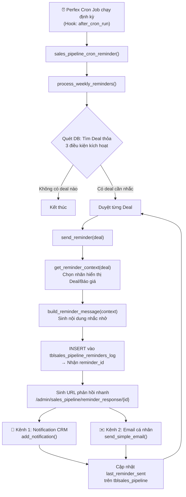
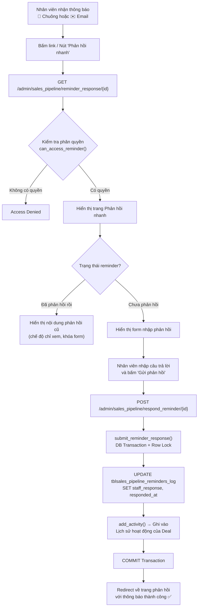
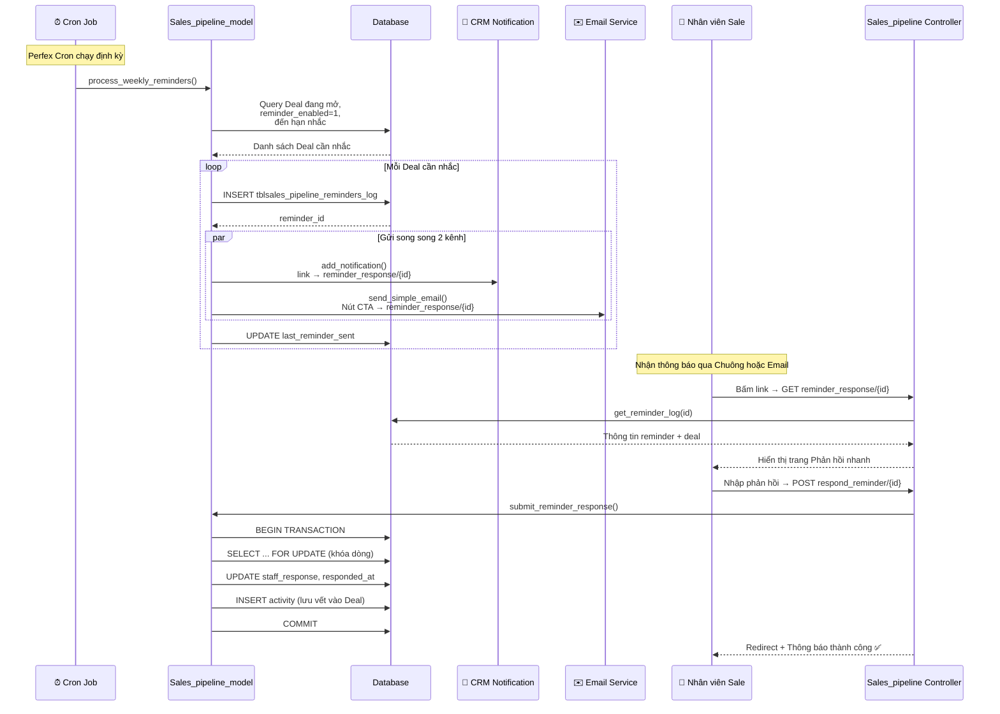
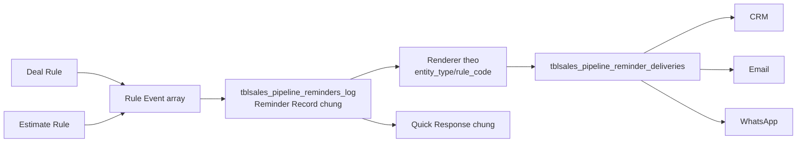
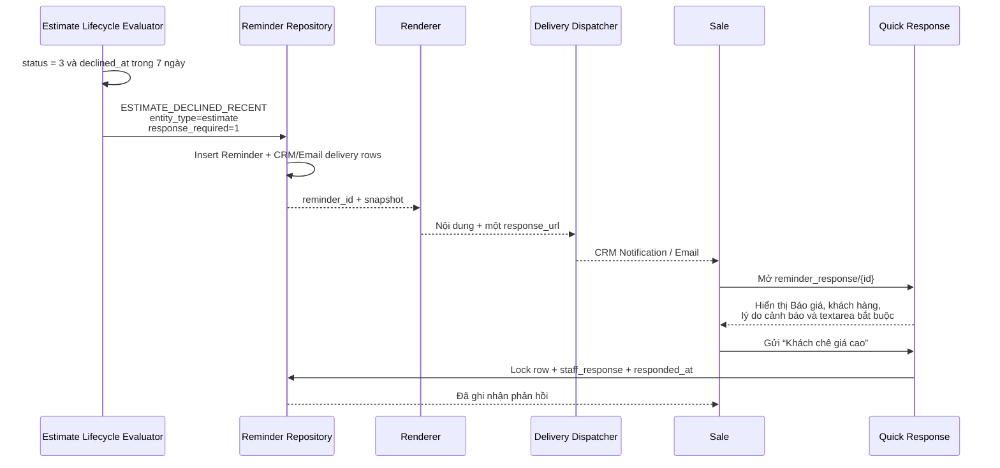
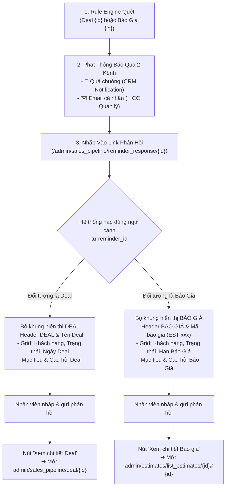
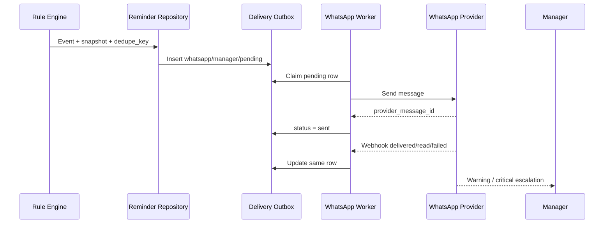

# Workflow: Hệ thống Nhắc nhở Tự động (Auto Reminder)

> **Module**: Sales Pipeline  
> **Phiên bản tài liệu**: 1.4  
> **Cập nhật lần cuối**: 2026-08-19

## 1. Tổng quan

Basecode hiện tại triển khai nhắc nhở cho **Deal đang mở** trong Sales Pipeline. Khi Deal có gắn `estimate_id`, giao diện đổi nhãn hiển thị sang Báo giá nhưng vẫn chạy trên Deal Record. Hệ thống As-Is phát qua hai kênh:

| Kênh             | Biểu tượng | Mô tả                                                                 |
|------------------|------------|------------------------------------------------------------------------|
| **Thông báo**    | 🔔 Chuông  | Notification nội bộ trên giao diện Admin CRM, hiện trên thanh nav bar |
| **Email**        | ✉️ Thư     | Gửi đến địa chỉ email cá nhân của nhân viên Sale phụ trách Deal       |

Cả hai kênh đều chứa **link hành động (Call-to-Action)** dẫn đến trang **Phản hồi nhanh** — nơi nhân viên nhập câu trả lời. Phản hồi được lưu vết vĩnh viễn vào lịch sử hoạt động của Deal.

> **Ranh giới trạng thái**: Mục 2–8 là **As-Is**, mô tả code Deal Reminder đang chạy. Mục 9 là **To-Be**, chưa có trong basecode và sẽ triển khai theo [core_plane.md](file:///Users/dieterhoang/Developer/portal_18/docs/plans/Sales%20Pipeline/core_plane.md). Điều kiện `if-else`, ngưỡng và checkpoint thuộc [rule_engine.md](file:///Users/dieterhoang/Developer/portal_18/docs/plans/Sales%20Pipeline/rule_engine.md).

---

## 2. As-Is — Điểm kích hoạt Deal Reminder

### 2.1 Nguồn dữ liệu kích hoạt

Hệ thống nhắc nhở **dựa vào Trạng thái (Status) của Deal** trên bảng `tblsales_pipeline` làm tiêu chí chính để xác định deal nào cần nhắc nhở.

Cụ thể, một Deal sẽ được đưa vào danh sách nhắc khi **tất cả** các điều kiện sau thỏa mãn:

| # | Điều kiện                                                    | Cột / Bảng liên quan                      | Giải thích                                                                 |
|---|--------------------------------------------------------------|--------------------------------------------|----------------------------------------------------------------------------|
| 1 | Trạng thái Deal là **Đang mở (Active)**                     | `tblsales_pipeline_statuses.is_won = 0`    | Deal chưa thắng                                                           |
|   |                                                              | `tblsales_pipeline_statuses.is_lost = 0`   | Deal chưa thua                                                            |
| 2 | Tính năng nhắc nhở **đã được bật** cho Deal này             | `tblsales_pipeline.reminder_enabled = 1`   | Mỗi Deal có toggle Bật/Tắt riêng                                          |
| 3 | Đã đến thời hạn nhắc nhở tiếp theo                         | `tblsales_pipeline.last_reminder_sent`     | `IS NULL` (chưa nhắc lần nào) **HOẶC**                                    |
|   |                                                              | `tblsales_pipeline.reminder_frequency`     | `DATEDIFF(NOW(), last_reminder_sent) >= reminder_frequency` (đã quá hạn)  |

### 2.2 Cấu hình tại cấp Deal

Khi tạo mới hoặc chỉnh sửa Deal, nhân viên/quản lý có thể thiết lập:

- **`reminder_enabled`** (Bật/Tắt): Mặc định `1` (bật).
- **`reminder_frequency`** (Tần suất nhắc): Số ngày giữa các lần nhắc, mặc định `2` ngày.

> **Tham chiếu nguồn**:
> - Giao diện cấu hình: [deal.php](file:///Users/dieterhoang/Developer/portal_18/modules/sales_pipeline/views/deal.php) (dòng 266–269)
> - Lưu vào Controller: [Sales_pipeline.php](file:///Users/dieterhoang/Developer/portal_18/modules/sales_pipeline/controllers/Sales_pipeline.php) (dòng 351–352)
> - Schema DB: [install.php](file:///Users/dieterhoang/Developer/portal_18/modules/sales_pipeline/install.php) (dòng 93–95)

---

## 3. As-Is — Luồng xử lý chính



---

## 4. As-Is — Chi tiết từng bước

### Bước 1: Kích hoạt Cron Job

- **Hook đăng ký**: `after_cron_run` → gọi hàm `sales_pipeline_cron_reminder()`
- **Vị trí đăng ký**: [sales_pipeline.php](file:///Users/dieterhoang/Developer/portal_18/modules/sales_pipeline/sales_pipeline.php) (dòng 18)
- **Hàm thực thi**: [sales_pipeline.php](file:///Users/dieterhoang/Developer/portal_18/modules/sales_pipeline/sales_pipeline.php) (dòng 87–93)

```php
function sales_pipeline_cron_reminder()
{
    $CI = &get_instance();
    $CI->load->model('sales_pipeline/sales_pipeline_model');
    $CI->sales_pipeline_model->process_weekly_reminders();
}
```

### Bước 2: Quét và lọc Deal cần nhắc

- **Method**: `process_weekly_reminders()` trong [Sales_pipeline_model.php](file:///Users/dieterhoang/Developer/portal_18/modules/sales_pipeline/models/Sales_pipeline_model.php) (dòng 869–897)
- **Logic**:
  1. Truy vấn bảng `tblsales_pipeline_statuses` lấy danh sách status có `is_won = 0 AND is_lost = 0` → mảng `$active_status_ids`.
  2. Query bảng `tblsales_pipeline` với các điều kiện:
     - `reminder_enabled = 1`
     - `status IN ($active_status_ids)`
     - `last_reminder_sent IS NULL OR DATEDIFF(NOW(), last_reminder_sent) >= reminder_frequency`
  3. Duyệt kết quả, gọi `send_reminder($deal)` cho mỗi deal.

### Bước 3: Xác định ngữ cảnh (Context)

- **Method**: `get_reminder_context($deal)` trong [Sales_pipeline_model.php](file:///Users/dieterhoang/Developer/portal_18/modules/sales_pipeline/models/Sales_pipeline_model.php) (dòng 1034–1085)
- **Logic phân loại**:
  - Nếu Deal có `estimate_id` hợp lệ (tồn tại trong `tblestimates`) → đổi **nhãn hiển thị** thành Báo giá: `entity_type = 'estimate'`, `entity_name` = số báo giá formatted.
  - Nếu không → xem là **Deal thường**: `entity_type = 'deal'`, `entity_name` = tên deal hoặc tên khách hàng.

> **Giới hạn As-Is**: Đây vẫn là một Deal Reminder có `pipeline_id` bắt buộc. Hàm chỉ đổi context trình bày khi Deal gắn `estimate_id`; nó chưa đánh giá các rule Báo giá độc lập theo Staff/ngày/tháng/tuần.

### Bước 4: Tạo bản ghi Log & Sinh link phản hồi

- **Method**: `send_reminder($deal)` trong [Sales_pipeline_model.php](file:///Users/dieterhoang/Developer/portal_18/modules/sales_pipeline/models/Sales_pipeline_model.php) (dòng 903–980)
- **Thao tác**:
  1. **INSERT** vào bảng `tblsales_pipeline_reminders_log`:
     ```
     pipeline_id, staff_id, reminder_type='email', message, sent_at
     ```
  2. Lấy `reminder_id` = `$this->db->insert_id()`
  3. **Sinh URL phản hồi**: `admin/sales_pipeline/reminder_response/{reminder_id}`
  4. **Sinh URL xem deal**: `admin/sales_pipeline/deal/{deal_id}`

### Bước 5: Phát thông báo qua 2 kênh

#### Kênh 1: 🔔 Thông báo nội bộ (Notification)

```php
add_notification([
    'description'     => 'sales_pipeline_reminder',
    'touserid'        => $deal['staff_id'],
    'fromuserid'      => null,
    'link'            => 'sales_pipeline/reminder_response/' . $reminder_id,
    'additional_data' => serialize([$deal['deal_name'], $deal['customer_name']]),
]);
```

- Xuất hiện dưới **biểu tượng chuông** trên thanh navigation bar Admin.
- Khi bấm → chuyển hướng đến trang Phản hồi nhanh.

#### Kênh 2: ✉️ Email cá nhân

- **Điều kiện gửi**: Staff có `email` không rỗng.
- **Template HTML**: [reminder.php](file:///Users/dieterhoang/Developer/portal_18/modules/sales_pipeline/views/emails/reminder.php)
- **Nội dung email bao gồm**:

| Thành phần          | Mô tả                                                        |
|---------------------|---------------------------------------------------------------|
| Lời chào cá nhân    | Xưng tên nhân viên Sale                                       |
| Thông tin tóm tắt   | Loại đối tượng, Tên đối tượng, Khách hàng, Tên deal, Trạng thái, Giá trị, Ngày kỳ vọng |
| Hướng dẫn hành động | Mô tả yêu cầu nhân viên phản hồi nhanh                      |
| **Nút CTA chính**   | `[ Phản hồi nhanh ]` → link đến `reminder_response/{id}`     |
| Link phụ            | `Xem chi tiết deal` → link đến `deal/{deal_id}`              |

- **Gửi qua**: `$this->emails_model->send_simple_email($staff->email, $subject, $body)`

### Bước 6: Cập nhật mốc thời gian nhắc

Sau khi gửi xong cả 2 kênh, hệ thống cập nhật:

```sql
UPDATE tblsales_pipeline SET last_reminder_sent = NOW() WHERE id = {deal_id}
```

Mốc này được dùng để tính toán lần nhắc tiếp theo (so sánh với `reminder_frequency`).

---

## 5. As-Is — Luồng phản hồi từ nhân viên



### 5.1 Trang Phản hồi nhanh (Quick Response Page)

- **Route**: `GET /admin/sales_pipeline/reminder_response/{reminder_id}`
- **Controller**: [Sales_pipeline.php](file:///Users/dieterhoang/Developer/portal_18/modules/sales_pipeline/controllers/Sales_pipeline.php) (dòng 462–480)
- **View**: [reminder_response.php](file:///Users/dieterhoang/Developer/portal_18/modules/sales_pipeline/views/reminder_response.php)

**Nội dung trang gồm**:

1. **Header**: Tiêu đề + Badge trạng thái (`Đang chờ` / `Đã phản hồi`)
2. **Thẻ tóm tắt Deal**: Loại đối tượng, Tên, Khách hàng, Giá trị, Ngày kỳ vọng, Trạng thái (có màu)
3. **Khung gợi ý phản hồi** — 3 câu hỏi định hướng:
   - 🔹 **Hôm qua**: Bạn đã thực hiện những gì với deal/báo giá này?
   - 🔹 **Hôm nay**: Kế hoạch hành động tiếp theo là gì?
   - 🔹 **Hỗ trợ**: Bạn có cần sự hỗ trợ nào từ cấp trên không?
   - ⚠️ **Cảnh báo Pipeline**: Nhắc về việc cập nhật trạng thái deal/báo giá
4. **Form phản hồi**: Textarea (tối đa 2000 ký tự) + Nút `Gửi phản hồi`
5. **Link phụ**: `Xem chi tiết deal` → chuyển đến trang Deal

### 5.2 Xử lý lưu phản hồi

- **Route**: `POST /admin/sales_pipeline/respond_reminder/{reminder_id}`
- **Controller**: [Sales_pipeline.php](file:///Users/dieterhoang/Developer/portal_18/modules/sales_pipeline/controllers/Sales_pipeline.php) (dòng 487–556)
- **Model**: `submit_reminder_response()` tại [Sales_pipeline_model.php](file:///Users/dieterhoang/Developer/portal_18/modules/sales_pipeline/models/Sales_pipeline_model.php) (dòng 1125–1213)

**Quy trình xử lý trong Transaction**:

| Bước | Thao tác                                                                                      |
|------|-----------------------------------------------------------------------------------------------|
| 1    | Mở DB Transaction                                                                             |
| 2    | `SELECT ... FOR UPDATE` — Khóa dòng reminder trong `tblsales_pipeline_reminders_log`          |
| 3    | Kiểm tra quyền: Staff sở hữu deal / Admin / Có quyền `sales_pipeline.edit`                   |
| 4    | Kiểm tra `staff_response IS NOT NULL` → Nếu đã phản hồi → trả `already_responded` (HTTP 409) |
| 5    | Kiểm tra Deal còn tồn tại trong `tblsales_pipeline`                                          |
| 6    | `UPDATE` bảng log: ghi `staff_response` + `responded_at`                                      |
| 7    | `add_activity()` → Ghi phản hồi vào **Lịch sử hoạt động (Activity Feed)** của Deal           |
| 8    | `COMMIT` Transaction                                                                          |

### 5.3 Phân quyền truy cập (Access Control)

Hàm `can_access_reminder()` trong [Sales_pipeline.php](file:///Users/dieterhoang/Developer/portal_18/modules/sales_pipeline/controllers/Sales_pipeline.php) (dòng 1205–1210):

```php
private function can_access_reminder($reminder)
{
    return (int) $reminder['staff_id'] === (int) get_staff_user_id()
        || is_admin()
        || has_permission('sales_pipeline', '', 'edit');
}
```

- ✅ Nhân viên Sale được chỉ định (`staff_id`) trên Deal
- ✅ Admin hệ thống
- ✅ Nhân viên có quyền `sales_pipeline → edit`

---

## 6. As-Is — Điểm cuối lưu vết

Phản hồi từ nhân viên được lưu vết tại **2 nơi**:

### 6.1 Bảng `tblsales_pipeline_reminders_log`

Lưu trọn vẹn vòng đời của mỗi lần nhắc nhở:

| Cột               | Kiểu dữ liệu | Mô tả                                           |
|--------------------|---------------|--------------------------------------------------|
| `id`               | INT (PK, AI)  | Mã định danh duy nhất của lần nhắc               |
| `pipeline_id`      | INT (FK)      | Liên kết đến Deal trong `tblsales_pipeline`      |
| `staff_id`         | INT (FK)      | Nhân viên được nhắc                              |
| `reminder_type`    | VARCHAR(50)   | Kênh gửi (mặc định: `email`)                    |
| `message`          | TEXT           | Nội dung nhắc nhở (snapshot tại thời điểm gửi)  |
| `staff_response`   | TEXT (NULL)    | Nội dung phản hồi từ nhân viên (`NULL` = chưa phản hồi) |
| `responded_at`     | DATETIME (NULL)| Thời điểm phản hồi                              |
| `sent_at`          | DATETIME       | Thời điểm gửi nhắc nhở                          |

> **Schema**: [install.php](file:///Users/dieterhoang/Developer/portal_18/modules/sales_pipeline/install.php) (dòng 223–237)

### 6.2 Activity Feed của Deal

Mỗi phản hồi thành công đồng thời tạo 1 bản ghi hoạt động gắn với `pipeline_id` qua hàm `add_activity()`, đảm bảo Manager/Admin có thể xem toàn bộ lịch sử tương tác ngay trên trang chi tiết Deal mà không cần truy cập bảng log riêng.

---

## 7. As-Is — Sơ đồ End-to-End



---

## 8. As-Is — Tham chiếu mã nguồn

| Thành phần                  | File                                                                                                                                                                            | Dòng        |
|-----------------------------|---------------------------------------------------------------------------------------------------------------------------------------------------------------------------------|-------------|
| Đăng ký Hook Cron           | [sales_pipeline.php](file:///Users/dieterhoang/Developer/portal_18/modules/sales_pipeline/sales_pipeline.php)                                                                    | 18          |
| Hàm Cron entry              | [sales_pipeline.php](file:///Users/dieterhoang/Developer/portal_18/modules/sales_pipeline/sales_pipeline.php)                                                                    | 87–93       |
| Quét Deal cần nhắc          | [Sales_pipeline_model.php](file:///Users/dieterhoang/Developer/portal_18/modules/sales_pipeline/models/Sales_pipeline_model.php)                                                 | 869–897     |
| Gửi nhắc nhở (2 kênh)      | [Sales_pipeline_model.php](file:///Users/dieterhoang/Developer/portal_18/modules/sales_pipeline/models/Sales_pipeline_model.php)                                                 | 903–980     |
| Xác định Context            | [Sales_pipeline_model.php](file:///Users/dieterhoang/Developer/portal_18/modules/sales_pipeline/models/Sales_pipeline_model.php)                                                 | 1034–1085   |
| Template Email              | [reminder.php](file:///Users/dieterhoang/Developer/portal_18/modules/sales_pipeline/views/emails/reminder.php)                                                                   | toàn bộ     |
| Controller Phản hồi         | [Sales_pipeline.php](file:///Users/dieterhoang/Developer/portal_18/modules/sales_pipeline/controllers/Sales_pipeline.php)                                                        | 462–556     |
| View Phản hồi nhanh         | [reminder_response.php](file:///Users/dieterhoang/Developer/portal_18/modules/sales_pipeline/views/reminder_response.php)                                                        | toàn bộ     |
| Lưu phản hồi (Transaction)  | [Sales_pipeline_model.php](file:///Users/dieterhoang/Developer/portal_18/modules/sales_pipeline/models/Sales_pipeline_model.php)                                                 | 1125–1213   |
| DB Schema — Deal             | [install.php](file:///Users/dieterhoang/Developer/portal_18/modules/sales_pipeline/install.php)                                                                                  | 93–95       |
| DB Schema — Reminders Log    | [install.php](file:///Users/dieterhoang/Developer/portal_18/modules/sales_pipeline/install.php)                                                                                  | 223–237     |
| Phân quyền truy cập         | [Sales_pipeline.php](file:///Users/dieterhoang/Developer/portal_18/modules/sales_pipeline/controllers/Sales_pipeline.php)                                                        | 1205–1210   |
| Cấu hình trên giao diện Deal| [deal.php](file:///Users/dieterhoang/Developer/portal_18/modules/sales_pipeline/views/deal.php)                                                                                  | 266–269     |
| Thống kê phản hồi           | [Sales_pipeline_model.php](file:///Users/dieterhoang/Developer/portal_18/modules/sales_pipeline/models/Sales_pipeline_model.php)                                                 | 2457–2495   |

---

## 9. To-Be — Reminder Workflow dùng chung

> Phần này chưa tồn tại trong basecode. Target-state sử dụng một Reminder Repository chung và một Delivery table chung, thống nhất với [core_plane.md](file:///Users/dieterhoang/Developer/portal_18/docs/plans/Sales%20Pipeline/core_plane.md). Workflow không tính lại điều kiện rule.

### 9.1 Cấu trúc tổng thể



Không tạo `tblsales_pipeline_rule_events` hoặc `tblsales_pipeline_manager_alerts`:

- Rule Event chỉ là payload trong bộ nhớ.
- Rule, severity, snapshot và phản hồi nằm trong Reminder Record.
- Staff, Manager hoặc Admin chỉ là `recipient_type` của Delivery.
- WhatsApp delivery ở trạng thái `pending` đóng vai trò outbox.

### 9.2 Tạo Reminder và sinh quick-response URL

Với mỗi Event hợp lệ:

1. Resolve người nhận từ `recipient_policy`.
2. Trong một transaction, atomic insert Reminder Record theo `dedupe_key` và materialize các delivery rows.
3. Commit rồi nhận `reminder_id`; nếu duplicate thì load record hiện có theo `dedupe_key`.
4. Sinh duy nhất một URL:

```text
/admin/sales_pipeline/reminder_response/{reminder_id}
```

5. Renderer chọn content theo `rule_code` và chỉ đọc `snapshot_json`.
6. Lưu title/message đã render để audit ổn định.
7. Dispatcher gửi hoặc worker claim các delivery `pending`. Duplicate reminder được resume nếu lần xử lý trước dừng giữa chừng.

Deal dùng `entity_type = deal`, có `pipeline_id`. Rule Báo giá tổng hợp theo kỳ dùng `entity_type = staff_estimate_period`, `pipeline_id = NULL`. Rule vòng đời một Báo giá dùng `entity_type = estimate`, `entity_id = Estimate ID` và không bắt buộc có Deal.

#### 9.2.1 Luồng phụ — Báo giá bị từ chối



Nếu Sale gửi nội dung rỗng, controller trả `422` và reminder vẫn `Pending`. CTA phụ `Đi tới Báo giá` mở Estimate gốc theo `entity_id`. Phản hồi gắn với Reminder Record; chỉ ghi Deal Activity khi reminder thực sự có `pipeline_id` hợp lệ.

Với `ESTIMATE_DRAFT_TOO_LONG` hoặc `ESTIMATE_EXPIRED`, Event có `response_required = 0`: cùng URL chỉ hiển thị cảnh báo và CTA `Đi tới Báo giá`, không render textarea và không nhận POST.

### 9.3 Delivery Dispatcher chung

`tblsales_pipeline_reminder_deliveries` lưu một dòng cho mỗi tổ hợp reminder/kênh/người nhận:

```text
id, reminder_id,
channel, recipient_type, recipient_key,
status, attempt_count, provider_message_id,
last_error, next_retry_at,
sent_at, delivered_at, read_at,
created_at, updated_at
```

Unique key:

```text
reminder_id + channel + recipient_type + recipient_key
```

Quy tắc:

- CRM và Email gửi cho Staff theo cấu hình rule.
- Email thiếu địa chỉ hợp lệ được đánh dấu `skipped`.
- Một kênh lỗi không ngăn kênh còn lại.
- Retry cập nhật cùng delivery row, không insert lịch sử attempt mới.
- CRM/Email chỉ dùng `pending/sent/failed/skipped` nếu không có receipt.
- WhatsApp được phép dùng `delivered/read` khi provider webhook xác nhận.

### 9.4 Quick Response chung (Universal Quick Response Framework)

Giữ một cặp route duy nhất cho toàn bộ hệ thống:

```text
GET  /admin/sales_pipeline/reminder_response/{reminder_id}
POST /admin/sales_pipeline/respond_reminder/{reminder_id}
```

#### 9.4.1 Luồng Hoạt Động Xuyên Suốt (End-to-End Flow)



**Quy tắc vận hành luồng**:
- **Không hardcode**: Toàn bộ nhãn ngữ cảnh (`DEAL`, `BÁO GIÁ`), mã/tên đối tượng, trạng thái, thời hạn đều được load động 100% theo bản ghi `reminder_id`.
- **Kết hợp thiết kế**: Phần trên (Header & Grid 4 ô thẻ) sử dụng phong cách hiện đại; phần thân dưới (Khối câu hỏi snapshot & Khung nhập liệu phản hồi) tuân thủ phong cách **Standard Form cổ điển của Perfex CRM**.
- **Phân quyền & Chế độ Giám sát**:
  - Nhân viên được nhắc: có quyền nhập và submit phản hồi.
  - Quản lý / Admin truy cập: hiển thị banner **Chế độ Giám sát (Supervisor Mode)** kèm chế độ chỉ xem (read-only).
- **Phân loại nhắc nhở**:
  - `response_required = 0`: Nhắc nhở mang tính chất thông báo (không có textarea, không treo Pending).
  - `response_required = 1`: Bắt buộc nhập phản hồi; trạng thái Pending kết thúc ngay khi lưu `staff_response`.
- **Lưu vết**:
  - Deal Reminder: Lưu vào `tblsales_pipeline_reminders_log` đồng thời ghi thêm vào Activity Feed của Deal.
  - Estimate Reminder: Lưu vào `tblsales_pipeline_reminders_log` và gắn với Estimate Record gốc.

---

#### 9.4.2 Chi Tiết 2 Bản Thể Hiện Thực Tế Của Bộ Khung

##### Bản 1: Khi Nhắc Nhở Về DEAL

```text
+--------------------------------------------------------------------------------------------------+
|  DEAL                                                                                            |
|  Phản hồi nhanh nhắc nhở                                                   [ ✓ Đã phản hồi ]     |
|                                                                                                  |
|  +---------------------------------------+   +------------------------------------------------+  |
|  | DEAL                                  |   | TÊN CÔNG TY                                    |  |
|  | Server Dell PowerEdge                 |   | Hoàng Công ty Cổ phần                          |  |
|  +---------------------------------------+   +------------------------------------------------+  |
|  | TRẠNG THÁI                            |   | NGÀY                                           |  |
|  | Đang báo giá                          |   | 2026-11-24                                     |  |
|  +---------------------------------------+   +------------------------------------------------+  |
|                                                                                                  |
|  +-- [Khối Nhắc Nhở Snapshot - Viền Xanh Dương] ----------------------------------------------+  |
|  |  Chào Dieter Hoàng, Deal này chưa thấy tiến triển mới trong tuần.                          |  |
|  |                                                                                            |  |
|  |  Mục tiêu: Deal "Server Dell PowerEdge" - Hoàng Công ty Cổ phần (Doanh số: 204,000,000):     |  |
|  |  Kết quả tuần này thế nào?                                                                 |  |
|  |                                                                                            |  |
|  |  Bạn vui lòng cập nhật nhanh:                                                              |  |
|  |  • Hôm qua:  Bạn đã xử lý xong những việc gì?                                              |  |
|  |  • Hôm nay:  Trọng tâm công việc bạn sẽ tập trung đẩy mạnh là gì?                           |  |
|  |  • Hỗ trợ:   Bạn đang gặp khó khăn gì? (Cần can thiệp về giá, kỹ thuật, hay giấy tờ?)       |  |
|  |                                                                                            |  |
|  |  +-- [Khung Cảnh Báo Màu Vàng] ---------------------------------------------------------+  |  |
|  |  | ⚠ Cảnh báo Pipeline: Hiện có Deal nào đang bị tắc nghẽn & Lý do chưa chốt được PO.     |  |  |
|  |  +--------------------------------------------------------------------------------------+  |  |
|  +--------------------------------------------------------------------------------------------+  |
|                                                                                                  |
|  <!-- KHI ĐÃ PHẢN HỒI (Standard Form Read-only) -->                                             |
|  NỘI DUNG PHẢN HỒI CỦA BẠN                                                                       |
|  +--------------------------------------------------------------------------------------------+  |
|  | biết rồi                                                                                   |  |
|  | (Ô form-control nền xám nhạt #f5f5f5, min-height: 100px - chế độ read-only)                |  |
|  +--------------------------------------------------------------------------------------------+  |
|                                                                                                  |
|  [ Alert Xanh Lá - alert-success ]                                                               |
|  ✓ Phản hồi đã được gửi thành công.                                                              |
|    Thời gian phản hồi: 18/08/2026 17:31:04                                                       |
|                                                                                                  |
|  (Phản hồi này đã được gửi và đã khóa, không thể chỉnh sửa lại.)                                 |
|                                                                                                  |
|  +----------------------------------------+                                                      |
|  | [icon external] Xem chi tiết Deal      | ➔ Mở: admin/sales_pipeline/deal/{id}                 |
|  +----------------------------------------+                                                      |
+--------------------------------------------------------------------------------------------------+
```

##### Bản 2: Khi Nhắc Nhở Về BÁO GIÁ (ESTIMATE)

```text
+--------------------------------------------------------------------------------------------------+
|  BÁO GIÁ                                                                                         |
|  Phản hồi nhanh nhắc nhở                                                   [ ◷ Chờ phản hồi ]    |
|                                                                                                  |
|  +---------------------------------------+   +------------------------------------------------+  |
|  | BÁO GIÁ                               |   | TÊN CÔNG TY                                    |  |
|  | EST-00012                             |   | Công ty TNHH Giải Pháp Công Nghệ               |  |
|  +---------------------------------------+   +------------------------------------------------+  |
|  | TRẠNG THÁI                            |   | HẠN BÁO GIÁ                                    |  |
|  | Đã gửi                                |   | 2026-09-01                                     |  |
|  +---------------------------------------+   +------------------------------------------------+  |
|                                                                                                  |
|  +-- [Khối Nhắc Nhở Snapshot - Viền Xanh Dương] ----------------------------------------------+  |
|  |  Chào Dieter Hoàng, Báo giá này chưa thấy tiến triển mới trong tuần.                       |  |
|  |                                                                                            |  |
|  |  Mục tiêu: Báo giá "EST-00012" - Công ty TNHH Giải Pháp Công Nghệ (Tổng tiền: 85,000,000): |  |
|  |  Kết quả tuần này thế nào?                                                                 |  |
|  |                                                                                            |  |
|  |  Bạn vui lòng cập nhật nhanh:                                                              |  |
|  |  • Hôm qua:  Bạn đã xử lý xong những việc gì?                                              |  |
|  |  • Hôm nay:  Trọng tâm công việc bạn sẽ tập trung đẩy mạnh là gì?                           |  |
|  |  • Hỗ trợ:   Bạn đang gặp khó khăn gì? (Cần can thiệp về giá, kỹ thuật, hay giấy tờ?)       |  |
|  |                                                                                            |  |
|  |  +-- [Khung Cảnh Báo Màu Vàng] ---------------------------------------------------------+  |  |
|  |  | ⚠ Cảnh báo Pipeline: Hiện có Báo giá nào đang bị tắc nghẽn & Lý do chưa chốt được PO.   |  |  |
|  |  +--------------------------------------------------------------------------------------+  |  |
|  +--------------------------------------------------------------------------------------------+  |
|                                                                                                  |
|  <!-- KHI CHƯA PHẢN HỒI (Nhân viên nhập phản hồi) -->                                            |
|  Nội dung phản hồi của bạn *                                                                     |
|  +--------------------------------------------------------------------------------------------+  |
|  | Nhập nội dung phản hồi nhanh của bạn...                                                     |  |
|  |                                                                                            |  |
|  +--------------------------------------------------------------------------------------------+  |
|  Tối đa 2.000 ký tự.                                                                             |
|                                                                                                  |
|  [ Nút Xanh Dương: <i class="fa fa-paper-plane"></i> Gửi phản hồi ]                              |
|                                                                                                  |
|  +----------------------------------------+                                                      |
|  | [icon external] Xem chi tiết Báo giá   | ➔ Mở: admin/estimates/list_estimates/{id}#{id}       |
|  +----------------------------------------+                                                      |
+--------------------------------------------------------------------------------------------------+
```

### 9.5 WhatsApp cho Quản lý

WhatsApp là kênh escalation/tóm tắt cho Manager và dùng cùng Reminder Record, không sao chép thành Manager Alert:



Không gọi WhatsApp API trực tiếp trong vòng evaluator. Việc bật WhatsApp chỉ thực hiện sau khi có nguồn mapping Manager, destination và chính sách quyền rõ ràng.

### 9.6 Chính sách vận hành và chống database bloat

- Không lưu lại snapshot hoặc HTML Email trong delivery row.
- Một kênh/người nhận chỉ có một row; retry tăng `attempt_count`.
- Index worker theo `(status, next_retry_at)` và index `reminder_id`.
- Không hard-code số điện thoại/conversation ID.
- Chỉ gửi dữ liệu tối thiểu; link CRM vẫn kiểm tra quyền khi mở.
- Áp dụng retention/archive delivery cũ khi có số liệu tăng trưởng thực tế.
- Không ghi token, credential hoặc payload nhạy cảm vào `last_error`.

### 9.7 Tiêu chí nghiệm thu To-Be

1. Deal và Estimate Event cùng tạo Reminder Record trong bảng chung.
2. Một `dedupe_key` không tạo quá một Reminder Record.
3. Không tồn tại bảng Rule Event hoặc Manager Alert riêng.
4. Một delivery được xác định duy nhất theo reminder/kênh/người nhận.
5. CRM, Email và WhatsApp cùng tham chiếu một `reminder_id`.
6. Lỗi một kênh không làm thất bại các kênh khác hoặc Cron Rule Engine.
7. Retry không sinh delivery row mới.
8. Cùng quick-response route xử lý Deal và Estimate period reminder.
9. WhatsApp webhook chỉ cập nhật delivery khớp `provider_message_id`.
10. Manager nhận escalation ở chế độ read-only, không phản hồi thay Sale.
11. Estimate lifecycle dùng cùng Reminder/Delivery repository và cùng quick-response route.
12. Informational lifecycle reminder không có textarea và không bị tính Pending phản hồi.
13. Actionable lifecycle reminder không thể hoàn tất khi phản hồi rỗng.
